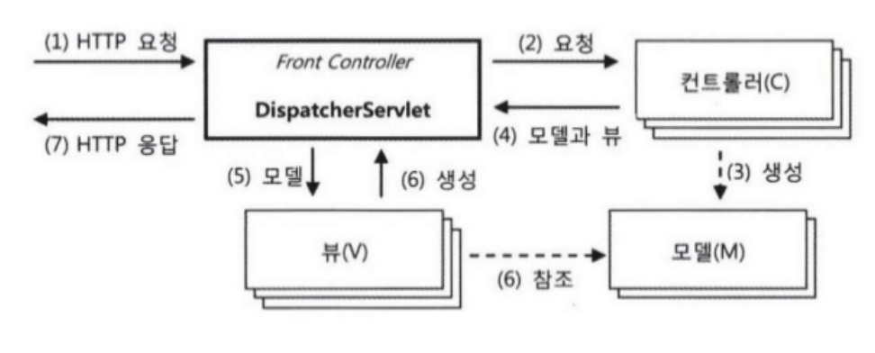

# Chap 01 IoC 컨테이너와 DI
## 1.1. IoC 컨테이너: 빈 팩토리와 애플리케이션 컨텍스트
* 스프링에선 오브젝트 생성, 관계설정, 사용, 제거등의 작업을 (애플리케이션 코드가 아닌) 독립된 컨테이너가 담당함.
    - 코드 대신 컨테이너가 오브젝트 제어권을 가지고 있다해서 `IoC`라 부름
    - 스프링 컨테이너를 IoC 컨테이너라 부름
* 스프링에선 IoC를 담당하는 컨테이너를 `빈 팩토리` 혹은 `애플리케이션 컨텍스트`라 부르기도 함.
    - 오브젝트 사이 런타임 관계를 설정하는 *DI 작업 관점*에서 보면 `빈 팩토리`
    - DI 뿐만 아니라 애플리케이션 개발시 필요한 *여러 컨테이너 기능을 추가*한 것을 `애플리케이션 컨텍스트`
* 스프링 애플리케이션은 최소 하나 이상의 애플리케이션 컨텍스트를 가지고 있음.

### 1.1.1. IoC 컨테이너를 이용해 애플리케이션 만들기
* 컨테이너가 IoC 컨테이너로 동작하려면 두가지가 필요.
    1. POJO 클래스 
        - 애플리케이션의 핵심 코드를 담고 있음.
    2. 설정 메타정보

#### POJO 클래스
* 각자 기능을 구현하며 독립적으로 설계된 POJO 클래스를 만들고 인터페이스를 이용해 느슨하게 결합을 맺어주는게 IoC 컨테이너가 POJO를 준비하는 첫단계.
    
#### 설정 메타정보
* IoC 컨테이너가 POJO 클래스들을 제어할 수 있도록 적절한 메타정보를 만들어 제공하는 작업이 두번째 필요한 작업.
* IoC 컨테이너의 기본적인 역할은 오브젝트 생성과 관리.
    - 스프링 컨테이너가 관리하는 오브젝트를 `빈(bean)`이라 부름.
    - IoC 컨테이너가 필요로하는 설정 **메타정보**는 이런 `빈을 어떻게 만들고 어떻게 동작하게 할 것인가에 관한 정보`
* 설정 메타정보는 BeanDefinition 인터페이스의 추상 정보임.
    - 애플리케이션 컨텍스트는 이 BeanDefinition으로 만들어진 메타정보를 담은 오브젝트를 사용해서 IoC와 DI 작업을 수행.
    - XML이 메타정보가 아니고, XML과 같은 메타정보를 표현한 리소스가 있으면 이걸 BeanDefinition 오브젝트로 변환해주는 BeanDefinitionReader가 있으면 됨.
* BeanDefinition의 메타정보
    - bean id, name, alias
    - class
    - scope
    - property
    - constructor parameter
    - 지연된 로딩 여부, 우선 빈 여부, 자동와이어링 여부, 부모 빈 정보, 빈 팩토리 이름 등.
* IoC 컨테이너는 설정 메타정보를 읽은 후, 이를 참고해서 빈 오브젝트를 생성하고, 프로퍼티나 생성자를 통해서 의존 오브젝트를 주입해주는 DI 작업 수행.
* IoC 컨테이너가 관리하는 빈은 오브젝트 단위임.(클래스 단위가 아님.)
    - 경우에 따라 한 클래스의 오브젝트를 여러개 만들어 빈으로 등록할 수도 있음.
    - e.g. 사용할 DB가 여러개 일 때 같은 DataSource 클래스로 된 빈을 여러개 만들어 등록하고 선택적으로 사용.

### 1.1.2. IoC 컨테이너의 종류와 사용 방법
* ApplicationContext 인터페이스를 구현하면 어떤 클래스든 스프링의 IoC컨테이너로 사용가능.
    - 하지만 그런일은 거의 없음.

#### ApplicationContext 구현 클래스 종류
1. StaticApplicationContext
    - 코드를 통해 빈 메타정보를 등록하기 위해 사용
2. GenericApplicationContext
    - 가장 일반적인 애플리케이션 컨텍스트
    - 컨테이너의 주요 기능을 DI를 통해 확장할 수 있도록 설계되어 있음(`뭔말이지?`)
    - 외부의 리소스(e.g. XML)에 있는 빈 설정 메타정보를 리더를 통해 읽어들여서 메타정보로 전환해서 사용.
    - 특정 포맷의 빈 설정 메타정보를 읽어서 이를 애플리케이션 컨텍스트가 사용할 수 있게 BeanDefinition 정보로 변환하는 기능을 가진 오브젝트는 BeanDefinitionReader (e.g. XmlBeanDefinitionReader)
    - 스프링에서는 대표적으로 XML, 자바 소스코드 애노테이션, 자바 클래스 이 3가지 방식으로 빈 설정 메타정보를 작성할 수 있음.
    - GenericApplicationContext는 BeanDefinitionReader를 여러개 사용해서 여러 리소스를 읽어 빈 설정 메타정보를 읽어들이게도 할 수 있음.
    - 스프링을 이용하면서 GenericApplicationContext 직접 이용할 일은 거의 없음.
    - 스프링 테스트 컨텍스트 프레임워크를 사용하는 JUnit 테스트에서는 테스트내에서 사용할 수 있도록 애플리케이션 컨텍스트를 자동으로 만들어줌.(이때 GenericApplicationContext로 만들어줌.)
3. GenericXmlApplicationContext
    - GenericApplicationContext와 XmlBeanDefinitionReader 클래스가 결합된 형태.(컨텍스트 오브젝트가 리더를 내장하고 있음.)
    - xml파일을 읽어들이고 refresh()로 초기화하는 것 까지 한줄로 끝낼 수 있음.
4. **WebApplicationContext**
    - 웹 환경에서 사용할 때 필요한 기능이 추가된 애플리케이션 컨텍스트.
        - 가장 많이 사용되는데, 스프링 애플리케이션은 대부분 서블릿 기반의 독립 웹 애플리케이션(WAR)으로 만들어지기 때문임.
    - WebApplicationContext의 특징은 자신이 만들어지고 동작되는 웹 모듈에 대한 정보에 접근가능하다는 것.
    - default는 XmlWebApplicationContext이고, 자바 애노테이션을 이용한 설정리소스만 참고한다면 AnnotationConfigWebApplicationContext를 사용.

> 스프링 IoC 컨테이너는 빈 설정 메타정보를 읽어서 빈 오브젝트를 만들고 DI 작업을 수행함.  
> 근데 여기서 끝나는게 아니라, 어디선가는 특정 빈 오브젝트의 메소드를 호출함으로써 애플리케이션을 동작시켜야 함.  
> 
> 이런 기동 역할의 빈을 사용하려면 IoC 컨테이너에 요청해서 빈 오브젝트를 가져와야함.   
> 적어도 한번은 IoC 컨테이너에게 요청해서 빈 오브젝트를 가져와야함.(getBean()을 통해)  
> 한번 가져온 후로는 다시 가져올 필요가 없음.(빈 오브젝트들끼리 DI로 서로 연결되어 있어 의존 관계를 타고 호출되면서 애플리케이션이 기동될 것임.)   
> IoC 컨테이너의 역할은 초기에 빈 오브젝트를 생성하고 DI한 후에 최초 애플리케이션을 기동할 빈 하나를 제공해주는 것까지.
> 
> 그런데 웹 애플리케이션은 동작방식이 근본적으로 다름.   
> 독립 자바 프로그램은 JVM에 main() 메소드를 가진 클래스를 시작시켜 달라 요청할 수 있음.  
> 하지만 웹에서는 main()을 호출할 방법이 없음. 또한 여러 사용자가 동시에 사용함.   
> 
> **그래서 web환경에선 main() 메소드 대신 서블릿 컨테이너가 브라우저로부터 오는 HTTP 요청을 받아서 해당 요청에 매핑되어 있는 서블릿을 실행해주는 방식으로 동작한다. 서블릿이 일종의 main() 메소드 역할을 하는 것임.**   
> 
> 웹 애플리케이션에서 스프링 애플리케이션을 기동시키는 방법은 main() 역할을 하는 서블릿을 하나 만들어두고, 미리 애플리케이션 컨텍스트를 생성한 후에, 서블릿으로 요청이 들어올 때마다 getBean()으로 필요한 빈을 가져와 정해진 메소드를 실행해주도록 하면 됨.   
> 
> 서블릿 컨테이너는 브라우저와 같은 클라이언트로부터 들어오는 요청을 받아서 서블릿을 동작시켜주는 일을 맡음.  
> 서블릿은 웹 애플리케이션이 시작될 때 미리 만들어둔 웹 애플리케이션 컨텍스트에게 빈 오브젝트로 구성된 애플리케이션의 기둥 역할을 해줄 빈을 요청해서 받아둠.  
> 그리고 미리 지정된 메소드를 호출함으로써 스프링 컨테이너가 DI 방식으로 구성해둔 애플리케이션의 기능이 시작되는 것임.  
>    
> 스프링은 웹 환경에서 애플리케이션 컨텍스트를 생성하고 설정 메타정보로 초기화하고 클라이언트 요청마다 적절한 빈을 찾아서 이를 실행해주는 기능을 가진 `DispatcherServlet`이란 서블릿을 제공함. 이 스프링이 제공해준 서블릿을 web.xml에 등록하는 것만으로 웹 환경에서 스프링 컨테이너가 만들어지고 애플리케이션을 실행할 준비는 대부분 끝남.  

### 1.1.3. IoC 컨테이너 계층구조
* IoC 컨테이너는 보통 한 애플리케이션에 하나면 충분.
* 근데 트리 모양의 계층구조를 만들 때 한개 이상의 IoC 컨테이너를 만들어두고 사용할 필요가 있음.

#### 부모 컨텍스트를 이용한 계층구조 효과 
* 모든 애플리케이션 컨텍스트는 부모 애플리케이션 컨텍스트를 가질 수 있음.
* 계층구조의 모든 애플리케이션 컨텍스트는 각자 독립된 설정정보를 이용해서 빈 오브젝트를 만들고 관리함.
    - 그런데 DI를 위해 빈을 찾을 때는 부모 컨텍스트의 빈까지 모두 검색함.
    - 자신한테서 찾고 없으면 부모, 부모의 부모로 빈이 있는지 요청함.
    - 트리상에서 `자식이나 형제 컨텍스트엔 요청하지 않음.`
    - 검색순서는 항상 자신이 먼저이고, 그다음 직계 부모의 순서
* 이런 계층트리형 애플리케이션 컨텍스트 구조를 사용하는 이유
    1. 이미 만들어진 애플리케이션의 설정을 가져다 사용하면서 일부 빈만 변경을 하고 싶은 경우 하위 컨텍스트에서만 빈을 다시설정해주기 위함.
    2. 공유하고자 하는 설정을 만들기 위함.
* 자식 컨텍스트는 부모 컨텍스트의 빈을 사용할 수 있지만, 그 반대는 안됨.
* AOP처럼 컨텍스트 안의 많은 빈에 일괄적으로 적용되는 기능은 대부분 해당 컨텍스트로 제한됨.

### 1.1.4. 웹 애플리케이션의 IoC 컨테이너 구성
> 서버에서 동작하는 애플리케이션에서 스프링 IoC 컨테이너를 사용하는 방법은 크게 3가지.   
> 두가지는 웹 모듈 안에 컨테이너를 두는 것.   
> 나머지 한가지는 엔터프라이즈 애플리케이션 레벨에 두는 것(이게 뭐지..? 서블릿 컨테이너 단에 둔다는 것인가?)  
> 우선 웹 애플리케이션 안에 WebApplicationContext 타입의 IoC 컨테이너를 두는 방법을 살펴볼 것임.

> 자바 서버에는 하나 이상의 웹 모듈을 배치해서 사용 가능.  
> 스프링을 사용한다면 보통 독립적으로 배포 가능한 웹 모듈(WAR) 형태로 애플리케이션 배포.  
> _하나의 웹 애플리케이션은 여러개의 서블릿을 가질 수 있는데, 자바 기술이 등장했던 초창기에는 URL하나당 하나의 서블릿을 만들어 등록 후 각각 독립적인 기능을 담당하게 함._   
> `하지만 최근에는 많은 웹 요청을 한 번에 받을 수 있는 대표 서블릿을 하나 두고, 공통작업을 수행하게 한 후에 각 요청의 기능을 담당하는 핸들러라고 불리는 클래스를 호출하는 방식으로 개발하는 경우가 일반적임.`(이런 방식을 프론트 컨트롤러 패턴이라 함.)   
> 스프링도 프론트 컨트롤러 패턴을 사용하고, 스프링 웹 앱에서 사용하는 서블릿은 많아봐야 1~3개.

* 웹 애플리케이션 안에서 동작하는 IoC 컨테이너를 만드는 방법은 2가지
    1. 스프링 애플리케이션의 요청을 처리하는 서블릿 안에서 생성.
    2. 웹 애플리케이션 레벨에서 만들어지는 것.
* 일반적으로 이 두가지방법을 모두 사용해서 컨테이너를 만듬.
    - 그래서 스프링 웹 애플리케이션에선 두개의 컨테이너, 즉 WebApplicationContext 오브젝트가 만들어짐.
    - **스프링 애플리케이션의 프론트 컨트롤러 서블릿이 추가적으로 늘어난다면 그만큼 전체 컨테이너 갯수는 더 늘어날 것임.**

#### 웹 애플리케이션의 컨텍스트 계층구조
* 웹 애플리케이션 레벨에 등록되는 컨테이너는 보통 루트 웹 애플리케이션 컨텍스트라 불림.
* 이 웹 애플리케이션에는 하나 이상의 스프링 애플리케이션의 프론트 컨트롤러 역할을 하는 서블릿이 등록될 수 있음.(일반적으로는 하나의 프론트 컨트롤러 서블릿만 둠.)
    - 이 서블릿에는 각각 독립적으로 애플리케이션 컨텍스트가 만들어짐.(각 프론트 컨트롤러 서블릿은 각자 자신 전용의 애플리케이션 컨텍스트를 갖고 있음.)
* 여러개의 서블릿의 컨텍스트가 공유하는 공통적인 빈이 있다면 루트 컨텍스트에 등록하면 중복 등록을 방지할 수 있음.
* 계층구조로 만드는 또 다른 이유는, 전체 애플리케이션에서 웹 기술에 종속되는 부분과 그렇지 않은 부분을 구분하기 위해서.
    - 스프링을 이용하지만 스프링의 웹 기술을 사용하지 않는 경우도 있음.(JSP/Servlet, Struts, etc.)
    - 이런 경우 계층형태로 컨텍스트를 분리하는 것이 좋음.
    - 비 스프링 웹기술에서 루트 애플리케이션 컨텍스트를 가져오기 위해, 스프링은 웹 애플리케이션마다 하나씩 존재하는 `ServletContext`를 통해 루트 애플리케이션 컨텍스트에 접근할 수 있는 방법 제공.
        - `WebApplicationContextUtils.getWebApplicationContext(ServletContext sc)`
        - `ServletContext`는 웹 애플리케이션마다 하나씩 만들어지는 것으로, `서블릿의 런타임 환경정보`를 담고 있음.
            - HttpServletRequest/HttpSession 오브젝트를 갖고 있으면 간단히 ServletContext를 가져올 수 있음.
        - 스프링과 연동해 사용하는 서드파티 웹 프레임워크를 사용한다면 루트 컨텍스트를 가져올때 이방법을 사용해야함.
        - ServletContext에 접근할 수 있는 JSP, Servlet에서도 가능.

#### 웹 애플리케이션의 컨텍스트 구성 방법
1. 서블릿 컨텍스트와 루트 애플리케이션 컨텍스트 계층 구조 
2. 루트 애플리케이션 컨텍스트 단일 구조 
3. 서블릿 컨텍스트 단일 구조

#### 루트 애플리케이션 컨텍스트 등록 
* 가장 간단한 방법은 서블릿의 event listener를 이용하는 방법.
    - 스프링은 `웹 애플리케이션의 시작과 종료시 발생하는 이벤트를 처리하는 리스너인 ServletContextListener`를 이용함.
```java
package javax.servlet;

import java.util.EventListener;

public interface ServletContextListener extends EventListener {
  void contextInitialized(ServletContextEvent var1);
  void contextDestroyed(ServletContextEvent var1);
}
```
* ServletContextListener 인터페이스를 구현한 리스너는 웹 애플리케이션 전체에 적용가능한 DB 연결/로깅 같은 서비스를 만드는데 유용.
* 이를 이용해서 웹 애플리케이션이 시작될 때 루트 애플리케이션 컨텍스트를 만들어 초기화하고, 웹 애플리케이션이 종료될 때 컨텍스트를 함꼐 종료하는 기능을 가진 리스너를 만들 수 있음.
    - 스프링은 이를 위해 `ContextLoaderListener` 제공.

```java
package org.springframework.web.context;

public class ContextLoaderListener extends ContextLoader implements ServletContextListener {
  private ContextLoader contextLoader;
  public ContextLoaderListener() { }
  public ContextLoaderListener(WebApplicationContext context) {
    super(context);
  }
  public void contextInitialized(ServletContextEvent event) {
    this.contextLoader = this.createContextLoader();
    if (this.contextLoader == null) {
      this.contextLoader = this;
    }
    this.contextLoader.initWebApplicationContext(event.getServletContext());
  }

  public void contextDestroyed(ServletContextEvent event) {
    if (this.contextLoader != null) {
      this.contextLoader.closeWebApplicationContext(event.getServletContext());
    }
    ContextCleanupListener.cleanupAttributes(event.getServletContext());
  }
}
```
* ContextLoaderListener 등록
```xml
<listener>
    <listener-class>org.springframework.web.context.ContextLoaderListener
    </listener-class>
</listener>
```

* ContextLoaderListener는 웹 애플리케이션이 시작할 때 자동으로 루트 애플리케이션 컨텍스트를 만들고 초기화해줌.
* 디폴트 설정
    - 애플리케이션 컨텍스트 클래스: XmlWebApplicationContext
    - XML 설정파일 위치: /WEB-INF/applicationContext.xml
* 컨텍스트 클래스와 설정파일 위치는 `서블릿 컨텍스트 파라미터`를 선언해서 변경할 수 있음.
    - ContextLoaderListener가 이용할 파라미터를 `<context-param>`에 넣으면 디폴트 설정대신 파라미터로 지정한 내용이 적용됨.

* contextConfigLocation
    - 디폴트 xml 설정파일 위치를 변경 
    - 설정파일의 위치는 리소스 로더가 사용하는 접두어를 사용해서 표현할 수도 있음.
    - 접두어를 붙이지 않으면 웹 애플리케이션의 서블릿 리소스 패스로부터 파일을 찾음.(그래서 보통 `/WEB-INF/`로 시작)
        - e.g. 클래스패스로부터 설정파일을 찾으려면 `classpath:applicationContext.xml`같은 류로 작성하면 됨.
```xml
<context-param>
    <param-name>contextConfigLocation</param-name>
    <param-value>
        /WEB-INF/daoContext.xml
        /WEB-INF/applicationContext.xml
    </param-value>
</context-param>
```

* contextClass
        - ContextLoaderListener가 생성하는 컨텍스트의 클래스를 변경하고자 할 때.
```xml
<context-param>
    <param-name>contextClass</param-name>
    <param-value>
        org.springframework.web.context.support.AnnotationConfigWebApplicationContext
    </param-value>
</context-param>
```

#### 서블릿 애플리케이션 컨텍스트 등록
* 스프링의 프론트 컨트롤러 서블릿은 DispatcherServlet.
* 웹 애플리케이션에 여러개의 DispatcherServlet을 등록가능.
* 각 DispatcherServlet은 서블릿이 초기화될 때 자신만의 컨텍스트를 생성하고 초기화함.
    - 이때 루트 애플리케이션 컨텍스트를 찾아서 부모 컨텍스트로 사용함.

* 서블릿 등록 
    * `<servlet-name>`
        - DispatcherServlet에 의해 만들어지는 각 애플리케이션 컨텍스트는 독립적인 네임스페이스를 가짐.
        - 이 네임스페이스가 서블릿 단위로 만들어지는 컨텍스트를 구분하는 키가 됨.
    * `<load-on-startup>`
        - 서블릿 컨테이너가, 등록된 서블릿을 언제 만들고 초기화할 지, 또 그 순서는 어떻게 되는지를 지정하는 정수 값.
        - 0 이상을 넣으면 웹 애플리케이션이 시작되는 시점에 서블릿을 로딩하고 초기화한다.
        - 여러 서블릿이 등록되어있다면 작은 수를 가진 서블릿이 우선적으로 만들어진다.
    * 서블릿 컨텍스트의 파라미터 선언 방법은 루트 컨텍스트와 거의 비슷한데, 파라미터 선언에 context-param대신 servlet안에 있는 `<init-param>`을 이용한다는 점만 다름.
```xml
<servlet>
    <servlet-name>spring</servlet-name>
    <servlet-class>org.springframework.web.servlet.DispatcherServlet</servlet-class>
    <load-on-startup>1</load-on-startup>
</servlet>
```

* 단일 서블릿 컨텍스트 구성 시(루트 컨텍스트 없이 서블릿 애플리케이션 컨텍스트에서 서비스/데이터액세스 레이어 빈, 웹 관련 빈을 모두 넣고자할 때)
```xml
<servlet>
    <servlet-name>spring</servlet-name>
    <servlet-class>org.springframework.web.servlet.DispatcherServlet</servlet-class>
    <init-param>
        <param-name>contextConfigLocation</param-name>
        <param-value>
            /WEB-INF/applicationContext.xml
            /WEB-INF/spring-servlet.xml
        </param-value>
    </init-param>
    <load-on-startup>1<load-on-startup>
</servlet>
```

## 1.2. IoC/DI를 위한 빈 설정 메타정보 작성
* IoC 컨테이너의 가장 기본적인 역할은 코드를 대신해서 애플리케이션을 구성하는 빈 오브젝트를 생성하고 관리하는 것.
* 컨테이너가 빈이라는 오브젝트를 만들고 관리하게 하는 것이 DI를 비롯한 스프링의 주요 기술을 적용하기 위한 전제조건임.
* 각종 빈 설정 메타정보 리소스 파일을 BeanDefinitionReader가 읽어서 IoC 컨테이너가 읽을 수 있게 BeanDefinition 형태로 변환시킴.

### 1.2.1. 빈 설정 메타정보
* BeanDefinition은 여러개의 빈을 만드는데 사용가능.(한 클래스에서 이름이 다른 여러 빈 오브젝트를 생성할 수 있음)
    - 그리서 BeanDefinition에는 id, name 정보는 들어가지 않음.

#### 빈 설정 메타정보 항목 ( 항목이름(디폴트 값) )
* **beanClassName** (없음)
    - 빈 클래스 이름
* parentName
    - 빈 메타정보를 상속 받을 부모 BeanDefinition의 이름.
* factoryBeanName
    - 팩토리 역할하는 빈을 통해 빈 오브젝트를 생성하는 경우 팩토리 빈의 이름 지정
* factoryMethodName
    - 다른 빈 또는 클래스의 메소드를 통해 빈 오브젝트를 생성하는 경우 메소드 이름 지정
* `scope` (싱글톤)
    - 빈 오브젝트 생명주기를 결정하는 스코프를 지정. 크게 싱글톤/비싱글톤 으로 나뉨.
* `lazyInit` (false)
    - 빈 오브젝트 생성을 최대한 지연할 것인지를 지정.
    - true이면 컨테이너는 빈 오브젝트의 생성을 꼭 필요한 시점까지 미룸. 
* dependsOn
    - 먼저 만들어져야 하는 빈을 지정.
    - 빈 오브젝트 생성 순서가 보장되야하는 경우 이용.
* autowireCandidate (true)
    - 명시적인 설정없이도 자동으로 DI 후보를 결정하는 자동와이어링 대상으로 포함시킬지의 여부.
* primary (false)
    - 자동와이어링 중 DI 후보가 여럿이 발생한 경우 최종 선택의 우선권을 부여할지 여부.
* abstract (false)
    - 메타정보 상속에만 사용하는 추상 빈으로 만들지 여부
* autowireMode
* dependencyCheck
* initMethod
    - 빈이 생성되고 DI를 마친 뒤에 실행할 초기화 메소드의 이름
* destroyMethod
    - 빈의 생명주기가 다 돼서 제거하기 전에 호출할 메소드의 이름
* propertyValues
    - 프로퍼티의 이름과 설정 값 또는 레퍼런스.
    - 수정자 메소드를 통한 DI 작업에서 사용.
* constructorArgumentValues
    - 생성자의 이름과 설정 값 또는 레퍼런스.
    - 생성자를 통한 DI 작업에서 사용.
* annotationMetadata

### 1.2.2. 빈 등록 방법
스프링에서 자주 사용되는 빈 등록 방법 5가지

#### (1) XML: <bean> 태그
* bean 태그를 통해 스프링 빈 메타정보의 거의 모든 항목을 지정가능함.
* 이 태그는 beans라는 루트 엘러먼트를 가지는 xml문서에 포함됨.

```xml
<bean id="hello" class="org.eminentstar.ioc.Hello">
</bean>
```
* bean은 다른 빈의 property 태그 안에 정의할 수도 있음.
    - 이때는 bean의 id, name을 지정해주지 않음.
    - 이렇게 다른 빈의 설정안에 정의되는 빈을 `inner bean`이라고 함.
        - inner bean은 특정 빈에서만 참조하는 경우에 사용.
        - 아이디가 없기에 다른 빈에서는 참조할 수 없음.
        - `Q: 그렇다면 inner bean은 DI를 통해서는 참조 가능한가? 음 id가 없으니 안되려나? DI는 어떻게 흘러가는지를 알아야할듯.`
```xml
<bean id="hello" class="org.eminentstar.ioc.bean.Hello">
    <property name="printer">
        <bean class="org.eminentstar.ioc.bean.StringPrinter"/>
    </property>
</bean>
```
  

#### (2) XML: 네임스페이스와 전용 태그
* 다양한 스키마에 정의된 전용 태그를 사용해 빈을 등록하는 방법
* 스프링의 빈을 분리를 하자면 `애플리케이션의 핵심 코드를 담은 컴포넌트`와 `서비스 또는 컨테이너 설정을 위한 빈`으로 구분가능.
```xml
<!-- vol1에서 AOP를 살펴볼 때 만들어 사용했던 빈. 이는 성격이 좀 다름. -->
<bean id="mypointcut" class="org.springframework.aop.aspectj.AspectJExpressionPointcut">
    <property name="expression" value="execution(* *..ServiceImpl.upgrade*(..))"/>
</bean>
```
* 위의 빈은 애플리케이션 핵심 로직을 담는 컴포넌트가 아님.
    - 단지 컨텍스트가 활용하는 기술적인 설정정보를 담고 있을뿐임.
* `스프링은 DI의 원리를 애플리케이션 컨텍스트 자신에도 적용`하기 때문에 애플리케이션 컨텍스트가 필요로 하는 정보도 오브젝트 형태로 만들어 컨테이너 자신에게 DI해서 사용하게 함. (확장성)
* `문제`: 근데 이렇게 컨텍스트가 사용하는 설정정보를 담은 빈을 일반 핵심 로직 컴포넌트 빈과 동일하게 bean태그를 사용해서 만들기에 구분이 잘 안됨.
    * 그래서 스프링은 기술적인 설정과 기반 서비스를 빈으로 등록할 때를 위해 의미가 잘 드러나는 네임스페이스와 태그를 가진 설정 방법을 제공함.
        - 이로 인해 내용이 분명하게 드러나고 선언 자체도 깔끔해짐.
        - 애플리케이션 로직을 담은 빈과도 혼돈되지 않음.
```xml
<aop:pointcut id="mypointcut" expression="execution(* *..*ServiceImpl.upgrade*())"/>
```
* 전용 태그 하나로 동시에 여러개의 빈을 만들 수도 있음.
* 애플리케이션에서 특정 패턴으로 자주 반복적으로 등장하는 빈 선언이 있거나 자주 사용하는 기술이 있다면 커스탬 태그를 만드는 것도 고려.


#### (3) 자동인식을 이용한 빈 등록: 스테레오타입 애노테이션과 빈 스캐너
* 빈으로 사용될 클래스에 특별한 애노테이션을 부여해주면 이런 클래스를 자동으로 찾아서 빈으로 등록해주게 할 수 있음.
    - 이를 `bean scanning을 통한 자동인식 빈 등록` 이라함.
* scanning을 담당하는 오브젝트를 `bean scanner`라고 함.
    - bean scanner는 지정된 클래스패스 아래의 모든 패키지의 클래스를 대상으로 필터를 적용해서 빈 등록을 위한 클래스들을 선별해냄.
    - bean scanner의 디폴트 필터는 @Component, 또는 @Component를 메타 애노테이션으로 가진 애노테이션이 부여된 클래스를 선택하도록 되어있음.
        - 이런 @Component, @Component를 메타애노테이션으로 가지는 디폴트 필터에 적용되는 애노테이션을 스프링에선 `stereotype annotation`이라 함.
            - stereotype annotation에 value를 지정해 bean name을 설정가능.
    - bean scanner는 기본적으로 클래스 이름을 빈의 아이디로 사용.(클래스 이름의 첫글자가 소문자인.)
        - 빈 등록을 위해선 최소한 클래스 이름과 아이디가 필요한데, 클래스 이름은 bean scanner가 클래스를 감지하기에 들고 올 수 있음.
    - AnnotationConfigApplicationContext는 bean scanner를 내장하고 있는 애플리케이션 컨텍스트 구현 클래스
* XML로 빈 설정 메타정보를 관리하는게 전체 애플리케이션의 의존관계나 설정등을 한눈에 보는게 편하긴함.
    - 또한 빈 스캔에 의해 자동등록되는 빈은 xml처럼 상세한 메타정보 항목을 지정할 수 없음.
    - 클래스당 한 개 이상의 빈을 등록할 수 없음.  
    - 하지만 빈 이름, 스코프, 지연 생성 같은 건 다른 애노테이션으로 설정가능하고, 보통 한개 클래스당 하나 이상의 빈을 등록하는 경우는 별로 없음. 빈 스캐닝 방법으로 괜찮음.
* 개발, 테스트, 운영 등 환경에 따라 독립된 설정정보를 두는 것을 권장.

##### 자동인식을 통한 빈등록 방법
1. XML을 이용한 bean scanner 등록
    - XML 설정파일안에 context 스키마의 전용 태그를 넣어 간단히 bean scanner 등록 가능 
```xml
<!-- 이 태그로 등록된 빈 오브젝트가 빈스캐너로 동작하며 인식된 클래스를 빈으로 등록함. -->
<context:component-scan base-package="org.eminentstar.ioc.bean" />
```

2. bean scanner를 내장한 ApplicationContext 사용
```xml
<!-- 루트 컨텍스트가 xml대신 빈 스캐너를 이용해 빈을 등록하도록 한 예시 -->
<context-param>
    <param-name>contextClass</param-name>
    <param-value>
        org.springframework.web.context.support.AnnotationConfigWebApplicationContext
    </param-value>
</context-param>

<context-param>
    <param-name>contextConfigLocation</param-name>
    <param-value>
        org.eminentstar.ioc.bean
        org.eminentstar.mvc.controller
    </param-value>
</context-param>

<!-- 서블릿 애플리케이션 컨텍스트라면 서블릿 안의 <init-param>을 이용해 동일 정보 설정. -->
```
* 빈 클래스 자동인식을 위한 stereotype annotation 종류 (여러 애노테이션을 사용하는 이유는 계층별 빈의 특성이나 종류를 나타내려는 목적, AOP 적용 대상 그룹을 만들기 위해서이기도 함.)
    1. @Repository
        - 데이터 액세스 계층의 DAO, or Repository 클래스에 적용.
        - DataAccessException 자동변환 같은 AOP 적용 대상을 선정하기 위해서도 사용.
    2. @Service
        - 서비스 계층
    3. @Controller
        - 프레젠테이션 계층의 MVC 컨트롤러에 사용. 스프링 웹 서블릿에 의해 웹 요청을 처리하는 컨트롤러 빈으로 선정.

#### (4) 자바 코드에 의한 빈 등록: @Configuration 클래스의 @Bean 메소드
* 스프링은 코드를 이용해서 오브젝트를 생성하고 DI를 진행하는 방식으로 만들어진 오브젝트를 빈으로 쓸 수 있는 방법을 제공.
* 하나의 클래스안에 여러 빈 정의 가능 
* 애노테이션을 통해 빈 오브젝트의 메타정보를 추가하는 것 가능. 
* 정의를 담고 있는 클래스 자체가 자동인식 빈의 대상이 되서 xml에 명시적으로 등록하지 않아도 됨.
  
* **빈 설정 메타정보를 담고 있는 자바코드**는 `@Configuration` 애노테이션이 달린 클래스를 이용해 작성.
    - 이 클래스에 `@Bean이 붙은 메소드`를 정의할 수 있는데, **이 @Bean 메소드를 통해 빈 정의 가능**.
    - xml과 비교해보면 @Configuration 클래스은 beans 태그, @Bean 메소드는 bean 태그에 대응된다 보면 됨.
    - @Configuration과 @Bean이 붙으면 스프링 컨테이너가 인식할 수 있는 빈 메타정보 겸 빈 오브젝트 팩토리가 됨.
        - @Configuration과 @Bean을 사용하는 클래스는 자바코드로 표현되는 메타정보로 이해하는 것이 좋음.
    - @Bean 이 붙은 메소드의 이름이 빈의 이름이 됨.
    - @Configuration이 붙은 클래스도 빈으로 등록이 됨.
* `스프링은 @Bean이 붙은 메소드를 이용해 빈을 만들 때 싱글톤 빈이라면 한 개의 오브젝트만 생성이 되고 더 이상 새로운 오브젝트가 만들어지지 않도록 특별한 방법으로 @Bean 메소드를 조작해둠.`(**주의: @Configuration 클래스안에서 사용된 @Bean에만 해당.**)
* 자바 코드를 이용한 빈 등록은 단순 빈 스캐닝을 통한 자동인식으로는 등록하기 어려운 기술 서비스의 빈의 등록이나, 컨테이너 설정용 빈을 xml 없이 등록하려 할 때 유용.
    - 예를 들면, DataSource 빈을 bean tag대신 빈 스캐너로 자동등록하려면 좀 복잡한 방법을 거처야함. (빈 스캐너에서 패턴 필터를 적용한다거나, DataSource를 래핑한 클래스에서 @Component를 붙인다거나.)
    - 위와 같이 일반 애플리케이션 클래스에 설정이 숨어있게하는 것보다, 아예 빈 설정 메타정보를 담는 것을 목적으로하는 @Configuration 클래스로 만드는게 훨씬 깔끔.
        - 이렇게 하면 프로퍼티 값지정이나 다른 설정도 쉽게 가능.(xml 없이도)

* 자바코드에 의한 설정이 XML 같은 외부 설정파일을 이용하는 것보다 유용한 점
    1. 컴파일러나 IDE를 통한 타입 검증 가능.
    2. 자동완성과 같은 IDE 지원 기능을 최대한 이용 가능.
    3. 이해하기 쉬움.
    4. 복잡한 빈 설정이나 초기화 작업을 손쉽게 적용 가능.


#### (5) 자바 코드에 의한 빈 등록: 일반 빈 클래스의 @Bean 메소드
* 일반 POJO 클래스에도 @Bean을 적용가능.
    - 하지만 @Configuration 클래스내에서 @Bean이 선언되지 않았기에, @Bean 메소드 호출 시 매번 다른 오브젝트를 받게됨.
    - `Q: Setter method를 통한 DI의 원리에 대해 좀 공부해야할 필요가 있을듯`
* 일반적으로 @Bean을 통해 정의되는 빈이 해당 @Bean 메소드를 정의한 클래스와 밀접한 연관이 있을 때, 특히 종속적인 관계일때 사용.
* 하지만 설정 수정시 일반 클래스를 수정해야 한다는 단점.


#### 빈 등록 메타정보 구성 전략
자주 사용되는 설정 방법
1. XML 단독 사용 
    - 모든 빈을 명시적으로 XML에 등록 (bean 태그와 스키마에 정의된 전용 태그를 이용)
    - XML은 BeanDefinition을 제외했을 때 스프링이 제공하는 모든 종류의 빈 설정 메타정보 항목을 지정할 수 있는 유일한 방법이기도 함.
2. XML과 빈 스캐닝의 혼용
    - 애플리케이션 핵심로직을 담은 클래스는 보통 하나만 필요하기에 빈 스캐닝 대상으로 두면 됨.
    - 자동인식 방법으로 등록하기 불편한 기술 서비스, 기반 서비스, 컨테이너 설정 등의 빈은 XML을 사용하면 됨.
    - 자동인식 방식으로 설정하기 어려운 DataSource, 트랜잭션 매니저등은 bean 태그를 통해 설정. 
    - 빈 스캐닝시 스캔 대상이 되는 클래스의 패키지를 미리 결정해둬야함에 주의
        - `빈 스캐닝은 애플리케이션 컨텍스트별로 진행되는 작업`
        - 빈 중복 등록이 될 수도 있음. 주의.(중복 등록시 빈의 부가 기능(e.g. AOP)이 무시 될 수도)
3. XML 없이 빈 스캐닝 단독 사용 
    - 자동인식을 위한 애노테이션을 부여할 수 있는 애플리케이션 컴포넌트 클래스는 빈 스캔 대상으로 삼음.
    - 기술 서비스 빈, 컨테이너 설정용 빈 등은 @Configuration 자바 코드를 이용한 설정 메타정보로 만듬.
    - 그리고 @Configuration 클래스들을 모두 빈 스캔 대상에 포함시킴.

### 1.2.3. 빈 의존관계 설정 방법
빈 오브젝트 `사이의` DI를 위한 의존관계 메타정보 작성 방법.

* DI 할 대상을 선정하는 방법으로 분류 
    1. 명시적으로 구체적인 빈을 지정하는 방법 
        - DI할 `빈의 id를 직접 지정`
    2. 일정한 규칙에 따라 자동으로 선정하는 방법
        - `타입 비교`를 통해 호환되는 타입의 빈을 DI 후보로 삼는 방법.
        - 보통 `autowiring`이라고 불림.

* 메타정보 작성 방법으로 분류
    1. XML bean tag
    2. 스키마를 가진 전용 태그 
    3. 애노테이션 
    4. 자바 코드에 의한 직접적인 DI

* 메타정보 작성 방법에 의한 분류도 다시 DI 할 대상을 선정하는 방법으로 나뉠 수 있음.(총 8가지 빈 의존관계 주입 방법)
* 일반적으로 DI라 하면 스프링이 관리하는 빈 오브젝트 사이의 관계를 말하지만, 넓게 보면 빈 외의 오브젝트 또는 단순 값을 주입하는 것도 포함됨.


빈 의존관계 메타정보 작성 방법
#### (1) XML: <property>, <constructor-arg>
* bean tag를 통해 빈을 등록했다면 프로퍼티, 생성자 두가지 방식으로 DI 지정 가능.
    - property는 자바빈 규약을 따르는 수정자 메소드를 사용 
    - 생성자는 빈 클래스의 생성자를 이용
* 두가지 방법 모두 파라미터를 통해 의존 오브젝트나 값을 넘겨 주입.

##### <property>: 수정자 주입
* ref 속성을 사용시 빈 이름을 이용해 주입할 빈을 찾음.
* value 속성을 통해 단순 값이나 빈이 아닌 오브젝트를 주입함. 
    - value 속성에 넣을 수 있는 값의 타입에는 제한이 없음.
    - 스프링은 문자열로 작성된 value의 값을 수정자의 타입에 맞게 적절한 변환을 시도.
    - 문제가 없으면 DI 될 수 있음.
```xml
<bean ...>
    <property name="printer" ref="defaultPrinter"/>
    <property name="name" value="Spring"/>
    <property name="age" value="30"/>
    <property name="myClass" value="java.lang.String"/>
</bean>

<bean id="defaultPrinter" class="...">
```

##### <constructor-arg>: 생성자 주입
* 생성자 주입은 생성자의 파라미터를 이용하기 때문에 한번에 여러개의 오브젝트를 주입가능.
```xml
  <bean id="hello" class="org.eminentstar.ioc.bean.Hello">
    <!--<constructor-arg index="0" value="Spring"/>-->
    <!--<constructor-arg index="1" ref="printer"/>-->
    <constructor-arg type="java.lang.String" value="Spring"/>
    <constructor-arg type="org.eminentstar.ioc.bean.Printer" ref="printer"/>
  </bean>

  <bean id="printer" class="org.eminentstar.ioc.bean.StringPrinter"/>
```

#### (2) XML: 자동 와이어링
* autowiring은 미리 정해진 규칙을 이용해서 자동으로 DI 설정을 컨테이너가 추가하도록 만드는 것.

##### byName: 빈 이름 자동와이어링
* bean 태그에 `autowire` 모드를 지정하면 property 태그 넣는 것을 생략가능.
* `autowire="byName"`으로 지정하면 클래스의 프로퍼티의 이름과 동일한 빈을 찾아서 자동으로 프로퍼티로 등록해줌.
    - 해당 클래스에 프로퍼티에 대한 setter 메소드도 있고, 이름이 같은 빈이 있으니 DI해도된다고 판단.
* 이름을 이용한 autowiring은 빈의 모든 프로퍼티에 대해 이름이 동일한 빈을 찾아 연결해줌.
    - `Q: 테스트를 해보니 id나 name 둘중하나만 맞으면 autowiring되는 것 같은데? 음..`

```xml
  <bean id="hello" class="org.eminentstar.ioc.bean.Hello" autowire="byName">
    <property name="name" value="Spring"/>
    <!-- printer 프로퍼티는 autowiring을 통해 컨테이너가 자동으로 추가해줌. -->
  </bean>

  <bean id="printer" class="org.eminentstar.ioc.bean.StringPrinter"/>
```
* beans 태그에  default-autowire 속성을 지정해서 전체 bean 태그에 autowiring 적용 가능. 

##### byType: 타입에 의한 자동와이어링 
* 프로퍼티 타입과 각 빈의 타입을 비교해서 자동으로 연결해주는 방법
* 단점:
    1. 타입이 같은 빈이 두 개 이상 존재하는 경우 적용되지 못함.(어떤 빈을 사용해야될 지 결정을 못함.)
    2. 성능이 느림.
        - 타입을 비교하는 것은 스트링으로 된 이름을 비교하는 것보다 느림.
    3. autowiring은 빈의 모든 프로퍼티에 일괄적용됨.
        - 프로퍼티의 개수가 많아지면 자동와이어링 대상이 아니여도 한 번씩 모든 빈의 타입과 비교하는 작업이 일어나야 함.

* XML내의 autowiring 방식의 단점
    1. XML만 봐서는 빈 간의 의존관계를 파악하기 힘듬.
    2. 이름을 이용한 autowiring에서 오타로 빈이름을 잘못 적으면 DI되지 않고 넘어감.
    3. 타입에 의한 autowiring에서는 대입가능한 타입이 두 개 이상이면 문제가 됨.
    4. 하나의 빈에 대해 한가지 autowiring 방식밖에 지정할 수 없음.

* autowiring방식을 사용하면 기존의 빈에 새로운 의존관계가 추가될 때 그에 따른 `수정자 메소드만 추가해주면 되기에` 편리함.

#### (3) XML: 네임스페이스와 전용 태그
* 스키마를 정의해서 사용하는 전용 태그의 의존관계 지정방법은 단순히 property/constructor-arg 태그 와 같이 고정되어있지 않음.
    - 각 스키마 마다 조금씩 다름.
* 전용 태그에 의해 생성되는 빈이 일반 bean태그를 통해 생성되는 빈에 DI될 수도 있고,
* bean 태그에 의해 생성되는 빈이 전용 태그에 의해 만들어지는 빈에 DI를 위해 참조될 수도 있음.


#### (4) 애노테이션: @Resource
> 애노테이션에 의해 빈의 의존관계를 정의할 수 있는 방법은 2가지로 첫번째는 `@Resource`, 두번째는 `@Autowired/@Inject`
* @Resource는 (property 태그와 비슷하게) **주입할 빈의 id로 지정**하는 방법A
* @Resource는 `자바 클래스의 수정자 뿐만 아니라 필드에도 붙일 수 있음.`
    - 지금까지 본 DI는 수정자/생성자 같은 특정 메소드를 이용했었음.
    - @Resource를 이용하면 수정자 메소드가 없어도 직접 내부 필드에 DI를 할 수 있음.

##### 수정자 메소드
* 수정자 메소드는 오브젝트 외부에서 내부로 다른 오브젝트의 레퍼런스나 값을 전달 할 수 있는 주입 경로가 됨.
```java
public class Hello {
  private Printer printer;

  /**
   * <property name="printer" ref="printer"/>와
   * 동일한 의존관계 메타정보로 변환됨.
   */
  @Resource(name = "printer")
  public void setPrinter(Printer printer) {
    this.printer = printer;
  }

}
```
* 참조할 빈의 이름은 @Resource의 name 속성을 통해 지정해줬지만 프로퍼티의 이름은 따로 지정해주지 않았음.
    - 자바빈 수정자 메소드의 관례를 따라 *메소드 이름*으로부터 프로퍼티 이름을 끌어 낼 수 있음.
* @Resource 같은 애노테이션으로 된 의존관계 정보를 이용해 DI가 이뤄지게 할 때 다음과 같은 방법을 사용해야함.
    1. XML의 `<context:annotation-config />`
        - `@Resource와 같은 애노테이션 의존관계 정보를 읽어서 메타정보를 추가해주는 기능을 가진 빈 후처리기를 등록`해주는 전용 태그
        - 이 빈 후처리기는 (새로운 빈을 등록해주지는 않지만) 이미 등록된 빈의 메타정보에 프로퍼티 항목을 추가해주는 작업을 함.
    2. XML의 `<context:component-scan />`
        - 빈 스캐닝을 통한 빈 등록 방법을 지정.
        - 내부적으로 'context:annotation-config 태그'로 만들어지는 빈을 함께 등록해줌.
        - 빈 스캐닝은 항상 애노테이션 의존관계 설정을 지원한다고 기억.
    3. AnnotationConfigApplicationContext 또는 AnnotationConfigWebApplicationContext
        - 해당 컨텍스트는 빈 스캐너와 애노테이션 의존관계 정보를 읽는 후처리기를 내장함.

##### 필드 
* @Resource는 필드에도 적용 가능. 필드의 정보를 참고해서 프로퍼티 추가.
* 수정자 메소드가 없어도 상관 없음.(`Field Injection`이라 부름`)
* access modifier가 public이 아니여도 됨.
* name 엘리먼트를 생략하면 DI할 빈의 이름이 프로퍼티나 필드 이름과 같다고 가정.


* XML의 autowiring은 각 프로퍼티에 주입할 만한 빈 후보가 존재하지 않으면 그냥 지나치지만, @Resource가 붙어 있으면 DI할 빈을 찾을 수 없으면 예외가 발생함.

* `@Resource`는 기본적으로 참고할 `빈의 이름`을 이용해서 빈을 찾음
    - @Resource의 name을 지정하지 않았고, 디폴트 이름으로는 참조할 빈을 찾을 수 없는 경우 타입을 이용해 다시 빈을 찾기도함.(하지만 권장하지 않음.)


#### (5) 애노테이션: @Autowired/@Inject
> 두번째 애노테이션을 이용한 의존관계 설정 방법
* 기본적으로 `타입`에 의한 autowiring 방식을 동작
* @Autowired는 스프링 2.5때부터 적용된 스프링 전용 애노테이션 
* @Inject는 JavaEE 6의 표준 스펙인 JSR-330(Dependency Injection for Java; DIJ)에 정의되어 있는 것.
    - 스프링에서 개발한 POJO를 앞으로 다른 환경에서도 사용할 가능성이 있다면 @Inject와 DIJ에서 정의한 애노테이션을 사용하는 것이 좋음.

<br>
`@Autowired는 XML의 타입에 의한 autowiring 방식을 생성자, 필드, 수정자 메소드, 일반 메소드 이렇게 4가지 방식으로 확장한 것.`

##### 수정자 메소드와 필드
* @Autowired가 부여된 `필드 or 수정자`를 만들어주면 스프링이 자동으로 DI해주도록 만드는 것
* (이름 대신) 필드나 프로퍼티 타입을 이용해 후보 빈을 찾음.
* 대입 가능한 빈 후보가 하나 발견되면 자동으로 DI됨.

```java
// 필드에 적용
public class HelloWithField {
  @Autowired
  private Printer printer;
```

```java
// setter method에 적용.
public class HelloWithSetterMethod {
  private Printer printer;

  @Autowired
  public void setPrinter(Printer printer) {
    this.printer = printer;
  }
}
```

##### 생성자
* @Autowired를 생성자에 부여했을 경우, `생성자의 모든 파라미터에` *타입에 의한 autowiring이 적용*됨. 
* @Autowired는 `단 하나의 생성자에만 사용`할 수 있다는 제한이 있음.

```java
public class HelloWithConstructor {

  private String name;
  private Printer printer;
  private Printer printer2;

  @Autowired
  public HelloWithConstructor(Printer printer, Printer printer2) {
    this.printer = printer;
    this.printer = printer2;
  }
}
```

##### 일반 메소드
* 파라미터를 가진 메소드에 @Autowired를 붙여주면 각 파라미터의 타입을 기준으로 autowiring을 해서 DI 해줄 수 있음.
* 여러 개를 지정할 수 있음.
* 이렇게 만들어진 클래스는 xml을 통해서는 의존관계를 설정할 방법이 없다는 점에 주의
```java
public class HelloWithNormalMethod {

  private String name;
  private Printer printer;
  private Printer printer2;

  @Autowired
  public void config1(Printer printer) {
    this.printer = printer;
    //    this.printer2 = printer2;
  }

  @Autowired
  public void config(Printer printer2) {
    this.printer2 = printer2;
  }
}
```

<br>
동일한 타입을 가진 빈이 하나 이상 존재할 때 @Autowired를 사용하는 방법에 대해 살펴보자.
##### 컬렉션과 배열
* @Autowired를 사용시 같은 타입의 빈이 하나 이상 존재할 때 그 빈들을 모두 DI받도록 할 수 있음.
    - @Autowired의 대상이 되는 필드나 프로퍼티, 메소드의 파라미터를 컬렉션이나 배열,리스트, 셋, 맵등으로 선언하면 됨.
    - 맵을 이용하면 빈의 이름을 키로 하는 맵을 DI 받을 수 있음.
* DI 받을 타입이 컬렉션인 경우 @Autowired로 자동 설정이 불가능함.(@Resource를 사용해야함.)

##### @Qualifier
* 타입 외의 정보를 추가해서 자동와이어링을 세밀하게 제어할 수 있는 보조적이 방법
* *타입만으로 원하는 빈을 지정하기 어려운 경우*가 종종 발생.
* @Autowired를 위한 타입의 빈이 2개 이상일 때, 스프링은 이 중 어떤 빈을 DI해줘야할 지 판단할 수 없음.
    - @Resource를 이용해서 이름을 통해 빈 주입을 할 수 있긴 하지만, 빈 이름은 변경되기 쉽고 그 자체로 의미를 부여하기는 힘듬.
    - `빈 이름과는 별도로 추가적인 메타정보를 지정해서 의미를 부여해놓고 이를 @Autowired에서 사용 할 수 있게 하는 @Qualifier 가 직관적임.`
* @Qualifier를 선언해서 qualifier를 가진 빈으로 autowiring 대상을 제한 가능.
    - 스프링은 DI할 타입의 빈중에 autowired될 빈에 qualifier가 있는(`xml의 <qualifier> 태그나, 빈의 타입레벨에 @Qualifier가 있는`) 것으로 한정해서 autowiring 시도함.

* e.g. autowired될 클래스
```java
public class MyDataSourceTransactionManager {
  @Autowired
  @Qualifier("mainDB")
  private DataSource dataSource;
}
```

* e.g. @Qualfier 지정할 빈
```xml
  <bean id="oracleDataSource" class="org.eminentstar.ioc.bean.annotated.autowired.qualifier.OracleDataSource">
    <qualifier value="mainDB"/>
  </bean>
```
```java
@Component
@Qualifier("mainDB") // <qualifier value="mainDB"/> 와 동일
public class OracleDataSource implements DataSource {
  @Override
  public Connection getConnection() throws SQLException {
    return null;
  }
}
```
* 지정한 qualifier가 없는 경우 `qualifier의 value에 해당하는 이름의 빈`이 한 번 더 있는 지 확인하고 있으면 그 빈을 DI 대상으로 선택.
    - 별로 권장되지 않음.
    - type과 qualifier를 활용하고 싶을 때만 @Autowired를 사용하는 것이 바람직.
* @Qualifier는 부여 대상이 필드, 수정자, 파라미터.
    - @Qualifier는 갖 파라미터마다 하나의 빈이 매핑되기에 생성자나, 메소드가 아니라 파라미터에 직접 각각 @Qualifier를 붙여야함.

* @Autowired는 지정시 반드시 DI 할 후보 빈이 있어야함. 없으면 예외 발생.
    - 없어도 세부 파라미터별로 선택적으로 DI가 가능하게하려면 @Autowired의 엘리먼트를 required=false로 선언.


<br>
JSR-300에도 @Autowired, @Qualifier와 비슷한 기능을 가진 @Inject, @Qualifier가 있음.(사용법은 약간 제한되어있고 다름.)
##### @javax.inejct.Inject 
* @Autowired와 매우 유사 
* @Autowired의 requrired 엘리먼트에 해당하는 선택 기능은 없음.

##### @javax.inject.Qualifier
* javax의 @Qualifier는 자체로는 한정자로 사용해서 @Inject와 함께 쓸 수 없음.
* 단지 다른 한정자 애노테이션을 정의하는 용도로만 사용 가능.

#### (6) @Autowired와 getBean(), 스프링 테스트 
* 해당 타입의 빈이 하나뿐이라면 애플리케이션 컨텍스트의 getBean(Class class)을 통해 가져 올 수 있음.
* @Autowired는 ~~테스트 클래스의 필드에 빈을 Injection해주는 것이 아니라~~, 엄밀히 말하면 `테스트 클래스 오브젝트에 애노테이션을 이용한 의존관계를 설정해준다`라고 할 수 있음.

#### (7) 자바 코드에 의한 의존관계 설정 
##### 애노테이션에 의한 설정 @Autowired, @Resource
* 빈은 자바코드에 의해 생성되지만 의존관계는 빈 클래스의 애노테이션을 이용하게 할 수 있음.
    - @Autowired같은 애노테이션을 통한 의존관계 설정은 빈 오브젝트 등록을 마친 후에 `후처리기에 의해 별도의 작업으로 진행`되기 때문.
    - @Autowired를 사용했더라도 일부 프로퍼티는 코드에서 직접 의존관계를 지정해줄 수 있음.

```java
public class Hello {

    @Autowired
    Printer printer;
}

@Configuration
public class Config {
    @Bean
    public Hello hello() {
        return new Hello();
    }

    @Bean
    public Printer printer() {
        return new Printer();
    }

}
```

##### @Bean 메소드 호출
* @Configuration과 @Bean을 사용하는 자바 코드 설정 방식의 기본은 메소드로 정의된 다른 빈을 메소드 호출을 통해 참조하는 것.
    - @Bean이 붙은 메소드 자체가 하나의 빈 이름처럼 사용됨.
    - @Configuration이 붙은 클래스에서는 설정정보로 인식되 @Bean에서 생성되는 빈이 싱글톤으로 한번만 생성되지만, 일반 클래스의 @Bean에서는 이렇게 동작하지 않기에 유의.


```java
@Configuration
public class Config {
    @Bean
    public Hello hello() {
        Hello hello = new Hello();
        hello.setPrinter(printer());
        return hello;
    }

    @Bean
    public Printer printer() {
        return new Printer();
    }
}
```

##### @Bean과 메소드 자동와이어링
* 메소드로 정의된 다른 빈을 가져와 자바 코드로 의존정보를 생성할 때 (직접 @Bean이 붙은 메소드를 호출하는 대신) 그 `빈의 레퍼런스를 파라미터로 주입받는 방식`을 사용.
    - @Bean이 붙은 자바 코드 설정용 메소드에 애노테이션을 이용한 의존관계 설정 기법을 적용한 것.
* @Bean이 붙은 메소드는 기본적으로 @Autowired가 붙은 메소드처럼 동작함.
* @Configuration이 붙은 클래스도 하나의 빈이고, @Bean이 @Autowired를 포함하고 있다고 생각하면 이해하기 쉬움.
* 파라미터에 @Qualifier를 추가해도됨.
* 한 개 이상의 파라미터 추가 가능.
* 파라미터의 빈은 해당 @Configuration 클래스안에 정의되지 않아도 됨.
    - xml이나 빈 스캐너를 이용해서 등록되는 빈을 가져와 자바 코드에 의해 만들어지는 빈에 사용할 수 있음.

```java
@Configuration
public class HelloConfig {

  /**
   * @Bean이 붙은 메소드는 기본적으로 @Autowired가 붙은 메소드처럼 동작함.
   */
  @Bean
  public Hello hello(Printer printer) {
    Hello hello = new Hello();
    hello.setPrinter(printer);
    
    return hello;
  }

  /**
   * hello(Printer printer)의 printer 파라미터로 지정 시,
   * @Autowired한 것과 동일하게 파라미터로 Printer 타입의 빈 정보가 제공됨.
   */
  @Bean
  public Printer printer() {
    return new StringPrinter();
  }

}
```

#### 빈 의존관계 설정 전략
자주 쓰이는 방법들.
1. XML 단독 
2. XML과 애노테이션 설정의 혼합
    - 빈 등록은 XML로, 의존관계 설정은 애노테이션으로.
3. 애노테이션 단독
    - 빈 등록도 @Component 애노테이션을 이용해서 스캐너에 맡기고, 의존관계 역시 @Autowired와 같은 애노테이션을 이용해 자동으로 등록.


### 1.2.4. 프로퍼티 값 설정 방법
* DI를 통해 빈에 주입되는 것은 2가지 
    1. 다른 빈 오브젝트의 레퍼런스 
    2. 단순 값(스프링이 관리하는 빈이 아닌 모든 것. 오브젝트가 될 수 있음.)

#### 메타정보 종류에 따른 값 설정 방법

##### (1) XML: <property>와 전용 태그 
* property 태그는 ref 애트리뷰트를 이용해 다른 빈의 아이디를 지정.
```xml
<bean id="hello" ...>
    <!-- public setName(String name) 메소드를 호출해서 "Everyone" 이라는 값을 주입함. -->
    <property name="name" value="Everyone" />
</bean>
```
* 스프링 컨테이너는 XML의 문자열로 된 값을 프로퍼티 타입으로 변환해주는 변환 서비스를 내장하고 있음.

##### (2) 애노테이션: @Value
* 빈 의존관계는 아니지만 어떤 값을 외부에서 주입해야하는 용도가 2가지가 있음.
    1. 환경에 따라 매번 달라질 수 있는 값.
        - e.g. DataSource 타입 빈에 제공하는 DriverClass, URL, UserName, Password
        - 환경에 의존적인 정보나, 상황에 따라 달라질 수 있는 값을 소스코드의 수정 없이 지정해주기 위해.
    2. 초기값은 정해져 있고 특별한 경우에만 다른 값을 지정해주고 싶은 경우.
* 코드와 외부 설정을 분리해 얻을 수 있는 장점은 설정이 바뀌더라도 소스코드를 다시 컴파일하지 않아도 된다는 점.

* @Value는 소스코드의 애노테이션을 이용해서 프로퍼티 값을 지정하는 방법.
```java
public class Hello {
    private String name;
    @Value("Everyone")
    public void setName(String name) {
        this.name = name;
    }
}
```
* @Value("Everyone")은 `<property ... value="Everyone"/>`과 동일.
* @Value는 스프링 컨테이너가 참조하는 정보. 그자체로 클래스의 필드에 값을 넣어주는 기능이 있는 건 아님.
* @Value로 값을 설정해준다는 건 자바 코드와 컨테이너가 런타임시에 주입하는 정보를 분리하겠다는 의미. 외부로부터 주입을 통한 초기화가 반드시 필요하다고 이해.
* @Value 애노테이션의 주요 용도는 자바 코드 외부의 리소스나 환경정보에 담긴 값을 사용하도록 지정해주는 데 있음.

* 다음과 같이 환경정보를 담은 프로퍼티 파일을 따로 만들어두고 그 값을 가져 올 수 있음.
```java
@Value("${database.username}")
String username;
```
* 이때는 database.username 속성이 정의된 database.properties 파일을 xml에서 지정해둬야 함.
```xml
<context:property-placeholder location="classpath:database.properties" />
```
* 이렇게 외부 리소스에 담긴 정보를 지정하는 표현식을 사용하면 @Value 애노테이션은 실제 설정 값에서 독립시킬 수 있음.

##### (3) 자바코드: @Value
* @Configuration과 @Bean을 사용하는 경우도 프로퍼티 값을 외부로 독립시킬 수 있음.
```java
@Configuration
public class Config {
    
    @Value("${database.username}")
    private String name;

    @Bean
    public Hello hello() {
        Hello hello = new Hello();
        hello.setName(name);
        return hello;
    }

}
```
* 또는 @Bean 메소드의 파라미터에 @Value를 직접 사용할 수 있음.
```java
@Bean
public Hello hello(@Value("${database.username}") String name) {
    Hello hello = new Hello();
    hello.setName(name);
    return hello;
}
``` 
 
#### PropertyEditor와 ConversionService
* XML의 value 애트리뷰트나 @Value의 엘러먼트는 모두 텍스트. 
    - 값을 넣을 프로퍼티 타입이 스트링이면 상관없지만, 그외의 타입이면 타입 변환이 필요.
* 스프링은 두가지 종류의 타입 변환 서비스를 제공.      
    - 디폴트는 PropertyEditor라는 타입 변환기.
        - 원래는 GUI 개발환경에서 자바빈 오브젝트의 프로퍼티 값을 직접 넣어주기 위해 만듬.
        - 스프링은 PropertyEditor를 xml또는 @Value의 스트링 값에서 빈 오브젝트의 프로퍼티 타입으로 변경하는데 활용.

* 스프링이 기본적으로 지원하는 변환 가능한 타입
    * 기본 타입
        - boolean, Boolean, byte, Byte, short, Short, int, Integer, long, Long, float, Float, double, Double, BigDecimal, BigInteger, char, Character, String
        - e.g. `@Value(1.2) double rate;`
    * 배열
        - byte[], char[], short[], int[], long[]
        - 값을 콤마로 구분해서 넣어주면 배열 형태로 변환됨.
        - e.g. `@Value("1,2,3,4") int[] intarr;`
    * 기타 
        - Charset, Class, Currency, File, InputStream, Locale, Pattern, Resource, Timezone, URI, URL
        
* 스프링 3.0부터는 PropertyEditor 대신 사용할 수 있는 ConversionService를 제공.
    - 스프링이 직접 제공하는 타입 변환 API
    - 멀티 스레드 환경에서 공유해 사용될 수 있음.
    - ConversionService를 사용하고 싶으면 conversionService 빈을 선언해주면 됨.
```xml
  <bean id="conversionService"
    class="org.springframework.context.support.ConversionServiceFactoryBean">
    <property name="converters">
      <list>
        <bean class="org.eminentstar.modelbinding.converter.StringToLevelConverter"/>
      </list>
    </property>
  </bean>
```


#### 프로퍼티 파일을 이용한 값 설정.
* 일부 설정 정보를 별도의 파일로 분리해두면 유용할 때가 있음.
    - 서버 환경에 종속적인 정보가 있다면 이를 애플리케이션 구성정보에서 분리하기 위함.
* 환경에 따라 자주 변경되는 내용은 프로퍼티 파일로 분리하느 것이 가장 깔끔.
* @Value에서 프로퍼티 파일의 내용을 참조하게 하면 소스코드 수정 없이 @Value를 통해 프로퍼티에 주입되는 값을 변경가능.

* 프로퍼티 파일의 값을 사용하는 방법은 2가지.(모두 XML의 value나 @Value에 대체 가능한 이름 또는 표현식을 넣어두고 스프링 컨테이너가 그 자리에 프로퍼티 파일에서 읽은 값을 넣어줌.)
    1. 수동 변환: PropertyPlaceHolderConfigurer
        - `프로퍼티 치환자(placeholder)`는 프로퍼티 파일의 키 값을 `${}`안에 넣어서 만들어줌.
        - xml 사용시 context 네임스페이스의 property-placeholder 태그를 추가하고 프로퍼티 파일의 위치를 지정.
        - 스프링 컨테이너는 초기화 작업 중 프로퍼티 파일을 읽고 각 키에 대해 ${}를 붙인 값과 동일한 value 선언을 찾음. 그리고 발견된 value의 값을 프로퍼티 파일에 정의해둔 값으로 바꿔치기함.
        - ${}로 선언된 값을 프로퍼티 파일의 내용으로 바꿔치기하는 것은 context:property-placeholder에 의해 자동으로 등록되는 `PropertyPlaceHolderConfigurer` 빈이 담당.
            - 이 빈은 빈 팩토리 후처리기.
            - 빈 팩토리 후처리기는 빈 후처리기와 비슷하지만 동작하는 시점과 다루는 대상이 다름.
            - `빈 후처리기는 매 빈 오브젝트가 만들어진 직후에 오브젝트의 내용이나 오브젝트 자체를 변경할 때 사용.`
            - `빈 팩토리 후처리기는 빈 설정 메타정보가 모두 준비됐을 때 빈 메타정보 자체를 조작하기 위해 사용.`
        - PropertyPlaceHolderConfigurer는 프로퍼티 파일의 내용을 읽은 후에 빈 메타정보의 프로퍼티 값 정보에서 ${}로 둘러싸인 치환자를 찾음.
        - 빈 메타정보의 프로퍼티 값 자체를 프로퍼티 파일의 내용을 이용해 변경해줌.
        - 해당 방법은 대체할 위치를 치환자로 지정해두고 별도의 후처리기가 치환자 값을 변경해주기를 기대하는 것이기 때문에 수동적임.
    2. 능동 변환: SpEL
        - 다른 빈 오브젝트에 직접 접근할 수 있는 표현식을 이용해 원하는 프로퍼티 값을 능동적으로 가져오는 방법.
        - SpEL의 대표적인 사용 경우가 스프링의 빈 메타정보의 값 설정에 이용하는 경우.
        - SpEL은 기본적으로 `#{}`안에 표현식을 넣도록 되어있음.
        - hello.name이라는 표현식은 hello인 빈의 name 프로퍼티를 의미함.
        - util:properties 태그를 이용해서 프로퍼티 파일을 읽어 Properties 타입의 빈으로 만들 수 있음.
            - util:properties는 빈 팩토리 후처리기로 동작하는 게 아니라, 단순 프로퍼티 파일의 내용을 담은 Properties 타입 빈을 만들어줄 뿐임.
    * SpEL의 경우 좀 더 능동적으로 정보에 접근하는 방식이기에 오타와 같은 실수가 있을 때 에러 검증이 가능함.
        - 맵을 사용하기에 키 값을 잘못적어도 예외가 발생하지 않고 무시되니 주의.
    * ${}를 사용하는 프로퍼티 치환자 방식은 문자열을 비교해서 일치하는 게 있으면 바꿔주고, 없으면 그대로 두기 때문에 이름을 잘못 적는 실수를 해도 예외가 발생하지 않음.

### 1.2.5. 컨테이너가 자동등록하는 빈 
* ApplicationContext, BeanFactory
    - 일반 빈에서 애플리케이션 컨텍스트를 사용하고 싶을 때 ApplicationContext 타입의 빈을 DI받도록 해주면 됨. 
    - 컨텍스트 자신은 이름을 가진 빈으로 등록되어 있지는 않음.
* ResourceLoader, ApplicationEventPublisher
    - 스프링 컨테이너는 ResourceLoader이기도 함. (서버환경에서 다양한 Resource를 로딩할 수 있는 기능을 제공.)
    - ApplicationEventPublisher는 ApplicationListener 인터페이스를 구현한 빈에게 이벤트를 발생시킬 수 있는 publishEvent() 메소드를 가진 인터페이스.
* systemProperties, systemEnvironment
    - systemProperties는 System.getProperties() 가 돌려주는 Properties 타입의 오브젝트를 읽기 전용으로 접근할 수 있게 만든 빈 오브젝트.
        - JVM이 생성해주는 시스템 프로퍼티 값을 읽을 수 있게 해줌.
    - systemProperties, systemEnvironment빈을 통째로 가져올 수도 있고, SpEL을 통해 특정 프로퍼티만 가져올 수 있음.


## 1.3. 프로토타입과 스코프
* 기본적으로 스프링의 빈은 싱글톤으로 만들어짐. (애플리케이션 컨텍스트마다 빈의 오브젝트는 하나만 만들어짐.)
* 싱글톤이 아닌 빈은 두가지로 만들어짐.
    - 프로토타입 빈, 스코프 빈

> `스코프`
> 존재할 수 있는 범위.   
> 빈의 스코프는 빈 오브젝트가 만들어져 존재할 수 있는 범위.  
> 싱글톤 스코프는 컨테이너 스코프라고 하기도 함.

* `프로토타입 스코프`는 컨테이너에게 `빈을 요청할 때마다` 매번 새로운 오브젝트를 생성해줌.

### 프로토타입 빈의 생명주기와 종속성 
> IoC의 기본 개념은 애플리케이션을 구성하는 핵심 오브젝트를 코드가 아니라 컨테이너가 관리한다는 것.   
> 스프링이 관리하는 오브젝트인 빈은 _생성, 다른 빈에 대한 의존관계 주입, 초기화(메소드 호출), DI, DL을 통한 사용, 제거_까지 모든 오브젝트 생명주기를 컨테이너가 관리함.   
> 빈에 대한 정보와 오브젝트에 대한 레퍼런스는 컨테이너가 계속 갖고 있고 필요할 때마다 요청해서 빈 오브젝트를 얻을 수 있음.
* 프로토타입 빈은 IoC의 기본 원칙을 따르지 않음.
* 일단 빈을 제공하고 나면 컨테이너는 더 이상 빈 오브젝트를 관리하지 않음.
    - 빈 오브젝트의 관리는 전적으로 DI 받은 오브젝트에 달려 있음.


### 프로토타입 빈의 용도 
* 프로토타입 빈은 코드에서 new로 오브젝트를 생성하는 것을 대신하기 위해 사용.
* DI때문에 드물게 컨테이너가 오브젝트를 만들고 초기화해줘야하는 경우가 존재.
* 오브젝트에 DI를 적용하려면 컨테이너가 오브젝트를 만들게 해야함.
* 프로토타입 빈은 오브젝트의 생성과 DI 작업까지 마친 후에 컨테이너가 돌려줌. 
* `매번 새로운 오브젝트가 필요하면서 DI를 통해 다른 빈을 사용할 수 있어야한다면 프로토타입 빈이 적절한 선택.`
* DI는 빈 오브젝트가 처음 만들어질 때 단 한번만 진행됨.
    - 코드 내에서 필요할 때 마다 컨테이너에게 요청해서 새로운 오브젝트를 만들어야 하기에 DL(Dependency Lookup)방식으로 사용.
 

### 프로토타입 빈의 DL 전략 
#### ApplicationContext, BeanFactory
* 사용하기는 간단하지만 코드에 스프링 API가 직접 등장한다는 단점.

#### ObjectFactory, ObjectFactoryCreatingFactoryBean
* 중간에 컨텍스트에 getBean()을 호출해주는 역할을 맡을 오브젝트를 둠. 팩토리.
* 팩토리를 이용하는 이유는 오브젝트를 요구하면서 오브젝트를 어떻게 가져오는지에 대해 신경 쓰지 않을 수 있기 떄문.
* 프로토타입 빈을 가져오는 방식으로 동작하는 팩토리를 하나 만들어서 빈으로 등록하고, 이 팩토리 역할을 하는 빈을 DI 받아서 필요할 때 메소드를 호출해서 빈을 가져올 수 있도록 만드는 방법
* 너무 로우레벨 API를 사용하지 않기에 코드가 깔끔하고, 팩토리 인터페이스를 이용해 만들면 테스트에서 사용하기도 편함.

* 인터페이스와 팩토리 클래스를 직접 만들기 귀찮다면, 스프링이 제공하는 ObjectFactory 인터페이스와 ObjectFactory 인터페이스를 구현한 팩토리를 만들어주는 특별한 빈 클래스를 사용하면 됨.

#### ServiceLocatorFactoryBean
* DL 방식으로 가져올 빈을 리턴하는 임의의 이름을 가진 메소드가 정의된 인터페이스만 있으면 됨.

#### 메소드 주입
* 메소드 코드 자체를 주입하는 것.
* 팩토리 역할을 하는 메소드를 추상 메소드로 선언.
* `<lookup-method>`라는 태그를 통해 가능.

#### Provider<T>
* JSR-330(DIJ)에 추가된 표준 인터페이스인 Provider를 이용.
* ObjectFactory와 거의 유사하나 ObjectFactoryCreatingFactoryBean을 이용해 빈을 등록하지 않아도 되기에 사용이 편리.
* Provider 인터페이스를 @Inject, @Autowired, @Resource 중의 하나를 이용해 DI되도록 지정해주기만 하면 스프링이 자동으로 Provider를 구현한 오브젝트를 생성해서 주입해줌.

### 1.3.2. 스코프
* 스프링은 singleton, prototype외에 request, session, globalSession, application이라는 네가지 스코프를 기본적으로 제공. (이 4가지 스코프는 모두 웹 환경에서만 의미있음.)

* 요청 스코프
    * 하나의 웹 요청 안에서 만들어지고 해당 요청이 끝날 때 제거됨.
    * 하나의 웹 요청을 처리하는 동안 참조하는 요청 스코프 빈은 항상 동일한 오브젝트임이 보장됨.
    * 존재 범위와 특징은 하나의 요청이 일어나는 메소드 파라미터로 전달되는 도메인 오브젝트나 DTO와 비슷함.
    * 주 용도는 애플리케이션 코드에서 생성한 정보를 프레임워크 레벨의 서비스나 인터셉터 등에 전달하는 것. 
    * 혹은 애플리케이션 코드가 호출되기 전에 프레임웤이나 인터셉터 등에서 생성한 정보를 애플리케이션 코드에서 이용할 때도 유용.
    * 과용하면 전역 변수를 쓰는 것처럼 코드를 이해하기 어려워짐.
* 세션 스코프, 글로벌 세션 스코프 
    * HTTP 세션과 같은 존재 범위를 갖는 빈으로 만들어주는 스코프 
    * HTTP 세션에 저장되는 정보를 모든 계층에서 안전하게 이용할 수 있음. 
* 애플리케이션 스코프
    * 서블릿 컨텍스트에 저장되는 빈 오브젝트 
    * 애플리케이션 스코프는 컨텍스트가 존재하는 동안 유지되는 싱글톤 스코프와 비슷한 존재범위를 갖음.
        - 드물지만 웹 애플리케이션 컨텍ㄷ스트의 존재 범위가 다른 경우가 있기 때문.? 
    * 싱글톤 스코프와 마찬가지로 상태를 갖지 않거나 상태가 있다 하더라도 읽기전용으로 만들거나, 멀티스레드 환경에서 안전하도록 만들어야 함.

#### 스코프 빈의 사용 방법
* request,session,globalSession 스코프는 프로토타입 빈과는 다르게 스프링이 생성부터 초기화, DI, DL, 제거의 전 과정을 관리함.
* 빈마다 하나 이상의 오브젝트가 만들어져야 하기때문에 싱글톤에 DI 해주는 방법으로 사용할 수 없음.(싱글톤에 DI하면 오브젝트 생성이 한번만 일어나기 때문)
* 스코프 빈은 프로토타입 빈과 마찬가지로 Provider나 ObjectFactory 같은 DL 방식으로 사용해야함.(request 스코프 빈 같은 경우 언제 요청이 들어올지 모르기때문.)

* 스코프 빈은 싱글톤에서 일반적인 방법으로 DI하는 것은 불가함.
    - 대신 스프링에서 제공하는, (직접 스코프 빈을 DI하는 대신) 스코프 빈에 대한 프록시를 DI 해주는 방식을 사용할 수 있음.
    - @Scope 애노테이션으로 스코프를 지정했다면 `proxyMode` 엘러먼트를 이용해서 프록시를 이용한 DI가 되도록 지정할 수 있음.
        - 스코프 프록시는 프록시 패턴을 활용한 것.

## 1.4. 기타 빈 설정 정보 
### 1.4.1. 빈 이름

#### XML 설정에서의 빈 식별자와 별칭
빈 id, 빈 name 모두 특정 빈을 구분해서 가리키기 위해 사용되는 `bean identifier`를 말함.   
빈은 하나 또는 그 이상의 식별자를 가질 수 있으며 빈의 식별자는 빈이 정의된 애플리케이션 컨텍스트 내에서 고유해야함.

* id
    - 명명 규칙:
        - 공백이 들어갈 수 없음.
        - 첫 글자는 알파벳과 언더바, 그외 허용된 문자만 사용가능 
        - 나머지 글자는 알파벳, 언더바, 숫자와 dot을 허용. 그외 특수문자는 사용할 수 없음.
    - id는 생략도 가능.
        - 생략하면 스프링 컨테이너가 자동으로 빈의 아이디를 부여해줌.
            - id를 지정하지 않았더라도 빈의 타입을 이용해 DI하는 것이 가능.
* name 
    - id와 달리 특별한 명명 제약이 없음.
    - id와 달리 한번에 여러 개의 이름을 지정할 수 있음.
        - 하나 이상의 이름을 부여할 때는 comma나 semi-colon을 이용해 각 이름을 구분.

* id와 name은 동시에 사용할 수 있음.
    - 하나의 빈을 다양한 이름으로 참조할 수 있음.
    - id와 name을 이용해 여러 개의 이름을 부여하고 양쪽에서 각기 다른 이름을 참조하게 만드는 편이 나을 때가 있음.

#### 애노테이션에서의 빈 이름
* 클래스에 @Component같은 스테레오타입 애노테이션을 부여하고 빈 스캐너에 의해 자동인식되도록 만든 경우에는 보통 클래스 이름을 그대로 빈 이름으로 사용하는 방법을 선호.
```java
@Component
public class UserService {}
```
* @Configuration이 달린 클래스의 @Bean 메소드를 이용해 빈을 정의하는 경우 메소드 이름이 그대로 빈 이름이 됨.
```java
@Configuration
public class Config {
    @Bean
    public UserDao userDao() {}
}
```
* 직접 빈 이름을 등록하는 경우도 있음.
```java
@Component("myUserService")
public class UserService {}
```
```java
@Configuration
public class Config {
    @Bean(name="myUserDao")
    public UserDao userDao() {}
}
```
* @Bean을 사용하는 경우 하나 이상의 빈 이름을 지정할 수 있음.
```java
@Configuration
public class Config {
    @Bean(name={"myUserDao", "useDao"})
    public UserDao userDao() {}
}
```

### 1.4.2. 빈 생명주기 메소드
#### 초기화 메소드 
> initialization method란 빈 오브젝트가 생성되고 DI작업까지 마친 다음에 실행되는 메소드.   
> 오브젝트의 기본 초기화는 생성자에서 하면 되지만, DI를 통해 모든 프로퍼티가 주입된 후에야 가능한 초기화 작업들이 있음.   
> 이런 경우 사용할 수 있는 것이 초기화 메소드.
초기화 메소드를 지정하는 4가지 방법이 있음.
1. 초기화 콜백 인터페이스 
    - InitializingBean 인터페이스를 구현해서 빈을 작성.
    - InitializingBean의 afterPropertiesSet()은 이름 그대로 프로퍼티 설정까지 마친 뒤에 호출됨.
    - 별로 권장X. 애플리케이션 빈 코드에 스프링 인터페이스가 노출되기 떄문.
2. init-method 지정 
    - XML을 통해 빈을 등록할 때 bean 태그에 init-method 속성을 넣어서 초기화 작업을 수행할 메소드의 이름을 지정할 수 있음.
    - 코드만 보고 초기화를 파악하긴 어려움.
3. `@PostConstruct`
    - 초기화를 담당할 메소드에 @PostConstruct 애노테이션을 부여해주기만 하면 됨.
    - @PostConstruct는 자바의 표준 공통 애노테이션(JSR-250)
    - 코드를 통해 파악하기 쉬움.
    - 가장 권장됨.
        - 근데 생각해보면 클래스의 코드가 엄청 많다면 @PostConstruct가 어디있는지 바로 보기는 어려울듯. InitializingBean 인터페이스를 구현하는 건 클래스 이름과 붙어 있기때문에 좀 더 파악하긴 쉬울듯.
4. @Bean(initMethod)
    - @Bean 메소드를 이용해 빈을 정의하는 경우 @Bean 애노테이션의 initMethod 엘리먼트를 사용해서 초기화 메소드를 지정할 수 있음.

#### 제거 메소드 
> 컨테이너가 종료될 때 호출돼서 빈이 사용한 리소스를 반환하거나 종료 전에 처리해야할 작업을 수행.
1. 제거 콜백 인터페이스 
    - DisposableBean 인터페이스를 구현해서 destroy()를 구현하는 방법
2. destory-method
    - bean 태그의 destroy-method 속성을 통해 지정 
3. @PreDestroy
    - 컨테이너가 종료될 때 실행될 메소드에 @PreDestroy를 붙여줌.
4. @Bean(destroyMethod)
    - @Bean 애노테이션의 destroyMethod를 붙여주면 됨.


### 1.4.3. 팩토리 빈과 팩토리 메소드
* 생성자 대신 오브젝트를 생성해주는 코드의 도움을 받아서 빈 오브젝트를 생성하는 것을 `팩토리 빈`
    - 팩토리 빈 자신은 빈 오브젝트로 사용되지 않음.
    - 대신 빈 오브젝트를 만들어주는 기능만 제공해줌.

#### FactoryBean 인터페이스 
* vol1에서 new 키워드나 리플렉션 API를 이용해 생성자를 호출하는 방식으로는 만들 수 없는 JDK프록시를 빈으로 등록하기 위해 FactoryBean 인터페이스를 구현해서 다이내믹 프록시를 생성하는 getObject() 메소드를 구현하고 팩토리 빈으로 등록해서 사용했음.
* 보통 팩토리 빈은 기술 서비스 빈이나 기반 서비스 빈을 활용할 때 주로 사용됨.

#### static factory method
* 클래스의 스태틱 메소드를 호출해스 인스턴스를 생성하는 방식
    - 내가 CommonBillingBaseResult abstract class의 오브젝트 생성을 구현했던 방법과 같나?
* 스태틱 팩토리 메소드를 호출해서 빈 오브젝트를 생성해야 한다면 bean 태그에 사용할 수 있는 factory-method 애트리뷰트를 이용하는 것이 편리
* 오브젝트 생성과 함께 초기화 작업이 필요한 경우 스태틱 팩토리 메소드를 이용해야함.(?)

#### instance factory method 
* 오브젝트의 인스턴스 메소드를 이용해 빈 오브젝트를 생성할 수 있음.
    - FactoryBean 인터페이스를 구현한 팩토리 빈이 바로 팩토리 빈 오브젝트의 메소드를 이용해서 빈 오브젝트를 생성하는 대표적인 방법
* 임의의 오브젝트의 메소드를 호출해서 빈을 생성해야 한다면 factory-bean, factory-method를 같이 사용할 수 있음.

#### @Bean 메소드 
* 자바 코드에 의한 빈 등록 방식에서 사용하는 @Bean 메소드도 일종의 팩토리 빈 메소드. 
    - 스프링 컨테이너가 @Bean 메소드를 실행해 빈 오브젝트를 가져오는 방식이기 때문.

## 1.5. 스프링 3.1의 IoC 컨테이너와 DI

### 1.5.1. 빈의 역할과 구분
#### 빈의 종류 
1. 애플리케이션 로직 빈 
    - 스프링에서 말하는 빈은 스프링 IoC/DI 컨테이너에 의해 생성되고 관리되는 오브젝트임.
    - 일반적으로 `애플리케이션의 로직을 담고 있는` 주요 클래스의 오브젝트가 빈으로 지정됨.
2. 애플리케이션 인프라 빈 
    - e.g. DataSource와 같이 구현 클래스가 여러가지 여서 하나를 지정해야 하고 연결 방법과 관련된 속성은 코드 외부에서 제공하는 경우 빈으로 사용하기 적당함.
    - e.g. TransactionManager의 경우는 DataSource 오브젝트와 관계를 맺으며 DB 커넥션에 대한 트랜잭션을 관리하는 책임을 가짐. 이역시 빈으로 등록돼서 스프링 IoC/DI 컨테이너에 의해 만들어지고 다른 빈과 관계를 맺고 동작함.
    - 이런 DataSource나 TransactionManager의 경우 애플리케이션 로직 빈과 같이 스프링 컨테이너에 등록되는 빈이긴 하지만 성격이 다름.
    * 애플리케이션의 로직을 담당하지 않음.
    * 애플리케이션 로직 빈을 `지원`함. 
    * 애플리케이션이 동작하는데 직접 참여하기에 애플리케이션 빈의 일종임.
3. 컨테이너 인프라 빈
    - e.g. DefaultAdvisorAutoProxyCreator의 경우 Advisor 타입 빈의 포인트 컷 정보를 이용해서 타깃 빈을 선정하고, 선정된 빈을 프록시로 바꿔주는 기능을 담당. 
        - 이는 애플리케이션 로직을 담고 있지도 않고, 다른 애플리케이션 로직을 담은 빈과 관계를 맺고 외부 서비스를 이용하는데 도움을 주는 것도 아님.
    * 스프링 컨테이너의 기능에 관여함.
    * 스프링 IoC/DI 컨테이너의 기능을 확장하는 방법은 확장 기능을 가진 오브젝트를 스프링의 빈으로 등록하는 것임.
    * 스프링 컨테이너의 기능을 확장해서 빈의 등록과 생성, 관계설정, 초기화 등의 작업에 참여하는 빈을 컨테이너 인프라스트럭처 빈이라 부르자.

#### 컨테이너 인프라 빈과 전용 태그
* 보통 컨테이너 인프라 빈은 bean 태그를 통해 직접 등록하는 것 보단 전용태그를 사용하는 방법이 많이 쓰임.  
* 애플리케이션 로직/인프라 빈과는 
    * 성격이 크게 다름.
    * 이름이 김.
    * 한 번에 여러 개의 빈을 동시에 설정해야 하는 경우도 많음.
* 그래서 스프링은 이런 빈을 개발자가 직접 등록하는 것 대신, `전용 태그`를 사용해 간접적으로 등록하는 방법을 권장함.

* IoC/DI 컨테이너에는 @Configuration/@Bean을 이용해 새로운 빈을등록해주는 기능이 없음.
    - 그래서 예제에서 @Configuration 클래스를 직접 xml에 bean으로 등록했을 때(@Configuration/@Bean, 의존관계 설정 , 빈 초기화 메소드 기능을 담당하는 빈을 등록하지 않았을 경우), @Configuration 클래스에서 @Bean 메소드로 정의한 빈은 등록되지 않았음.
* @Configuration/@Bean, @Autowired 같은 애노테이션을 이용한 빈 의존관계 설정방식, @PostConstruct를 통한 빈 초기화 메소드 기능 모두 스프링 컨테이너가 기본적으로 제공하는 기능이 아님.
    - 스프링 컨테이너의 기능을 확장할 수 있는 컨테이너 인프라 빈이 제공하는 기능일 뿐임.
* `<context:annotation-config>` 태그는 context 네임스페이스의 태그를 처리하는 핸들러를 통해 특정 빈이 등록되게 해줌.
    - 이 과정에서 등록되는 빈이 스프링 컨테이너를 확장해서 빈의 등록과 관계 설정, 후처리 등에 새로운 기능을 부여하는 컨테이너 인프라 빈.

* 스프링 3.1에서 context:annotation-config 태그를 추가할 때 등록되는 빈
    * org.springframework.context.annotation.ConfigurationClassPostProcessor$ImportAwareBeanPostProcessor#0	org.springframework.context.annotation.ConfigurationClassPostProcessor$ImportAwareBeanPostProcessor
    * org.springframework.context.annotation.ConfigurationClassPostProcessor
        - @Configuration, @Bean을 이용해 새로운 빈을 등록하는 역할
    * org.springframework.beans.factory.annotation.AutowiredAnnotationBeanPostProcessor
        - @Autowired가 붙은 필드를 찾아서 빈 의존관계를 설정해줌.
    * springframework.beans.factory.annotation.RequiredAnnotationBeanPostProcessor
    * org.springframework.context.annotation.CommonAnnotationBeanPostProcessor
        - @PostConstruct가 붙은 메소드를 빈이 초기화된 뒤에 호출해주는 기능을 제공.

* 컨테이너 인프라 빈은 스프링 컨테이너의 기본 기능을 확장하는 데 사용되고 주로 전용 태그를 통해 간접적으로 등록함.
    - 등록할 때 주로 일정한 설정 패턴이 있기 때문에 전용 태그로 등록하고 애트리뷰터를 통해 필요한 속성만 부여하도록 하는 것이 일반적.

#### 빈의 역할 
> 웹 환경에서 애플리케이션 컨텍스트는 web.xml의 설정에 따라 루트 애플리케이션 컨텍스트나 서블릿 컨텍스트 형태로 만들어짐.

* 아래는 빈의 메타정보 오브젝트의 role 프로퍼티를 지정할 때 사용하는 상수(BeanDefinition 인터페이스에 정의)
    - 스프링 빈을 역할에 따라 구분하면 아래와 같이 3가지로 구분 가능
```java
int ROLE_APPLICATION = 0;
int ROLE_SUPPORT = 1;
int ROLE_INFRASTRUCTURE = 2;
```
* 빈의 역할에 따른 구분
    1. `ROLE_APPLICATION`
        - (애플리케이션 로직 빈/애플리케이션 인프라 빈과 같이) 애플리케이션이 동작하는 중에 사용되는 빈.
        - 애플리케이션을 구성하는 빈
    2. `ROLE_SUPPORT`
        - 복잡 구조의 빈을 정의할 때 보조적으로 사용되는 빈의 역할을 지정하기 위한 것.
        - 거의 쓰이지 않음. 
    3. `ROLE_INFRASTRUCTURE`
        - `<context:annotation-config>` 같은 전용 태그에 의해 등록되는 컨테이너 인프라 빈
* 스프링 3.1 부터 개발자가 빈을 정의할 때 @Role을 통해 직접 등록 가능.
* 빈 메타정보의 역할 속성을 기준으로 구분
    - 애플리케이션 빈 
        - 애플리케이션 로직 빈: 개발자가 직접 구성 
        - 애플리케이션 인프라 빈: 스프링이나 외부 라이브러리에서 제공하는 클래스가 주로 사용됨.
    - 인프라 빈(컨테이너 인프라 빈)


# Chap 02: 데이터 액세스 기술 

- Declarative Transaction의 `Transaction Propagation`기능 덕분에 여러 메소드를 조합하여 하나의 트랜잭션에서 동작하게 만들 수 있는 것임.
> Declarative Transaction은 EJB의 가장 매력적인 기능이었으나, 스프링에서 POJO방식의 코드로 이 Declarative Transaction을 구현함.

### 2.6.3 트랜잭션 속성
##### Transaction Propagation(트랜잭션 전파): propagation
- `REQUIRED`: (디폴트) 미리 시작된 트랜잭션이 **있으면 참여, 없으면 새로 시작.**
- `SUPPORTS`: 이미 시작된 트랜잭션이 **있으면 참여, 없으면 트랜잭션 없이 진행**
- `MANDATORY`: 이미 시작된 트랜잭션이 **있으면 참여, 트랜잭션이 없으면 Exception 발생.** 
   - 독립적으로 트랜잭션을 진행하면 안되는 경우에 사용.
- `REQUIRES_NEW`: **Always 새로운 독립적인 트랜잭션 시작.**, 이미 트랜잭션이 있으면 그 트랜잭션을 보류시켜놓음.
- `NOT_SUPPORTED`: 트랜잭션을 **사용안함**. 이미 트랜잭션이 있으면 그 트랜잭션을 보류시켜놓음.
- `NEVER`: 트랜잭션을 사용하지 **않도록 강제.** 이미 진행 중인 트랜잭션이 존재하면 안됨.
- `NESTED`: 이미 진행중인 트랜잭션이 있으면 `중첩 트랜잭션(트랜잭션 안의 트랜잭션)`을 시작함.
   - `REQUIRES_NEW`와는 다름.
   - 중첩 트랜잭션은 자신의 부모의 커밋/롤백엔 영향을 받으나 중첩 트랜잭션 자신의 커밋/롤백은 부모 트랜잭션에 영향을 주지 못함.

<hr>

# Chap 03: 스프링 웹 기술과 스프링 MVC
* 웹 프레젠테이션 계층: 엔터프라이즈 애플리케이션의 가장 앞단에서 사용자 또는 클라이언트 시스템과 연동하는 책임을 맡고 있음.

## 3.1. 스프링의 웹 프레젠테이션 계층 기술
* 스프링은 의도적으로 서블릿 웹 애플리케이션의 컨텍스트를 두가지로 분리하였음.(스프링 웹 서블릿 컷텍스트를 통째로 다른 기술로 대체할 수 있도록 하기 위함.)
    1. 루트 애플리케이션 컨텍스트: 웹 기술에서 완전 독립적인 비즈니스 계층과 데이터 액세스 계층을 담음.
    2. 서블릿 애플리케이션 컨텍스트: 스프링 웹 기술을 기반으로 동작하는 웹 관련 빈을 담음.

### 3.1.1. 스프링에서 사용되는 웹 프레임워크의 종류
* 스프링 웹 프레임워크
    * 스프링 서블릿/스프링 MVC
        -  스프링이 직접 제하는 서블릿 기반의 MVC 프레임워크
        -  front controller 역할을 하는 `DispatcherServlet`을 핵심 엔진으로 사용.
        -  스프링 서블릿은 다양한 종류의 컨트롤러를 동시에 사용할 수 있게 설계되어있음.
        -  스프링 서블릿의 모든 컴포넌트는 스프링의 서블릿 애플리케이션 컨텍스트의 빈으로 등록되어 동작.(따라서 간단히 루트 컨텍스트에 존재하는 서비스 계층의 빈을 사용할 수 있음.)
    * 스프링 포틀릿
* 스프링 포트폴리오 웹 프레임워크(스프링 서블릿을 기반으로 하는 고급 웹 프레임워크)
    * Spring Web Flow
    * Spring JavaScript
    * Spring Faces
    * Spring Web Service
    * Spring BlazeDS Integration
* 스프링을 기반으로 두지 않는 웹 프레임워크 
    * JSP/Servlet
        - 이 JSP나 Servlet을 스프링 애플리케이션의 웹 프레젠테이션 계층으로 사용할 수 있음.
    * Struts1
    * Struts2
    * Tapestry 3, 4
    * JSF/Seam

가장 스프링 답게 스프링의 개발철학과 원칙을 지켜서 효과적으로 개발할 수 있는 방법은 스프링이 직접 제공하는 웹 프레임워크를 사용하는 것.

### 3.1.2. 스프링 MVC와 DispatcherServlet 전략
* 스프링 웹 기술의 핵심이자 기반이 되는 것은 `DispatcherServlet`
    - 스프링의 웹 기술을 구성하는 다양한 전략을 DI로 구성해서 확장하도록 만들어진 스프링 서블릿/MVC의 엔진과 같은 역할을 함.

#### DispatcherServlet과 MVC 아키텍쳐
* 스프링 웹 기술은 MVC 아키텍쳐를 근간에 둠. 
    - M(Model): 정보
    - V(View): 화면 출력 로직
    - C(Controller): 제어 로직
    - 이 3가지 요소가 서로 협력해 하나의 웹 요청을 처리하고 응답을 만들어내는 구조.
* MVC 아키텍쳐는 Front Controller 패턴과 함꼐 사용됨.
    - 프론트 컨트롤러가 프레젠테이션 계층의 가장 앞에서 서버로 들어오는 모든 요청을 받아 처리하게 함.
    - 프론트 컨트롤러는 클라이언트가 보낸 요청을 받아서 공통 작업을 먼저 수행한 후, 적절한 세부 컨트롤러로 작업을 위임해주고 클라이언트에게 보낼 뷰를 선택해서 최종 결과를 생성하는 등의 작업을 수행함.
    - 예외 처리를 일관되게 하는 것도 프론트 컨트롤러의 역할
* 스프링 MVC의 핵심은 DispatcherServlet이라는 Front Controller


##### HTTP 요청이 들어왔을 때 과정
1. DispatcherServlet의 HTTP 요청 접수 
    - 자바 서버의 서블릿 컨테이너는 HTTP를 통해 들어오는 요청이 스프링 DispatcherServlet에 할당된 것이라면 HTTP 요청정보를 DispatcherServlet에 전달.
    - `web.xml`에 DispatcherServlet이 전달받을 URL이 정의되어있음.
    - DispatcherServlet은 모든 요청에 대해 공통적으로 진행해야 하는 전처리 작업이 등록된 것이 있으면 이를 먼저 수행(보안, 파라미터 조작, 한글 디코딩)
2. DispatcherServlet에서 Controller로 HTTP 요청 위임
    - DispatcherServlet은 URL이나 파라미터 정보, HTTP 명령등을 참고해서 어떤 컨트롤러에게 작업을 위임할 지 결정.
        - 컨트롤러를 선정하는 것은 DispatcherServlet의 `핸들러 매핑 전략(사용자 요청을 어떤 핸들러에게 작업을 위임할지를 결졍해주는 것)`을 이용.(컨트롤러를 핸들러라고 하기도 함.)
    - 핸들러 매핑 전략은 DispatcherServlet의 수정없이도 DI를 통해 확장가능.
        - DispatcherServlet은 스프링 컨텍스트에 등록되는 빈이 아니므로 DI가 일어나는 것은 아님.
        - DI가 적용되는 것처럼 서블릿 애플리케이션 컨텍스트의 빈을 가져와 사용함.(Auto-wiring 기법 사용)
    - DispatcherServlet은 어떤 종류의 오브젝트라도 컨트롤러로 사용 가능(`어댑터 패턴`를 사용함으로써 가능.)
        - 특정 컨트롤러를 호출해야 할 때 해당 컨트롤러 타입을 지원하는 `어댑터`를 중간에 껴서 호출함.
    - 각 어댑터는 자신이 담당하는 컨트롤러에 맞는 호출 방법을 이용해서 컨트롤러에 작업 요청을 보내고 결과를 돌려받아서 DispatcherServlet에 다시 돌려주는 기능을 가짐.
    - **스프링 서블릿/MVC 확장구조의 기본은 바로 어댑터를 통한 컨트롤러 호출 방식임.**
        - 어떤 어댑터를 사용할지는 DispatcherServlet 전략의 하나인 `핸들러 어댑터 전략`을 통해 결정.
    - DispatcherServlet이 핸들러 어댑터에 웹 요청을 전달할 때는 `모든 웹 요청 정보가 담긴 HttpServletRequest` 타입 오브젝트를 전달해줌. 이를 어댑터가 적절히 변환해 컨트롤러 메소드가 받을 수 있는 파라미터로 변환해서 전달해주는 것임.(HttpServletResponse도 함께 전달해줌. 메소드가 리턴값을 돌려주는 대신 이 오브젝트안에 값을 직접 집어넣을 수도 있음.)
3. Controller의 모델 생성과 정보 등록
    - 컨트롤러의 작업 
        1. 사용자 요청을 해석 
        2. 그에 따라 실제 비즈니스 로직을 수행하도록 서비스 계층 오브젝트에게 작업을 위임 
        3. 결과를 받아서 모델(이름과 오브젝트 값의 쌍)을 생성 
        4. 어떤 뷰를 사용할지 결졍하는 것.
    - 컨트롤러는 어떤식으로든 DispatcherServlet에게 `모델과 뷰`를 돌려줘야함
4. Controller의 결과 리턴: 모델과 뷰
    - (컨트롤러가 뷰 으보젝트를 직접 리턴할 수도 있긴 하지만) 보통 뷰의 논리적인 이름을 리턴해주면 DispatcherServlet의 전략인 `뷰 리졸버`가 이를 이용해 뷰 오브젝트를 생성해줌.(뷰도 하나의 오브젝트임.)
        - 대표적으로 사용되는 뷰는 JSP/JSTL뷰. JSP 파일로 만들어진 뷰 템플릿과 JstlView 클래스로 만들어진 뷰 오브젝트 결합해서 최종적으로 사용자가 보게 될 HTML을 생성함.
    - ModelAndView라는 오브젝트가 DispatcherServlet이 최종적으로 어댑터를 통해 컨트롤러로부터 돌려받는 오브젝트.
5. DispatcherServlet의 뷰 호출과 모델 참조
    - DispatcherServlet은 컨트롤러로부터 모델과 뷰를 받은 후, 뷰 오브젝트에게 모델을 전달해주고 클라이언트에게 돌려줄 최종 결과물을 생성해달라고 요청함.
        - JstlView는 컨트롤러가 돌려준 JSP 뷰 템플릿의 이름을 가져다 HTML을 생성 
    - 뷰 작업을 통한 최종 결과물은 HttpServletResponse 오브젝트 안에 담김.
6. HTTP 응답 돌려주기
    - 뷰까지 생성한 다음에 DispatcherServlet은 등록된 후처리기가 있는지 확인하고, 있다면 후속 작업을 진행한 후에, 뷰가 만들어준 HttpServletResponse에 담긴 최종 결과를 서블릿 컨테이너에 돌려줌.
    - 서블릿 컨테이너는 HttpServletResponse에 담긴 정보를 HTTP 응답으로 만들어 사용자의 브라우저나 클라이언트에게 전송하고 작업을 종료한다.


##### DispatcherServlet의 DI 가능한 전략
스프링 MVC는 자주 사용되는 전략을 디폴트로 설정해주고 있긴함.

* HandlerMapping: URL과 요청 정보를 기준으로 어떤 핸들러 오브젝트, 즉 컨트롤러를 사용할 것인지를 결정하는 로직을 담당.
* HandlerAdapter: 핸들러 매핑으로 선택한 컨트롤러/핸들러를 DispatcherServlet이 호출할 때 사용하는 어댑터
    - 핸들러 매핑과 어댑터는 서로 관련이 있을수도 없을수도 있다.
    - @ReqeusetMapping과 @Controller에 의해서 정의되는 컨트롤러의 경우는 DefaultAnnotationHandlerMapping에 의해 핸들러가 결저오디고, 그에 대응되는 AnnotationMethodHandlerAdapter에 의해 호출이 일어남.
* HandlerExceptionResolver: 예외가 발생했을 때 이를 처리하는 로직을 갖음.
    - DispatcherServlet은 등록된 HandlerExceptionResolver중에서 발생한 예외에 적합한 것을 찾아서 예외처리를 위임함.
* ViewResolver: 컨트롤러가 리턴한 뷰 네임을 참고해서 적절한 뷰 오브젝트를 찾아주는 로직을 가진 전략 오브젝트.
* LocaleResolver: 지역정보를 결졍해주는 전략.
    - AcceptHeaderLocaleResolver는 HTTP 헤더의 정보를 보고 지역정보를 설정.
    - 이 전략을 바꾸면 지역정보를 HTTP 헤더 대신 세션이나 URL 파라미터, 쿠키, XML 설정에 직접 지정한 값등 다양한 방식을 결정할 수 있음.
* ThemeResolver: 테마?정보를 결정해주는 전략
* RequestToViewNameTranslator: 컨트롤러에서 뷰 이름이나 뷰 오브젝트를 제공해주지 않았을 경우 URL과 같은 요청정보를 참고해서 자동으로 뷰 이름을 생성해주는 전략.


> DispatcherServlet은 각 전략의 디폴트 설정을 DispatcherServlet.properties라는 전략 설정파일로부터 가져와서 초기화함. 
> DispatcherServlet은 서블릿 컨테이너가 생성하고 관리하는 으보젝트임. 
> 스프링의 컨텍스트에서 관리하는 빈 오브젝트가 아님.
> 따라서 DispatcherServlet은 내부에 서블릿 웹 애플리케이션 컨텍스트를 갖고있고, 내부 컨텍스트로부터 개발자가 추가하거나 설정을 수정한 전략이 담긴 빈 오브젝트가 있는지 찾아보고, 있다면 이를 가져와서 디폴트 전략을 대신해서 사용함.

## 3.2. 스프링 웹 애플리케이션 환경 구성
- 웹 프레젠테이션 계층은 최소한 서블릿 or 포틀릿 컨테이너가 제공되는 서버환경이 있어야 동작함.

### 3.2.1. 간단한 스프링 웹 프로젝트 생성

#### 루트 웹 애플리케이션 컨텍스트 
서비스 계층과 데이터 액세스 계층을 포함해서 웹 환경과 직접 관련이 없는 모든 빈은 여기에 등록 
- intellij프로젝트의 webapp을 web root 라고 부름.

* 디버깅 
    * 서버 배치중 에러: web.xml 설정에 문제가 있을 수 있음.
    * jsp 실행시 예외 메시지: 다양한 문제가 있을 수도(주로 발생하는 문제는 적절한 스프링 모듈과 라이브러리 파일이 추가되지 않는 경우.)
    * 빈 생성/초기화 작업 시 예외: applicationContext.xml파일에 오류.
    * 그외: 복잡..

#### 서블릿 웹 애플리케이션 컨텍스트 등록
- web.xml에 DispatcherServlet 서블릿 추가
- DispatcherServlet 서블릿 등록시 담당할 HTTP 요청의 URL 패턴을 지정해야 함.
    - 구분 방법 3가지 
        1. 확장자로 구분(e.g. *.do / *.action)
        2. 특정 URL 폴더로 구분 (e.g. /app/*)
        3. 모든 요청 받기(/*)
- DispatcherServlet은 초기화시 서블릿 레벨의 웹 애플리케이션 컨텍스트를 생성해줌. 
    - 디폴트 이름은 `서블릿이름-servlet.xml`
    - 디폴트로 WEBROOT/WEB-INF 하위에 생성해주자.

#### 스프링 웹 프로젝트 검증 
스프링 MVC를 사용하려면 먼저 DispatcherServlet의 전략을 사용해야함.  
여기선 디폴트 전략들을 사용해보겠음.

#### Handler Adapter
* 컨트롤러는 핸들러 어댑터가 지원하는 타입으로 만들어야함.

* SimpleControllerHandlerAdapter
    - 해당 어댑터가 컨트롤러를 지원하려면 Controller interface를 상속받아야함.

- 컨트롤러는 서블릿 애플리케이션 컨텍스트 안에 빈이 등록되기에 DI 이용가능.
    - 자식 컨텍스트(서블릿 애플리케이션 컨텍스트)는 부모 컨텍스트(루트 컨텍스트)의 빈을 참조할 수 있음.

#### Handler Mapping
URL과 이를 담당하는 핸들러를 매핑하는 일을 담당함.

* BeamNameUrlHandlerMapping
    - 컨트롤러를 빈으로 등록할 때 빈의 이름에 매핑할 URL을 넣어주는 것.

-     컨트롤러가 리턴한 뷰 이름을 참고해서 InternalResourceView를 돌려줌.

#### View Resolver
DispatcherServlet은 뷰 리졸버를 이용해서 컨트롤러가 리턴한 뷰 이름에 해당하는 뷰 오브젝트를 가저옴. 가져온 뷰 오브젝트를 이용해서 최종 HTTP Response를 만들어냄.  

* InternalResourceViewResolver
    - 컨트롤러가 리턴한 뷰 이름을 참고해서 JSP와 서블릿을 템플릿으로 사용하는 InternalResourceView를 돌려줌.

- JSP EL은 컨트롤러에서 생성되어 DispatcherServlet을 거쳐 JSP 뷰로 전달된 모델로부터 특정 이름의 오브젝트를 가져와 표현식 대신 넣어줌.

- JSP파일을 url을 통해 직접 실행시키지 못하게 하기 위해 직접 접근이 불가능한 `WEB_ROOT/WEB-INF/` 하위에 JSP 파일을 두는 게 좋음.
    - InternalResourceView는 내부적으로 WEB-INF아래에 있는 JSP도 실행가능.

>  뷰와 뷰(View), 뷰 이름, JSP 뷰(템플릿)
> * MVC의 한 축으로써의 뷰 컴포넌트 
>   - 모델을 이용해 사용자에게 보여줄 내용을 만들어내는 역할을 통틀어 말함.
> * View 오브젝트.
>   - 스프링 MVC에서는 View 인터페이스를 구현해서 뷰 기능을 담당하는 다양한 클래스를 만들어 사용함. 
>   - 그래서 View는 DispatcherServlet이 직접 사용하는 오브젝트를 가리키는 말이기도 함. 
> * JSP 뷰
>   - JSP는 뷰 오브젝트가 활용하는 템플릿 파일일 뿐이지만, InternalResourceView는 실제 JSP에 모든 뷰 작업을 위임하기 때문에 JSP가 사실상 모델로부터 최종 내용을 생성하는 뷰의 역할을 담당한다고 봄.
> * 사용자가 보는 화면 또는 내용 

### 3.2.2. 스프링 웹 학습 테스트
* MockHttpServletRequest
* MockHttpServletResponse
* MockHttpSession
* MockServletConfig, MockServletContext
    - 스프링의 루트 웹 애플리케이션 컨텍스트는 서블릿 컨텍스트 안에 저장되는데, 모델 1 서블릿에서 루트 컨텍스트를 가져오는 경우를 테스트하려면 MockServletContext를 생성해서 스프링 루트 컨텍스트 넣어주면 됨.
    - 이렇게 생성된 MockServletContext는 MockHttpSession이나 MockHttpServletRequest에 넣어서 서블릿에 전달됨. 
    - 무슨 말이지?????

## 3.3. 컨트롤러 
- 서블릿이 넘겨주는 HTTP 요청은 HttpServletRequest 오브젝트에 담겨 있음.
- 컨트롤러는 이 HttpServletRequest의 정보를 추출함.
- 사용자가 바르게 요청을 보냈는지도 검증을 해야함.
- 그후 컨트롤러는 서비스 계층의 메소드를 선정하는 것과 메소드가 필요로 하는 파라미터 타입에 맞게 요청 정보를 변환해야함.
- 컨트롤러는 서비스 계층 메서드가 돌려준 결과를 보고 어떤 뷰를 보여줘야 하는지도 결정해야 함.
- 뷰 선택이 끝난 후 뷰에 출력할 내용을 모델에 넣어줘야함.

### 3.3.1. 컨트롤러의 종류와 핸들러 어댑터 
- 스프링 MVC가 지원하는 컨트롤러의 종류는 4가지.(각 컨트롤러를 DispatcherServlet에 연결해주는 핸들러 어댑터도 하나씩 있어야 하므로 핸들러 어댑터도 총 4가지)   
- SimpleServletHandlerAdapter를 제외한 세 개의 핸들러 어댑터는 DispatcherServlet에 디폴트 전략으로 설정되어 있음.

#### 4가지 컨트롤러 / 핸들러 어댑터
##### 1. `Servlet / SimpleServletHandlerAdapter`
- `표준 서블릿`을 MVC의 컨트롤러로 사용가능함.
- (서블릿이라면 web.xml에 등록하고 사용하면 되긴하지만,) 기존에 서블릿으로 개발된 코드를 스프링 애플리케이션에 가져와 사용하려면 일단 서블릿을 web.xml에 별도로 등록하지 말고 스프링 MVC 컨트롤러로 등록해 사용
- 서블릿을 컨트롤러로 사용했을 때의 장점은 서블릿 코드를 그대로 유지하면서 서블릿이 스프링의 빈으로 등록된다는 점(서블릿 코드 스프링 포팅시 유용)
- 서블릿이 컨트롤러 빈으로 등록된 경우 init(), destroy()같은 생명주기 메서드는 호출되지 않음.
- 서블릿에서 초기화 작업을 하는 코드가 있으면 bean tag로 등록시 `init-method` attribute나 `@PostConstruct` 애노테이션을 이용해 빈 생성 후에 초기화 메소드가 실행되게 해야함 
- SimpleServletHandlerAdapter는 XML 설정에 핸들러 어댑터를 등록해줘야함.
- 빈이 등록되어 있으면 DispatcherServlet은 이를 자동으로 감지해 디폴트 핸들러 어댑터를 대신해 사용함.
    - 동시에 두가지 이상의 컨트롤러를 사용할 수 있기 때문에 DispatcherServlet은 여러 개의 핸들러 어댑터를 사용하기도 함. 
    - **핸들러 매핑에 의해 사용할 컨트롤러 빈을 찾아주면 그에 맞는 핸들러 어댑터를 이용해 컨트롤러를 호출해주는 것임.**
- Servlet 타입 컨트롤러는 모델과 뷰를 리턴하지 않음.

DispatcherServlet은 컨트롤러가 ModelAndView 타입의 오브젝트 대신 null을 리턴하면 뷰를 호출하는 과정을 생략하고 작업을 마치게 되어있음.(??)

#### 2. HttpRequestHandler / HttpRequestHandlerAdapter
- 서블릿 인터페이스와 비슷. 서블릿처럼 동작하는 컨트롤러를 만들기 위해 사용.
- 서블릿 스펙을 준수할 필요 없이 HTTP 프로토콜 기반으로 한 전용 서비스를 만들려고 할 때 사용. 
- 스프링은 HttpRequestHandler를 이용해서 자바의 RMI(Remote Method Invoker)를 대체할 수 있는 HTTP 기반 원격 호출 서비스인 HTTP Invoker를 제공.
- 모델과 뷰 개념이 없는 HTTP 기반의 RMI 같은 로우레벨 서비스를 개발할 때 이용 할 수 있다는 사실만 기억하자.

##### 3. Controller / SimpleControllerHandlerAdapter
- Controller 인터페이스를 구현한 컨트롤러.
- DispatcherServlet이 컨트롤러와 주고받는정보를 그대로 메소드의 파라미터와 리턴값으로 갖고 있음.
- 스프링 3.0의 애노테이션과 관려를 이용한 컨트롤러가 나오기전까지 많이 사용되던 컨트롤러
* Controller 타입 컨트롤러는 스프링 MVC를 확장해서 애플리케이션에 최적화된 전용 컨트롤러를 설계할 때 가장 유용 
    - Controller 처럼 HttpServletRequest를 직접 받지않고, 컨트롤러 메소드 파라미터에서 생략시킴. 
    - 프로퍼티에 지정해둔 파라미터만 request에서 추출해 이를 별도의 맵에 저장해 전달.
    - 기반 컨트롤러에서 미리 모델을 만들어 전달해주면 그 모델안에 값만 저장되도록 구현

##### 4. AnnotationMethodHandlerAdapter
- 지원하는 컨트롤러의 타입이 정해져 있지 않음.
- 클래스와 메소드에 붙은 몇 가지 애노테이션의 정보와 메소드 이름, 파라미터, 리턴 타입에 대한 규칙등을 종합적으로 분석해서 컨트롤러를 선별하고 호출 방식을 결정함. 
- 컨트롤러 하나가 하나 이상의 URL에 매핑될 수 있음. 
    - AnnotationMethodHandlerAdapter를 지원하면서 URL의 매핑을 컨트롤러 단위가 아니라 메소드 단위로 가능하게 됨.(스프링 2.5부터)
    - 메소드 단위로 컨트롤러 로직을 넣기위해 유연한 방식으로 매핑정보등을 지정해줘야 하기 때문에 애노테이션을 필요. 
- DefaultAnnotationHandlerMapping과 함께 사용해야 함.(동일한 애노테이션 사용)

### 3.3.2. 핸들러 매핑
* 핸들러 매핑: **HTTP 요청정보를 이용해서 이를 처리할 핸들러 오브젝트, 즉 컨트롤러를 찾아주는 기능을 가진 DispatcherServlet의 전략.**
- 핸들러 매핑은 컨트롤러의 타입과는 상관 X(한 핸들러 매핑 전략이 여러 타입의 컨트롤러를 선택 가능)
- 스프링은 기본적으로 5가지 핸들러 매핑을 제공.
    - 디폴트는 BeanNameUrlHandlerMapping, DefaultAnnotationHandlerMapping

#### 5가지 핸들러 매핑 
##### 1. BeanNameUrlHandlerMapping
- 빈의 이름에 들어 있는 URL을 HTTP 요청의 URL과 비교해서 일치하는 빈을 찾아줌.

##### 2. ControllerBeanNameHandlerMapping
- 빈의 아이디나 빈 이름을 이용해 매핑해주는 핸들러 매핑 전략
    - 빈의 id에 /를 사용할 수 없지만 ControllerBeanNameHandlerMapping이 자동으로 빈 아이디에 /를 붙여줌.
- 디폴트 전략이 아니기에 사용하려면 전략 빈으로 등록해줘야 함.
    - `특정 전략 클래스를 빈으로 등록한 경우엔 디폴트 전략은 무시됨`

##### 3. ControllerClassNameHandlerMapping
- 클래스 이름을 URL에 매핑해줌.
- 기본적으로 클래스 이름을 모두 url에 매핑하지만, 컨트롤러가 Controller로 끝날 때는 Controller를 제외한 이름이 url에 매핑됨.

##### 4. SimpleUrlHandlerMapping
- {URL-컨트롤러} 매핑 정보를 한곳에 모아놓을 수 있는 핸들러 매핑 전략. 
- 매핑정보는 SimpleUrlHandlerMapping의 빈의 프로퍼티에 넣어줌.
- 매핑정보가 한곳에 모여 있기 때문에 url 관리가 편함.
- 단점: 매핑할 컨트롤러 빈의 이름을 직접 적어줘야 하기 때문에 오타 등의 오류가 발생할 가능성이 있음.

##### 5. DefaultAnnotationHandlerMapping
- `@RequestMapping`이라는 애노테이션을 컨트롤러 클래스나 메소드에 직접부여하고 이를 이용해 매핑하는 전략 
- 메소드 단위로 url를 매핑할 수 있어서 컨트롤러 개수를 많이 줄일 수 있음.
- URL 뿐만 아니라 HTTP 메소드, 파라미터와 HTTP 헤더 정보까지 매핑에 활용할 수 있음.
- 다른 핸들러 매핑방식에선 컨트롤러의 코드에서 처리해야하는 것을 애노테이션으로 대체할 수 있음.
- 단점: 매핑 애노테이션의 사용 정책과 작성 기준을 잘 만들어두지 않으면 개발자마다 제멋대로 매핑 방식을 적용해서 매핑정보가 지저분해지고 관리하기 힘들어질 수
- 도 있음.

##### 기타 공통 설정 정보 
* order
    - 두개 이상의 핸들러 매핑을 적용했을 때 URL 매핑 정보가 중복되는 경우를 주의 해야함.
    - 이런 경우를 위해 스프링에서 핸들러 매핑의 우선순위를 지정할 수 있음. 
* defaultHandler
    - URL 매핑을 찾기 못했을 경우 자동으로 디폴트 핸들러를 서택.
    - 핸들러 매핑에서 URL에 매핑할 컨트롤러를 찾지 못하면 http 404 에러가 나는데, 대신에 디폴트 핸들러를 넘겨서 유연하게 대처 가능.
* alwaysUseFullPath 
    - URL 매핑은 기본적으로 웹 애플리케이션의 컨텍스트 패스와 서블릿 패스 두가지를 제외한 나머지만 가지고 비교.(웹 애플리케이션 배치 경로와 서블릿 매핑을 변경하더라도 URL 매핑정보가 영향받지 않게 하기 위해.)
    - 특이 케이스로 URL 전체를 사용해서 컨트롤러를 매핑하길 원할때 true 로 지정.
* detectHandlersInAncestorContexts
    - 보통 서블릿 컨텍스트의 부모 컨텍스트는 루트 컨텍스트인데, 자식 컨텍스트에선 부모 컨텍스트의 빈을 참조가능.(역은 불가)
    - 근데 핸들러 매핑의 경우 서블릿 컨텍스트내에서만 매핑할 컨트롤러를 찾음.(detectHandlersInAncestorContexts가 false)
    - true로 설정하면 루트 컨텍스트의 빈도 참조 대상이 되긴한데, 웹에 종속된 컨트롤러 빈은 서블릿 컨텍스트에만 두는게 바람직. 


### 3.3.3. 핸들러 인터셉터 
* 핸들러 매핑의 역할: URL에 매핑된 핸들러를 찾아주는 것 + `핸들러 인터셉터 적용`
* 핸들러 인터셉터: DispatcherServlet이 컨트롤러를 호출하기 전/후에 요청과 응답을 참조하거나 가공할 수 있는 일종의 필터(서블릿 필터같은 느낌. 서블릿 필터는 뭐지?)

핸들러 매핑은 DispatcherServlet으로 부터 매핑 작업을 요청받으면 그 결과로 HandlerExecutionChain을 돌려줌. 이 HandlerExecutionChain은 하나 이상의 HandlerInterceptor를 거쳐서 컨트롤러가 실행되게끔 구성되어 있음. 인터셉터가 전혀 등록되어 있지 않으면 바로 컨트롤러가 실행됨. 하나 이상의 인터셉터가 지정되었으면 순서에 따라 인터셉터를 거친 후 컨트롤러 호출됨.

* 핸들러 인터셉터는 서블릿 필터와 쓰임새가 유사.
    - HttpServletRequest/HttpServletResponse뿐만 아니라, 실행될 컨트롤러 빈 오브젝트, 컨트롤러가 돌려주는 ModelAndView, 발생한 예외등을 제공받을 수 있어 서블릿 필터보다 더 정교하게 인터셉터를 만들 수 있음.
* 핸들러 인터셉터는 스프링 빈이기때문에 DI를 통해서 다른 빈을 활용가능함.

#### HandlerInterceptor
* HandlerInteceptor 인터페이스를 구현 
* 3개의 메소드를 구현
    1. boolean preHandle(HttpServletRequest req, HttpServletResponse res, Object handler)
        - 컨트롤러 호출 전 실행. 
        - handler 파라미터는 핸들러 매핑이 찾아준 컨트롤러 빈 오브젝트 
        - 컨트롤러 실행이전에 처리해야할 작업이 있다거나 요청정보를 가공하거나 추가하는 경우에 사용. 
        - 리턴값이 true이면 HandlerExectionChain의 다음단계로 진행. false면 작업을 중단하고 리턴해서 컨트롤러와 남은 인터셉터는 실행되지 않음.  
    2. void postHandle(HttpServletRequest req, HttpServletResponse res, Object handler, ModelAndView mav)
        - 컨트롤러가 실행되고 난 다음 호출. 
        - 일종의 후처리 작업을 진행.
        - 컨트롤러가 돌려준 ModelAndView 타입 정보가 제공되기에 작업 결과를 참조하거나 가공가능.
        - preHandle()에서 false를 리턴했을 경우 postHandle()은 실행되지 않음.
    3. void afterCompletion(HttpServletRequest req, HttpServletResponse res, Object handler, Exception ex)
        - 뷰에서 최종결과를 생성하는 등의 모든 작업이 완료된 후에 실행.
        - 요청 처리중 사용한 리소스를 반환해주기에 적당한 메소드.
* 핸들러 인터셉터는 하나이상 등록 가능. 
    - preHandle()은 인터셉터가 등록된 순서대로 호출 
    - postHandle(), afterCompletion()은 preHandle() 순서와 반대. 

* 핸들러 인터셉터는 핸들러 매핑 단위로 등록. 
* 인터셉터 자체도 하나의 독립적인 빈임.(한번만 등록해주고 각 매핑에 레퍼런스를 여러번 설정해주긴 해야함.)

- 서블릿 필터는 web.xml에 별도 등록해줘야하고, 필터 자체는 스프링 빈이 아님. 하지만 웹 애플리케이션으로 들어오는 모든 요청에 적용된다는 장점. 

* 컨트롤러에 공통적으로 적용할 부가 기능은 핸들러 인터셉터를 사용하는게 좋음.
    - AOP를 통해 인터셉터의 기능처럼 컨트롤러에 공통적인 부가 기능을 부여할 수도 있긴하지만, 컨트롤러의 타입이 일정하지 않고, 호출 패턴도 정해져 있지 않기 때문에 AOP 적용은 복잡함. 
    - 스프링 MVC는 모든 종류의 컨트롤러에 동일한 인터셉터를 적용할 수 있게 해줌


## 3.4. 뷰 
* View는 MVC아키텍처에서 모델이 가진 정보를 어떻게 표현해야하는가에 대한 로직을 담고있는 컴포넌트.
* 컨트롤러가 작업을 마치고 뷰 정보를 ModelAndView 오브젝트로 담아서 DispatcherServlet에 돌려주는 방법은 두가지가 있음.
    1. View 타입의 오브젝트를 돌려주는 방법
    2. View 이름을 돌려주는 방법
        - 뷰 이름으로 부터 실제 사용할 뷰를 결정할 `ViewResolver`가 필요함.

### 3.4.1. 뷰
* View 인터페이스
    - getContentType(): 뷰 오브젝트가 생성하는 컨텐트 타입 정보 제공.
    - render(): 모델을 전달받아 클라이언트에 돌려줄 결과물을 만들어내는 작업.
* 뷰를 사용하는 방법
    1. 스프링이 제공하는 기반 뷰 클래스를 확장해서 코드로 뷰를 만드는 방법(엑셀, PDF, RSS피드 같은 뷰는 컨텐트 생성하는 API를 사용해 뷰 로직 작성)
    2. 스프링이 제공하는 뷰를 활용하되, (뷰 클래스를 상속하거나 코드를 작성하지는 않고) JSP나 프리마커 같은 템플릿 파일을 사용하거나 모델을 자동으로 뷰로 전환하는 로직을 적용.

#### InternalResourceView, JstlView
##### InternalResourceView
- RequestDispatcher의 forward()나 include()를 이용하는 뷰.
- forward()나 include()는 다른 서블릿을 실행해서 그 결과를 현재 서블릿의 결과로 사용하거나 추가하는 방식.
- 서블릿을 forward() 용도로 사용하는 일은 드뭄(?).
- 주로 JSP 서블릿을 통해 JSP 뷰를 적용할 때 사용
- 서블릿을 웹 계층에서 만들던 때라면 서블릿안에서 RequestDispatcher를 만들어 JSP로 포워딩해주는 방식을 사용했을 것임.(뷰 역할을 하는 .jsp가 HTML페이지를 완성하는데 사용할 다이내믹한 정보는 서블릿 요청의 애트리뷰트에 담아서 전달.)
    - 컨트롤러가 돌려준 뷰 이름을 포워딩할 JSP의 이름을 사용하고 모델 정보를 요청 애트리뷰트에 넣어주는 작업을 InternalResourceView와 DispatcherServlet이 대신 해주는 것임.

##### JstlView
- JstlView는 InternalResourceView의 서브클래스
- 지역정보에 따라 달라지는 지역화된 메시지를 JSP 뷰에 사용할 수 있게 해줌.

<br>

* InternalResourceView/JstlView를 사용하려면 컨트롤러안에서 뷰 오브젝트를 직접생성하는 것보다 `뷰 리졸버를 이용하는 게 편함`.(JSP 파일의 위치를 나타내는 논리적인 뷰 이름만 넘겨주면 됨.)
* 뷰 오브젝트 대신 뷰 이름이 ModelAndView에 전달되오면 DispatcherServlet은 디폴트 뷰 리졸버로 등록된 InternalResourceViewResolver를 통해 InternalResourceView를 가져와 사용할 것임. 
* 뷰 리졸버는 보통 뷰 오브젝트를 캐싱하기 때문에 같은 URL의 뷰가 반복적으로 만들어지지 않게 해서 성능 면에서도 유리함.

#### RedirectView
* HttpServletResponse의 sendRedirect()를 호출해주는 기능을 가진 뷰.
    - 뷰가 생성되는게 아니라, URL만 만들어져 다른 페이지로 리다이렉트 됨.
    - 모델정보가 있으면 URL뒤에 파라미터로 추가됨.
* 컨트롤러가 RedirectView 오브젝트를 직접 생성해서 리턴해도되지만, 뷰리졸버가 인식할 수 있게 `redirect:`로 시작하는 뷰이름을 사용하면 편리함.
```java
return new ModelAndView(new RedirectView("/main"));

return new ModelAndView("redirect:/main");
```
* 리다이렉트에서 쓰는 url은 'http://' 혹은 '/'으로 시작할 수 있음.
    - '/'로 시작하는 경우 서버의 루트 URL로부터 시작되야함.
        - 웹 애플리케이션의 루트 패스가 '/'가 아니라면 생성자나 프로퍼티를 통해 contextRelative를 true로 바꿔줘야함.
        - contextRelative가 false이면 Redirect url에 웹 컨텍스트 루트까지 써줘야함.
    - 서블릿 패스또한 자동으로 추가되지 않음.
#### 그외
- VelocityView, FreeMarkerView
- MarshallingView
- AbstractExcelView, AbstractJExcelView, AbstractPdfView
- AbstractAtomFeedView, AbstractRssFeedView
- XsltView, TilesView, AbstractJasperReportsView
- MappingJacksonJsonView

### 3.4.2. 뷰 리졸버 
* 뷰 리졸버는 뷰 이름으로 부터 사용할 뷰 오브젝트를 만들어줌.
* 뷰 리졸버를 빈으로 등록하지 않으면 DispatcherServlet의 디폴트 뷰 리졸버인 InternalResourceViewResolver 가 사용됨.
* 하나 이상의 뷰 리졸버를 빈으로 등록 가능.


#### InternalResourceViewResolver
* 디폴트 뷰 리졸버 
* 단순한 예제를 만드는게 아니면 디폴트로 등록된 기본상태의  InternalResourceViewResolver를 그대로 사용하는 일은 피해야함.
* 디폴트 상태로 사용하게 되면 뷰로 사용할 템플릿의 full path; e.g. `/WEB-INF/view/hello.jsp`를 다 적어줘야함. 
* suffix, prefix 프로퍼티를 통해 생략가능함.(뷰리졸버를 빈으로 등록하는 설정을 해줘야함.)
    - 이렇게 되면 뷰 리졸버가 뷰 이름을 이용해 포워딩할 때 앞뒤에 붙여주는 내용을 지정함.
* 뷰와 관련된 DispatcherServlet 전략중에 `RequestToViewNameTranslator`라는 것이 있음.
    - 컨트롤러가 뷰 이름을 넘겨주지 않았을 경우 URL을 이용해서 자동으로 뷰 이름을 만들어줌.
* InternalResourceViewResolver는 JSTL 라이브러리가 클래스패스상에 존재하면 JstlView(JSTL 부가기능을 지원하는)를 사용하고, 존재하지 않으면 InternalResourceView를 사용함.

#### VelocityViewResolver, FreeMarkerViewResolver
- JSP와는 다르게 템플릿의 경로를 만들때 사용할 루트 패스를 VelocityConfigurer, FreeMarkerConfigurer로 지정해줘야 함.

#### ResourceBundleViewResolver, XmlViewResolver, BeanNameViewResolver
* ResourceBundleViewResolver, XmlViewResolver는 외부 리소스 파일에 각 뷰 이름에 해당하는 뷰 클래스와 설정을 저장하고 이를 참조함.

##### ResourceBundleViewResolver
* 기본적으로 views.properties 파일에서 뷰 이름으로 시작하는 키르 ㄹ찾아 뷰 클래스와 url등의 정보를 가져와 뷰를 생성함.
* 장점: 독립적인 파일을 이용해 뷰를 자유롭게 매핑할 수 있다.
* 단점: 모든 뷰를 일일이 파일에 정의해야함/뷰에서 다른 빈을 참조하는 경우 프로퍼티 파일 사용이 어려움.

##### XmlViewResolver
* xml의 빈 설정파일을 이용해 뷰를 등록(뷰 이름과 일치하는 아이디를 가진 빈을 뷰로 사용.)
* 서블릿 컨텍스트를 부모 컨텍스트로 갖는 애플리케이션 컨텍스트로 만들어짐. 
* 빈 설정을 사용하기 때문에 DI를 자유롭게 이용할 수 있음.

##### BeanNameViewResolver
* 뷰 이름과 동일한 빈 이름을 가진 빈을 찾아서 뷰로 사용하게 해줌.
* 서블릿 컨텍스트의 빈을 사용함.


> 템플릿 파일을 사용하는 뷰가 아닌 경우 컨트롤러에서 뷰 오브젝트를 직접 리턴하는 방법과 설정 파일을 이용해서 뷰를 매핑해주는 방법 중에 한가지를 선택해 사용하면 됨.

#### ContentNegotiatingViewResolver
* 뷰 이름으로부터 직접 뷰 오브젝트를 찾아주지 않음.
* 미디어 타입을 이용해서 다른 뷰 리졸버에게 뷰 찾는 일을 위임한후에 적절한 뷰를 선정해서 돌려줌.
* ContentNegotiatingViewResolver의 뷰 결정 과정 
    1. 미디어 타입 결정
        - 요청정보로부터 사용자가 요청할 미디어 타입정보 추출
        - 4가지 방법(URL 확장자 이용/파라미터 이용/Accept 헤더 이용/디폴트 이용)
    2. 뷰 리졸버 위임을 통한 후보 뷰 선정
        - 컨트롤러가 돌려준 뷰 이름을 모든 후보 뷰 리졸버에 보내 사용 가능한 뷰를 확인
        - ContentNegotiatingViewResolver를 사용하는 경우에는 다른 뷰 리졸버를 독립적으로 사용하지 않음. 
        - defaultVeiws 프로퍼티를 이용해서 디폴트 뷰를 등록해주면 디폴트 뷰는 뷰 리졸버의 조회 결과에 상관없이 무조건 후보 뷰로 추가됨.
    3. 미디어 타입 비교를 통한 최종 뷰 선정
        - 요청정보의 미디어 타입과 뷰 리졸버에서 찾은 후보 뷰 리스트를 비교해 사용할 뷰 선정.


> InternalResourceViewResolver는 `new JstlView("/WEB-INF/jsp/content.jsp")`와 같이 생성된 뷰를 돌려줄 것임.
> 그렇다면 모든 url에 대해 요청이 한번씩은 들어왔다고 가정한다면 ViewResolver는 각 JSP템플릿을 이용한 JstlView 오브젝트를 하나씩 생성해서 캐싱하고 있다고 보면 될라나?


## 3.5. 기타 전략
### 3.5.1. 핸들러 예외 리졸버
* 컨트롤러의 작업중에 발생한 예외를 어떻게 처리할지 결정하는 전략.
* 보통 컨트롤러/그 밑 레이어에서 예외가 던져지면 DispatcherServlet이 전달받아 서블릿 밖으로 던져서 서블릿 컨테이너가 처리하게 됨.
    - 좀 더 친절하게 web.xml에 `<error-page>`를 지정해서 예외가 발생했을 때 JSP 안내 페이지를 보여줄 수도 있음.
* HandlerExceptionResolver가 등록되있으면 DispatcherServlet은 예외 발생시 먼저 HandlerExceptionResolver에게 처리할 수 있는지 확인.
    - 처리할 수 있다면 예외를 DispatcherServlet 밖으로 던지지 않고 해당 HandlerExceptionResolver가 처리함.

#### AnnotationMethodExceptionHandler
* 예외가 발생한 `컨트롤러 내의 메소드 중`에서 `@ExceptionHandler` 애노테이션이 붙은 메소드를 찾아 예외처리를 맡겨주는 핸들러 예외 리졸버
* 특정 예외 클래스를 애노테이션에 지정할 수 있음.
* ExceptionHandler에서 ModelAndView를 리턴하게 되면 DispatcherServlet에서 컨트롤러가 ModelAndView를 리턴한 것 처럼 뷰를 통해 결과를 만들어줌.

#### ResponseStatusExceptionHandler
* 예외를 특정 HTTP 응답 상태코드로 전환해주는 것.(좀 더 의미있는 HTTP 상태로)
* ResponseStatusExceptionHandler는 발생한 예외의 클래스에 @ResponseStatus가 있는지 확인하고, 만약 있다면 애노테이션에 지정해둔 HTTP 응답 상태코드를 클라이언트에 전달함. 
* 단점: @ResponseStatus를 붙일 수 있는 예외 클래스를 만들어 사용해야함. 

#### DefaultHandlerExceptionResolver
* 위 두가지 ExceptionResolver에서 처리하지 못한 예외를 다루는 마지막 ExceptionHandler
* 스프링 내부적으로 발생하는 주요 예외를 처리해주는 표준 예외처리 로직을 담고 있음.
* 스프링 MVC 내부에서 발생하는 예외를 다루는 것이므로 신경쓰지 않아도 됨.

#### SimpleMappingExceptionHandler
* web.xml의 `<error-page>`와 유사하게 예외를 처리할 뷰를 지정할 수 있음.
* 디포트 빈이 아니기에 직접 빈등록 해야함.
* 모든 컨트롤러에서 발생하는 예외에 일괄적용 가능
> 예외 발생시 로그 기록/알람 같은 경우는 HandlerInterceptor의 afterCompletion()에서 처리하는 게 좋음.

### 3.5.2. 지역정보 리졸버
* LocaleResolver는 애플리케이션에서 사용하는 지역정보를 결정하는 전략. 
* AcceptHeaderLocaleResolver: HTTP 헤더의 지역정보를 그대로 활용. 
    - 브라우저 설정을 따름.
* 브라우저 설정을 따르지 않고 사용자가 직접 변경하도록 만드려면 SessionLocaleResolver/CookieLocaleResovler를 사용하는 것이 편리
    - HTTP 세션이나 쿠키에 들어 있는 값을 확인해 애플리케이션의 지역정보를 결정.

### 3.5.3. 멀티파트 리졸버 
* 멀티파트 포맷의 요청정보를 처리하는 전략 설정. 
* DispatcherServlet은 멀티파트 요청을 받으면 MultipartResolver에게 요청해서 HttpServletRequest를 MultipartHttpServletRequest로 전환함.

### RequestToViewNameTranslator
* 컨트롤러가 Dispatcher에게 뷰 이름이나 뷰 오브젝트를 전달하지 않았을 경우 HTTP 요청정보를 참고해서 뷰 이름을 생성해주는 로직를 담음.
* 디폴트로 DefaultRequestToViewNameTranslator 전략 등록. 
    - URL을 기준으로 뷰 이름 결정 
    - 기본 URL에서 확장자를 제거한 것을 뷰 이름으로 사용함.


## 3.6. 스프링 3.1의 MVC
### 3.6.1. 플래시 맵 매니저 전략 
- 스프링 3.1에서 플래시 맵을 관리하는 `FlashMapManager` 전략이 추가됨.

#### 플래시 맵
* 플래시 애트리뷰트를 저장하는 맵
* 플래시 애트리뷰트
    - 하나의 요청에서 생성되어 다음 요청으로 전달되는 정보
    - 다음 요청에서 한번 사용되고 바로 제거됨
    - 주로 Post/Redirect/Get 패턴을 사용하는 경우 Post 요청에서의 작업 결과 메시지를 redirect되는 페이지로 전달할 때 주로 사용함.
* **Post/Redirect/Get 패턴**
    -  POST 요청의 결과로 뷰를 보여주게 되면, 이때 나오는 웹페이지는 POST 요청의 결과이기 때문에 브라우저에서 새로고침을 하게 되면 동일한 POST 요청으로 폼 결과가 재전'/송되기에 사용자 정보가 중복되어 저장될 위험이 있음.
    - 그래서 POST의 작업을 마친 후에 `RedirectView`를 이용해서 아예 다른 URL을 가진 페이지로 이동시키는 것이 권장됨.
* 새로운 페이지로 리다이렉트하는 경우 HTTP 요청이 바뀌기에 컨트롤러가 모델을 이용해서 다음 요청의 뷰로 정보를 전달할 수 없음.
    - 리다이렉트 하는 url에 파라미터로 담거나, 세션을 사용해야함.
* 리다이렉트 될 때 한번만 메시지를 보여주고 같은 페이지에서 검색 조건을 바꾸거나 직접 페이지를 갱신해서 동일한 웹 페이지가 다시 로딩되는 경우 작업 직후에 보여줬던 메시지가 사라져야함.
    - 이에 적합한 게 `플래시 애트리뷰트`
* 플래시 애트리뷰트는 보통 다음 웹 요청에서 사용하고 제거함.
* ajax와 같이 액션없이 서버에 수시로 요청을 보내는 기능을 가진 웹 페이지에선 POST/Redirect 사이에 다른 요청이 끼어들 위험도 있음
    - 특정 페이지의 요청에서만 처리하도록 지정할 수 있음. 

#### 플래시 맵 매니저 
* 플래시 맵을 저장/유지/조회/제거 하는 등의 작업을 담당하는 오브젝트.

#### 플래시 맵 매니저 전략 
* 플래시맵을 저장하는 방법은 세션이나, 디비등에 가능.

### 3.6.2. WebApplicationInitializer를 통한 컨텍스트 등록
* 서블릿 3.0은 이전까지 웹 애플리케이션 구성에 web.xml 파일만 단독으로 사용하던 것을 벗어나, 설정 방식을 모듈화해서 관리하는 방법을 도입.
* 프레임워크 모듈에서 직접 서블릿 컨텍스트를 초기화할 수 있게 도와주는 ServletContainerInitializer 같은 API가 제공됨.
    - `서블릿 컨테이너를 초기화한다는 것은 web.xml에서 했던 주요한 설정 작업들, 대표적으로 서블릿 등록과 매핑, 리스너 등록, 필터 등록 같은 작업을 말함`
* 스프링 3.1에서는 ServletContainerInitializer를 이용하면 스프링 컨텍스트 설정과 등록 작업에 자바 코드를 이용할 수 있다. 
    - 스프링의 웹 모듈 내에 ServletContainerInitializer를 구현한 클래스가 포함되어 있음.
    - WebApplicationInitializer 인터페이스를 구현한 클래스를 찾아 컨텍스트의 초기화 작업을 위임.

* **WebApplicationInitializer를 구현한 클래스를 만들어두면 웹 애플리케이션이 시작될 때 onStartup() 메소드가 자동으로 실행됨.**
    - 이때 메소드 파라미터로 ServletContext 오브젝트가 전달되는데, 이를 이용해 필요한 컨텍스트 등록 작업을 수행하면 됨.
    - `이 방법을 이용하면 기존에 web.xml내에 <listener>나 <servlet>을 이용해 등록했던 루트 컨텍스트나 서블릿 컨텍스트를 자바 코드에서 직접 등록하고 생성할 수 있음.`

#### 루트 웹 컨텍스트 등록 
* 기존에 루트 컨텍스트는 web.xml에서 서블릿 컨텍스트 리스너 형태로 등록.
* 리스너로 등록되는 **ContextLoaderListener**는 기본적으로 `/WEB-INF/applicationContext.xml`를 설정파일로 사용하는 XmlWebApplicationContext 타입의 애플리케이션 컨텍스트를 생성하고, 생성된 컨텍스트를 서블릿 컨텍스트의 애트리뷰트로 등록해서 다른 곳에서 손쉽게 가져다 사용할 수 있게 해줌.
    - (`서블릿의 리스너에 대해서 한번 공부를 또 해봐야할 듯.`)
```xml
  <!-- (리스너를 이용한) 루트 웹 애플리케이션 컨텍스트 생성. -->
  <listener>
    <display-name>ContextLoader</display-name>
    <listener-class>
      org.springframework.web.context.ContextLoaderListener
    </listener-class>
  </listener>
```

* 리스너란 서블릿 컨텍스트가 생성하는 이벤트를 전달받도록 만들어진 것.(이벤트 리스너)
    - 서블릿 컨텍스트가 만드는 이벤트는 `컨텍스트 초기화/종료 이벤트`. 웹 애플리케이션이 시작되고 종료되는 시점에 이벤트가 발생하고, 리스너를 만들어두면 두가지 이벤트를 전달받게 됨.
    - **스프링이 리스너를 이용해 루트 애플리케이션 컨텍스트를 생성하는 이유는 루트 컨텍스트의 생명주기가 서블릿 컨텍스트와 일치하기 때문.**(서블릿 컨텍스트가 초기화/종료될 때 루트 컨텍스트도 초기화/종료 될 필요가 있음.)
    - 이렇게 웹 애플리케이션과 같은 범위 동안 유지되는 서비스를 관리하기 위해 리스너가 사용됨.
* WebApplicationInitializer를 구현한 코드는 서블릿 컨텍스트가 초기화 될 때 자동으로 실행되니 초기화 시점을 고려할 필요는 없음.
    - 하지만 서블릿 컨텍스트 종료 시점은 파악할 수 없기때문에, WebApplicationInitializer를 사용하더라도 루트 컨텍스트는 리스너를 이용해 관리하는게 좋음.

* 기존 루트 컨텍스트를 web.xml에서 리스너를 등록해서 생성하는 방법에서, 디폴트 루트 컨텍스트인 XmlWebApplicationContext 대신 AnnotationConfigWebApplicationContext가 사용되게 한다거나, 디폴트 XML 설정파일인 /WEB-INF/applicationContext.xml 외의 파일을 추가하고 싶다면 ContextLoaderListener가 참고 할 수 있게 컨텍스트 클래스와 설정파일 위치 정보를 별도로 제공해야함.
    - 컨텍스트 초기화 파라미터를 이용해서 전달 가능.

* XML에서 컨텍스트 파라미터를 이용해 루트 컨텍스트의 클래스나 설정파일, 클래스의 위치를 지정하게 한 것은 XML에선 이런 정보를 지정하는 방식에 제약이 있기 때문.
    - 자바 코드에서는 직접 클래스를 이용해 컨텍스트 오브젝트를 생성하고필요한 설정을 할 수 있음.

* ContextLoaderListener 생성
    - 디폴트 생성자를 사용하면, 우선 컨텍스트 파라미터가 등록된게 있는지 먼저 확인하고 없으면 디폴트 설정으로 루트 컨텍스트 오브젝트를 생성.
    - 만들어진 컨텍스트 오브젝트를 생성자에 넣으면 해당 컨텍스트 오브젝트를 루트 컨텍스트로 사용함. 
* 루트 컨텍스트 오브젝트를 코드에서 생성했기 때문에 마음대로 초기화 작업을 진행가능.
    - scan()을 통해 패키지를 통째로 스캔할 수도, 
    - register()를 통해서 @Configuration 클래스 하나만 등록할 수도 있음.
* 생성된 루트 컨텍스트에서 런타임 환경 오브젝트를 가져와서 활성 프로파일을 지정하거나 프로퍼티 소스를 추가할 수도 있음.

> **여기까지 했다면 초기화 작업까지 마친 루트 컨텍스트 오브젝트를 리스너에 담아서 서블릿 컨텍스트에 추가해주면 루트 컨텍스트 등록 부분은 마무리가 됨.**

#### 서블릿 컨텍스트 등록
* 서블릿 컨텍스트는 서블릿 안에서 초기화되고 서블릿이 종료될 때 같이 종료됨.
    - 이때 사용되는 서블릿이 DispatcherServlet
* 서블릿 컨텍스트를 만드는 XML에서 서블릿 등록시 `서블릿 이름/클래스/서블릿 로딩 조건/매핑 URL 패턴`이 담겨져 있음.
* 서블릿 컨텍스트를 DispatcherServlet의 디폴트 설정과 다르게 만드려면 `<init-param>`을 사용.
    - ServletRegistration.Dynamic 오브젝트의 setInitParameter()를 통해 등록가능.

* 서블릿 컨텍스트를 직접만들고 초기화해서 DispatcherServlet의 생성자로 전달해도 됨.

> WebApplicationInitializer 인터페이스를 구현한 클래스를 넣어두면 스프링과 관려된 모든 설정을 web.xml에서 제거할 수 있음.
> web.xml과 WebApplicationInitializer를 같이 사용하는 경우 web.xml의 `<web-app>` 루트 엘리먼트 버전이 반드시 3.0이어야함.

* **web.xml 및 xml 설정정보를 WebApplicationInitializer를 이용하도록 했을 때 처음에 안됬던 이유(디버깅)**
    - 우선 web.xml을 deployment descriptor로 사용하던 것에서 web.xml을 제거하는 방식으로 변경했을 때 인텔리제이 프로젝트의 proejct structure에서 module의 Web의 Deployment Descriptor가 web.xml.bak에 레퍼런스로 박혀잇던걸 제거하니 우선 해당 이슈는 넘어가고 웹앱이 잘 떴음.
    - 근데 또 CGLIB가 없어서 @Configuration 클래스를 읽을 수 없었음. pom에 cglib추가하니 되긴 했는데, 이게 왜 이런건지 파악이 필요함.
        - (이런 이슈가 뜨는데, 이게 일어나는 이유와 CGLIB가 하는일들, 그리고 @Configuration을 진행하는데 왜 CGLIB가 필요한지를 파악해보자.)

## 3.7. 정리
* 스프링 MVC의 핵심엔진인 `DispatcherServlet`은 7가지 종류의 전략을 제공함. 
    - 각 전략은 빈으로 등록하고 설정할 수 있음. 직접하지 않으면 디폴트 전략 구성을 활용.
* DispatcherServlet은 컨트롤러를 직접 호출하지 않고 핸들러 어댑터를 통해 호출함. 
* 핸들러 매핑은 다양한 전략을 통해 요청정보와 이를 처리하는 컨트롤러를 연결 
* 핸들러 인터셉터는 컨트롤러 수행 전/후에 적용할 부가기능을 만들때 사용 
* 뷰 리졸버는 컨트롤러가 리터하는 논리적인 뷰 이름을 이용해 뷰 오브젝트를 찾아줌.
* 핸들러 예외 리졸버를 통해 애플리케이션에서 발생한 예외를 처리하는 방법 지정
* 스프링 3.1에서는 플래시 맵 매니저 전략이 추가됐고, WebApplicationInitializer를 이용해 컨텍스트 생성과 등록을 위한 초기화 코드를 작성할 수 있음.

<hr>

# Chap 04: 스프링 @MVC
애노테이션 중심의 새로운 MVC 확장기능은 @MVC라는 별칭으로 부르기도 함.(애노테이션 기반 MVC)

## 4.1. @RequestMapping 핸들러 매핑
* @MVC의 가장 큰특징은 핸들러 매핑과 핸들러 어댑터의 대상이 오브젝트가 아니라 `메소드`
* @MVC에선 모든 것이 메소드 레벨로 세분화 
    - 애노테이션은 타입(클래스, 인터페이스) 레벨 뿐만 아니라 메소드 레벨에도 적용이 가능 
* 애노테이션은 부여되는 대상의 타입이나 코드에는 영향을 주지 않는 메타 정보이기에 유연하게 컨트롤러를 구성할 수 있음. 
* @MVC 핸들러 매핑을 위해선 `DefaultAnnotationHandlerMapping`이 필요. 

### 4.1.1. 클래스/메소드 결합 매핑정보 
* DefaultAnnotationHandlerMapping의 핵심은 `매핑정보로 @RequestMapping 애노테이션`을 활용한다는 점.
* @RequestMapping은 타입레벨 뿐만 아니라 메소드 레벨에도 붙일 수 있음.
    - 스프링은 이 두 위치에 붙은 @RequestMapping 정보를 결합해서 최종 매핑정보를 생성.
* 기본적인 결합방법은 타입 레벨의 @RequestMapping정보를 기준으로 삼고, 메소드 레벨의 @RequestMapping 정보는 타입 레벨의 매핑을 좀 더 세분화하는데 사용.

#### @RequestMapping 애노테이션
##### String[] values(): URL 패턴 
* URL 패턴을 지정.
* 와일드카드를 사용할 수도 있음. 
```java
@RequestMapping("/hello")
@RequestMapping("/main*")
@RequestMapping("/view.*")
@RequestMapping("/admin/**/user")
```
* {}를 사용하는 URL템플릿을 사용할 수도 있음.
    - {}위치에 해당하는 내용을 컨트롤러 메소드에서 파라미터로 전달 받을 수 있음.
    - {}에 들어가는 이름은 `path variable`이라 불리고, 하나이상 등록 가능.
```java
@RequestMapping("/user/{userid}")
```
* 하나 이상의 URL 패턴 정의 가능.
```java
@RequestMapping({"/hello", "/hi"})
```

* **default suffix pattern**이 적용됨.
```java
@RequestMapping("/hello") // 이 URL을 지정했다고 하면
// 아래와 같은 3개의 URL 패턴을 적용했을 때와 동일한 결과가 나옴.
@RequestMapping({"/hello", "/hello/", "/hello.*"})
// "/hello"라고 정의하면 "/hello.do", "/hello.html"과 같이 확장자가 붙은 URL이나, "/hello/"처럼 끝에 /가 붙은 URL도 자동 매핑됨.
```
##### RequestMethod[] method(): HTTP 요청 메소드 
* 같은 URL이더라도 요청 http 메소드에 따라 다른 컨트롤러 메소드에 매핑해줄 수 있음.

> HTML의 폼에서는 GET과 POST만 지원하기 때문에 PUT, DELETE 같은 요청 메소드를 사용하기가 쉽지 않음. 
> 이런 요청 메소드를 사용하려면 js나, 스프링이 지원하는 커스텀 태그인 `<form:form>`을 이용해서 히든 필드를 통해 HTTP 메소드를 전달하는 방법이 있음. 

##### String[] params(): 요청 파라미터 
* 요청 파라미터와 그 값을 비교해서 매핑해주는 것.
* 같은 URL을 사용하더라도 http 요청 파라미터에 따라 별도 작ㅇ버을 해주고 싶을 때가 있음.
    - 코드에서 파라미터 체크 후 기능 분리하는 대신 @RequestMapping에 매핑을 위한 요청 파라미터를 지정해줄 수 있음. 
```java
@RequestMapping(value="/user/edit", params="type=admin")
@RequestMapping(value="/user/edit", params="type=member")
@RequestMapping(value="/user/edit")
```
* URL구분이 좀 더 상세한 쪽이 선택됨.
* 폼에서 POST로 전송한 폼 파라미터도 비교 대상임.
* 특정파라미터가 존재하지 않아야 한다는 조건을 지정할 수도 있음.
```java
@RequestMapping(value="/user/edit", params="!type")
```

##### String[] headers(): HTTP 헤더
```java
@RequestMapping(value="/view", headers="content-type=text/*")
```

#### 타입 레벨 매핑과 메소드 레벨 매핑의 결합 
* 타입(클래스/인터페이스) 레벨에 붙은 @RequestMapping은 타입 내의 모든 매핑용 메소드의 공통 조건을 지정할 때 사용.
    - 그후 메소드 레벨에서 조건을 세분화해줌.
```java
@RequestMapping("/user")
public class UserController {
    @RequestMapping("/add")
    public String add(...) {}
    @RequestMapping("/edit")
    public String edit(...) {}
    @RequestMapping("/delete")
    public String delete(...) {}
}
```
* 타입 레벨 URL 패턴에 `*나 **`를 사용했을 때도 URL을 결합가능.
    - 타입레벨에서 /user/* 를 사용했을 경우 메소드 레벨에 /add가 선언되있으면 /user/add 로 결함.
        - 타입 레벨이 /user, /user/, /user/* 중 하나로 되어있으면 메소드레벨에 /add라 선언되있으면 /user/add로 결합가능
    - 타입레벨에서 /user/** 를 사용했을 경우 메소드 레벨에 /add는 /user/**/add로 결합.

* **타입 레벨에서 공통 매핑조건을 정의하고 각 메소드에서 세분화된 매핑조건을 추가한다는 개념만 있으면 어떤식이든 결합가능**

#### 메소드 레벨 단독 매핑
* 타입 레벨에 조건을 주지 않고 메소드 레벨에만 매핑정보를 지정할 수도 있음.
    - 타입 레벨에는 조건이 없는 @RequestMapping을 붙이기만 하면 됨.
    - 타입 레벨에 @RequestMapping을 주지 않게되면 클래스 자체가 매핑 대상이 되지 않아 텅빈 @RequestMapping이라도 부여해줘야함.
    - 컨트롤러 클래스에 @Controller 애노테이션을 붙여 빈 자동스캔 방식으로 등록되게하면 @RequestMapping을 생략할 수 있음.(스프링이 @Controller 애노테이션을 보고 애노테이션 방식을 사용한 클래스라고 판단)

#### 타입 레벨 단독 매핑
* 애노테이션 영향으로 매핑 방법이 메소드까지 세분화되긴 했지만, 다른 컨트롤러와의 일관성을 위해 애노테이션 방식의 핸들러 매핑에서도 일단 오브젝트까지만 매핑하고, 최종 실행할 메소드는 핸들러 어댑터가 선정함.
* 그래서 @RequestMapping을 타입 레벨에서 단독으로 사용해서 다른 컨트롤러에 대한 매핑을 위해 사용할 수도 있음.
```java
@RequestMapping("/hello")
public class HelloController implements Controller {
    ...
}
```
* 원칙적으로 핸들러 매핑과 핸들러 어댑터는 독립적으로 조합될 수 있기 때문에 적용가능한 방식.

* 클래스 레벨에선 `/*`로 끝나게하고 메소드 레벨에는 빈 @RequestMapping 애노테이션만 부여해주면 메소드 이름이 URL 대신 적용됨.
```java
@RequestMapping("/user/*")
public class UserController {
    @RequestMapping public String add(...) {} // /user/add 에 매핑
    @RequestMapping public String edit(...) {} // /user/edit 에 매핑
}
```

### 4.1.2. 타입 상속과 매핑
1. @RequestMapping 정보는 상속됨.
2. 단, 서브클래스에서 @RequestMapping을 재정의하면 슈퍼클래스의 정보는 무시됨.

* 인터페이스 구현에 의한 @RequestMapping 정보 상속은 클래스 상속과 약간 차이가 있음. 주의.

#### 매핑정보 상속의 종류
1. 상위 타입과 메소드의 @RequestMapping 상속
2. 상의 타입의 @RequestMapping과 하위 타입 메소드의 @RequestMapping 결합 
3. 상위 타입 메소드의 @RequestMapping과 하위 타입의 @RequestMapping 결합 
    - 인터페이스를 구현하는 메소드에 URL이 없는 빈 @RequestMapping을 부이면 인터페이스 메소드의 매핑정보가 무시됨. 주의.
    - 제네릭스와 결합하면 매우 편리하게 활용할 수 있는 추상 클래스 만들 수 있음.
4. 하위 타입과 메소드의 @RequestMapping 재정의 
5. 서브클래스 메소드의 URL 패턴 없는 @RequestMapping 재정의
    - 클래스 상속에서 오버라이드한 하위 메소드에 한해 URL 조건이 없는 @RequestMapping을 붙였을 경우 상위 메소드의 @RequestMapping의 URL 조건이 그대로 상속됨.

#### 제네릭스와 매핑정보 상속을 이용한 컨트롤러 작성
* 타입만 달라지는 중복코드이면 제네릭스의 타입 파라미터를 가진 슈퍼클래스로 공통코드를 뽑아내는 것이 좋음. 
    - 동시에 매핑정보의 일부, 즉 URL의 일부가 중복되는 것도 슈퍼 클래스에 미리 정의해둘 수 있음.
* CRUD성 컨트롤러의 코드는 도메인 오브젝트만 바뀐채로 반복될 것임.
* 컨트롤러의 역할에서 파라미터 파싱, 요청 정보 검증, 뷰 선택 로직 등은 모두 컨트롤러 밖으로 분리할 수 있음.(이부분 이해 못햇음.)


## 4.2. @Controller
* Controller interface를 구현하는 핸들러의 경우 호출될 메서드가 정해져있고 파라미터/리턴 타입이 결정되어있기때문에 핸들러 어댑터 입장에서 핸들러를 호출할 때 간단히 할 수 있음.
* @MVC의 컨트롤러는 특정 인터페이스를 구현하지도 않고, 메소드 이름, 파라미터 종류 및 갯수, 리턴타입이 정해져 있지 않음.
    - AnnotationMethodHandlerAdapter가 어떻게 이런 핸들러 메소드를 사용할 수 있을까?

> 컨트롤러가 DispatcherServlet으로부터 실행되는 과정.
> 
> DispatcherServlet이 HTTP 요청 정보를 이용해 HandlerMapping에게 매핑된 HandlerAdapter를 찾음.
> DispatcherServlet은 HttpServletRequest, HttpServletResponse를 HandlerAdapter에게 전달함.
> 그럼 HandlerAdapter는 전달받은 HttpServletRequest/Response를 컨트롤러가 사용할 수 있는 형태로 변환한 후에 제공함.
> 컨트롤러 호출 후 HandlerAdatper는 컨트롤러가 돌려준 결과를 ModelAndView에 담아서 DispatcherServlet에게 돌려줌.

* Controller 인터페이스의 경우 파라미터로 HttpServletRequest, HttpServletResponse를 전달받고 리턴타입으로 ModelAndView를 반환함.
    - 그래서 Controller 인터페이스를 구현한 핸들러를 담당하는 HandlerAdapter는 해줄일이 거의 없음.
    - DispatcherServlet으로부터 HttpServletRequest, HttpServletResponse 전달받은 걸 그대로 컨트롤러 호출시 넘기고, 컨트롤러 리턴값인 ModelAndView를 그대로 DispatcherServlet에게 리턴하면 되기 때문.

* 앞서 3장에서 구현한 커스텀 컨트롤러(SimpleController)를 위한 핸들러 어댑터가 DispatcherServlet에서 받은 파라미터를 조작 후 컨트롤러에게 넘겨줌. 또한 컨트롤러 호출시 모델을 담을 객체도 생성해서 컨트롤러로 던져줌.(컨트롤러에서 직접 Model을 만들지 않아도됨.)
    - 이렇게 편하기는 하지만, 문제는 DispatcherServlet에서 넘겨준 HttpServletRequest/HttpServletResponse를 컨트롤러에서 그대로 사용하고 싶은 경우임.
    - HttpServletRequest
        - e.g. 쿠키,HTTP 헤더 참조/멀티파트 정보 핸들링/HTTP 세션 핸들링
    - HttpServletResponse(e.g. ModelAndView로는 넣을 수 없는 부가적인 응답정보; 어떤게 있지)
    
* `@Controller를 사용하면 메소드의 파라미터 개수와 타입, 리턴 타입등을 자유롭게 결정할 수 있음.`
    - 그래서 @Controller를 담당하는 핸들러 어댑터는 상당히 복잡함.

* 리턴값이 없는 핸들러 메소드이면 스프링은 비어있는 모델 오브젝트와 뷰 이름을 돌려줌.
    - 뷰이름은 RequestToViewNameTranslator에 의해서 URL을 따라 지정될 것임. 

* 스프링은 메소드의 파라미터와 리턴값이 어떻게 선언됬는지 보고,이를 이용해 적절한 파라미터 값을 준비해서 호출함. 리턴 값도 타입에 따라 적절한 방식으로 사용.


### 4.2.1. 메소드 파라미터의 종류 
* HttpServletRequest,HttpServletResponse
    - 주의: HttpServletResponse를 파라미터에 추가하면 핸들러 리턴타입이 void일 떄 RequestToViewNameTranslator가 적용이 안됨.
* HttpSession
    - HttpSession은 HttpServletRequest를 통해 가져 올 수 있긴 하지만 세션만 필요한 경우라면 위의 파라미터 선언.
    - 서버에 따라 멀티스레딩 환경에서 안전성이 보장되지 않음 (why?)
* WebRequest, NativeWebRequest
    - HttpServletRequest의 요청정보를 대부분 그대로 가지고 있는 서블릿 API에 종속적이지 않은 오브젝트 타입.
* Locale
    - DispatcherServlet의 Locale Resolver가 결정한 Locale 오브젝트를 받을 수 있음.
* InputStream, Reader
    - HttpServletRequest의 getInputStream()을 통해 받을 수 있은 콘텐트 스트림 혹은 Reader타입 오브젝트 제공받을 수 있음.
* OutputStream, Writer
    - HttpServletResponse의 getOutputStream()을 통해 가져올 수 있는 출력용 콘텐트 스트림 또는 Writer 타입 오브젝트를 받을 수 있음.
* `@PathVariable`
    - @RequestMapping의 URL에 {}로 들어가는 path variable을 받음.
    - 요청 파라미터를 쿼리 스트링 대신 url 패스로 풀어 쓰는 방식을 쓸 때 유용
    - URL의 `{}`에는 패스 변수를 넣고, 이 이름을 `@PathVariable`  애노테이션의 값으로 넣어서 메소드 파라미터에 부여.
    - 여러개를 선언할 수도 있음. 
    - 타입이 맞지 않으면 400 에러
* `@RequestParam`
    - 단일 HTTP 요청 파라미터를 메소드 파라미터에 넣어주는 애노테이션
    - 요청 파라미터의 이름을 @RequestParam의 기본 값으로 지정해주면 됨.
    - 하나 이상의 파라미터에 적용가능.
    - 스프링 내장 변환기가 다룰 수 있는 모든 타입을 지원.
    - @RequestParam에 파라미터 이름을 지정하지 않고 `Map<String, String> 타입으로 선언하면 모든 요청 파라미터를 담은 맵을 받을 수 있음.`
    - @RequestParam을 사용했다면 해당 파라미터가 반드시 있어야만 함.
        - 없으면 400 에러 
        - 파라미터를 필수가 아니라 선택적으로 받게 하고 싶으면 `required` element를 false로 하면 됨.
    - 디폴트 값 지정 가능.
    - 요청 파라미터의 이름과 컨트롤러 파라미터의 이름이 같다면 @RequestParam의 이름을 생략가능.
    - String, int  같은 단순 타입은 @RequestParam생략가능.
        - 비추천
* @CookieValue
    - HTTP 요청의 쿠키 값을 파라미터에 넣어줌.
    - 애노테이션 기본값에 쿠키의 이름 지정
    - 메소드 파라미터 이름과 쿠키 값이 동일하다면 쿠키 이름 생략가능.
    - @RequestParam과 마찬가지로 무조건 값이 있어야하고, 필수가 아니면 required=false, 디폴트 값을 넣고싶으면 defaultValue를 지정.

* `Map, Model, ModelMap`
    - `다른 애노테이션이 붙어있지 않다면` java.unit.Map, org.springframework.ui.Model, org.springframework.ui.ModelMap 타입의 파라미터는 모두 모델정보를 담는데 사용할 수 있는 오브젝트가 전달됨. 
    - 파라미터로 정의해서 HandlerAdapter에서 미리 만들어 제공해주는 것을 사용하면 편리.
    - Model/ModelMap은 addAttribute()를 재공함.
        - 일반 Map의 put()처럼 이름을 지정해서 오브젝트를 넣을 수도 있음.
        - 자동 이름 생성 기능을 이용해서 오브젝트만 넣을 수 있음.
            - 타입정보를 이용해서 모델이름 자동 지정
    - addAllAttribute()를 이용하면 Collection에 담긴 모든 오브젝트를 자동 이름 생성 방식을 적용해서 모든 모델로 추가해줌.

* `@ModelAttribute`
    - 여기서 설명하는 것처럼 메소드 파라미터에 부여할 수도 있고, 메소드 레벨에 적용할 수도 있음.(사용 목적이 다르니 차이점에 주의!)
    - @ModelAttribute는 이름 그대로 모델로 사용되는 오브젝트.
        - _일반적으로 컨트롤러가 뷰에 출력할 정보를 전달하기 위해 ModelAndView에 담아서 전달하는 모델과는 조금 의미가 다름._
        - 컨트롤러는 모델 오브젝트 하나를 뷰에 전달하는게 아니라 여러개의 모델을 맵형태 컬렉션에 담아서 전달함.
            - 이 모델 맵을 보통 모델이라고 부르기도 함.(구분 잘 할 것.)
    - `@ModelAttribute는 모델맵에 담겨서 뷰에 전달되는 모델 오브젝트의 한가지라 볼 수 있음.`
    - 기본적으로 @ModelAttribute는 별도 설정없이도 자동으로 뷰에 전달됨.
    - 모델 정보를 생성하고 조작하는 건 컨트롤러의 몫이긴 하지만, 때로는 클라이언트로 부터 받는 HTTP 요청정보를 이용해서 생성되는 모델도 있음.
        - e.g. 웹 페이지의 form 정보 처럼 일단 컨트롤러가 받아서 내부 로직에 사용하고 필요에 따라 다시 화면에 출력하기도 하는 정보가 있음.
    - `클라이언트로 부터 받는 요청정보중에서 하나 이상의 값을 가진 오브젝트 형태로 만들 수 있는 구조적인 정보를 @ModelAttribute 모델`이라 부름.
    - 컨트롤러가 전달받는 오브젝트 형태의 정보를 가리키는 말.
    * 컨트롤러가 클라이언트에게 전달 받는 정보 중 가장 단순한 형태는 요청 파라미터.
        - GET 메소드: URL의 쿼리스트링을 통해 전달
        - POST 메소드: form 필드의 값으로 전달.
        - 단순한 파라미터는 @RequestParam 애노테이션으로 받으면 됨.
    * 요청 파라미터를 메소드 파라미터에서 1:1로 받으면 @RequestParam
    * 도메인 오브젝트나 DTO의 프로퍼티에 요청 파라미터를 바인딩해서 한번에 받으면 @ModelAttribute
        - 하나의 오브젝트에 클라이언트의 요청정보를 담아서 한번에 전달되는 것이기에 커맨드 패턴에서의 커맨드 오브젝트라 부르기도 함.
    * URL이 쿼리 스트링으로 들어오는 검색조건 같은 정보를 @ModelAttribute가 붙은 파라미터 타입에 모두 담아서 전달해주는 것을 커맨드라 부름.
    * 폼 데이터를 받는 경우도 @ModelAttribute사용.
        - 폼의 내용을 담을 수 있는 도메인 오브젝트나 DTO를 @ModelAttribute로 사용함.
        - submit된 폼의 내용을 저장해서 전달받거나 / 뷰로 넘겨서 출력하기 위해 사용되는 오브젝트를 모델 애트리뷰트라함.
    * 애노테이션 생략 가능 
        - @RequestParam/@ModelAttribute 둘다 생략가능한데, 스프링에서 어떤 애노테이션이 생략됬는지 판단하는 기준이, String, int 같은 단순 타입은 @RequestParam; 그외 복잡한 오브젝트는 @ModelAttribute가 생략됐다고 간주함.
    * 컨트롤러가 리턴하는 모델에 파라미터로 전달한 오브젝트를 자동으로 추가해줌.
        - 모델 이름은 기본적으로 파라미터 타입의 이름을 따름.(다른이름을 붙이기 위해선 애노테이션 밸류값 지정.)

* Errors, BindingResult
    - @ModelAttribute가 붙은 파라미터를 사용할 때는 @RequestParam과 달리 validation 작업이 진행됨.
        - @RequestParam은 스프링의 기본 타입 변환 기능을 사용해서 요청 파라미터를 메소드 타입으로 변환함.(URL의 쿼리 스트링이이나 폼필드는 멀티 타입이 아니면 문자열로 오기 때문)
        - @RequestParam의 타입 변환 작업에 실패하면 예외가 발생해 400 bad request가 전달됨.
        - @ModelAttribute에 데이터 바인딩 도중 타입 변환 에러가 발생해도 400 에러가 나지 않음.
            - 단지 BindException 타입의 오브젝트에담겨서 컨트롤러로 전달됨.
            - @ModelAttribute는 요청 파라미터의 타입이 모델 오브젝트의 프로퍼티 탕입과 일치하는지를 포함한 다양한 방식의 검증 기능을 수행하기 때문에 에러로 바로 처리하지 않음.
            - 파라미터 타입이 일치하지 않는 다는 것은 검증 작업의 한 결과일 뿐임. 예외상황이 아님.
    - 폼 필드는 사용자가 직접 입력하는 것이기 때문에 반드시 검증이 필요함. 
        - 입력 값 오류 처리는 컨트롤러에게 맡겨야하는데, 메소드 파라미터에 맞게 요청정보를 추출해서 제공해주는 책임을 가진 핸들러 어댑터가 변환 작업 실패에 대한 정보를 컨트롤러에게 전달해줘야함.
        - 이 예외 정보는 org.springframework.validation.Errors나 org.springframework.validation.BindingResult 타입의 파라미터를 같이 사용해야함.
    - 스프링 폼 처리 커스텀 태그를 사용하면 BindingResult에 담긴 오류 정보를 적절한 메시지로 변환해서 화면에 출력가능.
    - _이 파라미터들은 반드시 @ModelAttribute 파라미터 뒤에 나와야함._
        - 자신의 바로 앞에 있는 @ModelAttribute 파라미터의 검증 작업에서 발생한 오류만 전달해줌.

* SessionStatus
    - 모델 오브젝트를 세션에 저장해두고 다음 페이지에서 다시 활용할 수 있게하는 기능이 있는데, 이 기능을 사용중 더이상 사용하던 모델 오브젝트가 필요가 없을 때 직접 작업 완료 메소드를 호출해서 세션 안의 오브젝트를 제거해줘야함.
        - 이때 사용하는게 SessionStatus 오브젝트
* @RequestBody
    - 이 애노테이션이 붙은 파라미터에는 http 요청의 body 부분이 그대로 전달됨.
    - 일반적인 GET/POST 요청에선 잘 사용할 일이 없고, XML이나 JSON 기반의 메시지를 사용하는 요청의 경우 유용.
    - AnnotationMethodHandlerAdaptor엔 HttpMessageConverter 타입의 메시지 변환기가 여러 개 등록되어 있음. 
        - @RequestBody가 붙은 파라미터가 있으면 http 요청의 미디어 타입과 파라미터의 타입을 먼저 확인.
        - 메시지 변환기 중에서 해당 미디어 타입과 파라미터 타입을 처리할 수 있는 것이 있으면 HTTP 요청의 본문 부분을 통째로 변환해서 지정된 메소드 파라미터에 전달.
        * 변환기 종류 
            - StringHttpMessageConverter: 스트링 타입의 파라미터와 모든 종류의 미디어 타입 처리
            - MarshallingHttpMessageConverter: XML 본문을 가지고 들어오는 요청을 XML이 변환된 오브젝트로 전달 받을 수 있게 함. 
            - MappingJacksonHttpMessageConverter: JSON 타입 메시지의 경우 사용.
    - @RequestBody는 보통 @ResponseBody와 함꼐 사용됨.

> Q: `@Autowired`는 어떻게 동작하는가?

* @Value
    - 빈의 값 주입에 사용하던 @Value애노테이션을 컨트롤러 메소드의 파라미터에 부여할 수 있음.
    - 사용방법은 동일.
    - 주로 시스템 프로퍼티나 다른 빈의 프로퍼티, 똔느 복잡한 SpEL을 이용해 클래스의 상수를 읽어오거나 특정 메소드를 호출한 결과 값, 조건식등을 넣을 수 있음.
    - 컨트롤러도 일반적인 스프링 빈이기 때문에 @Value를 메소드 파라미터 대신 멤버필드에 DI해주는 것이 가능.
```java
// 컨트롤러 메소드 파라미터에 전달
@RequestMapping(...)
public String hello(@Value("#{systemProperties['os.name']}") String osName) {...}

// 멤버에 DI
public class HelloController {
    @Value("#{systemProperties['os.name']}") 
    String osName;

    @RequestMapping(...)
    public String hello() {
        String osName = this.osName;
    }
```

* @Valid
    - JSR-303의 빈 검증기를 통해 모델 오브젝트를 검증하도록 지시하는 지시자.
    - 모델 오브젝트의 검증 방법을 지정하는데 사용. 
    - 보통 @ModelAttribute와 함께 사용.

> Q: 왜 프로그래밍 랭귀지의 리턴 값은 하나인가? 컴구때 배운거 같기도 한데.. stack pointer 때문인가?


### 4.2.2. 리턴 타입의 종류 
* 컨트롤러가 핸들러 어댑터를 거쳐 최종적으로 DispatcherServlet에게 전달해야하는 정보는 `모델과 뷰`이고 ModelAndView 타입으로 리턴 값이 전달됨.
* 컨트롤러의 리턴 타입은 기타 정보와 결합해서 ModelAndView로 만들어짐.

#### 자동 추가 모델 오브젝트와 자동생성 뷰 이름
메소드 리턴 타입에 상관없이 조건만 맞으면 모델에 자동 추가되는 정보.
1. @ModelAttribute 모델 오브젝트 또는 커맨드 오브젝트
2. Map, Model, ModelMap 파라미터
    - 컨트롤러에 해당 파라미터를 지정하면 미리 생성된 모델 맵 오브젝트를 전달받아 오브젝트 추가가능.
    - 이런 파라미터에 추가한 모델 맵 오브젝트는 DispatcherServlet을 거쳐 뷰에 전달되는 모델에 자동으로 추가됨.(`Q: 여기 어감은 그맵이 그대로 들어가는게 아니라 어디 다른 맵에 내용이 옮겨진후 들어간다는 느낌이네? 한번 코드봐야알듯.`)
3. @ModelAttribute 메소드
    - @ModelAttribute를 _컨트롤러 클래스의 일반 메소드에 부여 가능_
    - 뷰에서 참고정보로 사용하는 모델 오브젝트를 생성하는 메소드를 지정하기 위해 사용
    - @ModelAttribute가 붙은 메소드는 컨트롤러 클래스 안에 정의하지만 컨트롤러 기능을 담당하지 않음.(@RequestMapping을 붙이면 안됨.)
    - 같은 클래스내의 모든 컨트롤러 메소드에서 공통적으로 활용하는 정보가 있을 때 적용하면 좋음.(모든 컨트롤러 메소드 실행시 모델에 담김.)
        - e.g. 폼이나 검색 조건 페이지등에서 select 태그를 써서 선택 가능한 목록등을 보여주는 경우
4. BindingResult
    - 뷰에서 사용되는 커스텀 태그나 매크로에서 사용되기 때문에 자동 추가
    - 주로 잘못 입력된 폼 필드의 잘못 입력된 값을 가져오거나 바인딩 오류 메시지를 생성할 때 사용.

5. 컨트롤러에서 어떤식으로든 뷰 이름을 제공해주지 않으면 RequestToViewNameTranslator 전략에 의해 자동으로 뷰이름 생성
    - ModelAndView 타입 오브젝트로 리턴했을 경우에도 뷰 이름이 설정되어 있지 않은 경우 자동생성의 대상이 됨.

#### 메소드 리턴 타입의 종류
* ModelAndView
    - 잘 사용되지 않음.(주로 옛 방식 포팅.)
* String
    - 뷰 이름으로 사용
    - 모델 정보는 모델 맵 파라미터를 가져와 추가하는 방식을 사용해야함.
    - 흔히 사용되는 @Controller 메소드 작성 방식. 깔끔.
* void
    - RequestToViewNameTranslator 전략을 통해 자동생성되는 뷰 이름 사용.
    - URL과 뷰 이름이 일관되게 사용된다면 적극 고려.
* 모델 오브젝트(일반 단순 오브젝트)
    - 뷰이름은 RequestToViewNameTranslator 전략을 사용하고 모델 하나밖에 없다면 해당 모델 오브젝트(모델 맵 X)을 리턴해도됨.
    - 스프링은 미리 지정한 타입이나 void가 아닌 단순 오브젝트면 이를 모델 오브젝트로 인식해서 모델 맵에 자동으로 추가함.(모델 이름은 타입 이름을 따름)
* Map/Model/ModelMap
    - 해당 오브젝트가 모델맵으로 사용됨.
    - 단일 오브젝트라해서 모델 오브젝트 하나가 모델맵에 추가된다고 착각하지 말 것.
* View
    - 뷰 이름대신 뷰 요브젝트를 사용하고 싶은 경우 사용
* @ResponseBody
    - @ResponseBody가 메소드 레벨에 부여되면 `메소드가 리턴하는 오브젝트는 메시지 컨버터를 통해 바로 HTTP 응답의 메시지 본문으로 전환됨.`(뷰를 통해 결과를 만들어내는 모델로 사용되는 대신)
    - 리턴 타입이 String이면 스트링 타입을 지원하는 메시지 컨버터가 이를 변환해서 HttpServletResponse의 출력스트림으로 넣어버림.
    - @ResponseBody가 적용된 컨트롤러는 리턴 값이 단일 모델 오브젝트이고 메시지 컨버터가 뷰와 같은 식으로 작동한다고 보면 됨.
    - 근본적으로 @RequestBody, @ResponseBody는 XML이나 JSON과 같은 메시지 기반의 커뮤니케이션을 위해 사용됨.

### 4.2.3. @SessionAttributes와 SessionStatus
* HTTP 요청에 의해 동작하는 서블릿은 기본적으로 상태를 유지하지 않음.
    - 그래서 매요청이 독립적으로 처리됨.
    - 하나의 HTTP 요청을 처리한 후에는 사용했던 모든 리소스를 정리해버림.


#### @SessionAttributes
스프링의 세션기능은 기본적으로 HTTP세션을 사용

* @SessionAttributes의 기능 
    1. 컨트롤러 메소드가 생성하는 모델정보중에서 @SessionAttributes에 지정한 이름과 동일한 것이 있다면 이를 세션에 저장해줌.
        - @SessionAttributes는 모델정보에 담긴 오브젝트 중에서 세션 애트리뷰트라고 지정한 모델이 있으면 이를 자동으로 세션에 저장해줌.
    2. @ModelAttribute가 지정된 파라미터가 있을 때 이 파라미터에 전달해줄 오브젝트를 세션에서 가져옴.
        - 원래 파라미터에 @ModelAttribute가 있으면 해당 타입의 새 오브젝트를 생성한 후에 요청 파라미터 값을 프로퍼티에 바인딩해줌.
        - @SessionAttributes에 선언된 이름과 @ModelAttribute의 모델 이름이 동일하면, 그때는 먼제 세션에 같은 이름의 오브젝트가 있는지 확인함.
        - 존재한다면 모델 오브젝트를 만드는 대신 세션에 있는 오브젝트를 가져와서 @ModelAttribute 파라미터로 전달할 오브젝트로 사용함.
        - @ModelAttribute는 폼에서 전달된 필드정보를 모델 오브젝트의 프로퍼티에 넣어줌.
* @SessionAttributes의 설정은 클래스의 모든 메소드에 적용됨.
* @SessionAttributes의 기본 구현인 HTTP세션을 이용하는 저장소는 기본적으로 모델의 이름을 세션의 attribute로 사용함.
    - 이름 충돌에 주의

#### @SessionStatus
* @SessionAttributes를 더이상 사용하지 않는다면 코드 레벨에서 직접 제거해줘야함.(스프링은 직접 지워주지않음.)
* SessionStatus 오브젝트의 setComplete() 메소드를 호출해서 세션의 오브젝ㄷ트를 제거해줘야함.
```java
@RequestMapping(value="/user/edit", method=RequestMethod.POST)
public String submit(@ModelAttribute User user, SessionStatus sessionStatus) {
    ...
    sessionStatus.setComplete();
    ...
}
```

#### 등록 폼을 위한 @SessionAttributes 사용 
* 스프링의 폼 태크는 등록/수정 화면에 상관없이 뷰에 노출할 때 폼의 내용을 담을 모델 오브젝트를 필요로 함.
    - 뷰 노출시 빈 오브젝트라도 던져줘야함.

## 4.3. 모델 바인딩과 검증
* 컨트롤러 메소드에 @ModelAttribute가 붙은 파라미터를 추가할 때 3가지 작업이 일어남.
    1. @ModelAttribute의 모델 오브젝트 생성
    2. HTTP 요청 파라미터를 @ModelAttribute 모델의 프로퍼티에 바인딩
    3. 모델 값 검증
        - 바인딩 단계에서 타입 변환 에러는 검증되었고, 그외 필요한 검증이 있다면 적절한 검증기를 등록해서 검증.
* 스프링에서의 바인딩은 오브젝트의 프로퍼티에 값을 넣는 것/읽는 것
* 스프링의 2가지 프로퍼티 바인딩
    1. XML 설정파일을 이용해 빈을 정의할 떄 property 태그로 값을 주입하는 것.(XML은 텍스트 파일이기 때문에 문자열 형태임.)
    2. HTTP 요청으로 들어오는 요청 파라미터를 모델 오브젝트 등에 변환할 떄.(HTTP 요청또한 전부 텍스트로 들어옴.)
* 스프링의 바인딩은 프로퍼티 값을 타입에 맞게 변환하는 작업과, 오브젝트에 setter를 호출해서 세팅하는 작업이 필요함.

### 4.3.1. PropertyEditor
* 스프링이 기본으로 제공하는 바인딩용 타입 변환 API(근데 사실 자바빈 표준에 정의된 인터페이스임.)
> 자바빈은 원래 GUI 환경에서 비주얼 컴포넌트를 만들떄 활용하도록 설계되었음.
> PropertyEditor는 GUI 환경에서 프로퍼티 창의 문자열과 자바빈의 프로퍼티 타입사이의 타입 변환을 담당.
> 하지만 GUI보다는 자바빈이 정의한 수정자, 접근자 규약을 이용해서 애플리케이션의 로직이나 정보를 저장하는 비 GUI 컴포넌트로 더 많이 활용됨.
* 자바빈은 리플렉션을 통한 오브젝트 자동생성에 필요한 파라미터 없는 기본 생성자와 프로퍼티 값을 읽고 쓰는 데 필요한 수정자, 접근자에 대한 규약정도만 남아 JSP빈이나 EJB등에서 프로퍼티를 표현하는 관례로 활용되는 정도임.
* 스프링도 관례를 따라서 `컨테이너가 관리하는 기본 오브젝트를 빈`이라 부름.

#### 디폴트 프로퍼티 에디터
* HTTP 요청에서 들어온 파라미터를 바인딩 과정에서 메소드 파라미터 타입으로 변환해주기 위해 스프링이 디폴트로 등록해준 프로퍼티 에디터 적용.
* 바인딩 과정에서 메소드 파라미터의 타입에 맞는 프로퍼티 에디터가 자동으로 선정돼서 사용됨.
* 스프링이 지원하지 않는 타입을 파라미터로 사용하면 직접 프로퍼티 에디터를 만들어서 적용할 수도 있음.

#### 커스텀 프로퍼티 에디터
* enum 용 PropertyEditor를 제공해주지 않으면 컨트롤러에 /user/search?level=1 과 같은 형식으로 요청이 오면 ConversionNotSupportedException 예외 때문에 500 에러가 날 것임.

#### @InitBinder
* @MVC에는 스프링 컨테이너에 정의된 디폴트 프로퍼티 에디터만 등록되있음.
> 
> 컨트롤러 메소드에서의 바인딩 과정:  AnnotationMethodHandlerAdapter는 @RequestParam, @ModelAttribute, @PathVariable등처럼 HTTP 요청을 파라미터 변수에 바인딩해주는 작업이 필요한 애노테이션을 만나면 가장 먼저 WebDataBinder를 생성함.   
* WebDataBinder는 여러 기능을 제공하는데, HTTP 요청에서 가져온 문자열을 파라미터 타입의 오브젝트로 변환하는 기능도 있음.  
* 커스텀 프로퍼티 에디터를 메소드 파라미터 바인딩에 적용하기 위해선 WebDataBinder에 직접 등록해줘야함.
* 스프링이 제공하는 WebDataBinder 초기화 메소드를 이용해서 등록.
* @InitBinder 애노테이션이 부여되있고 WebDataBinder 파라미터가 있는 메소드를 컨트롤러에 생성.
    - 커스텀 프로퍼티 에디터를 등록
```java
@InitBinder
public void initBinder(WebDataBinder dataBinder) {
dataBinder.registerCustomEditor(Level.class, new LevelPropertyEditor());
}
```
* @InitBinder가 붙은 메소드는 메소드 파라미터 바인딩이 일어나기 전에 자동으로 호출됨.
    - 그래서 디폴트 프로퍼티 에디터 외에도 WebDataBinder에 커스텀 프로퍼티 바인더를 추가할 기회를 제공.
* @InitBinder를 통해 등록된 커스텀 에디터는 같은 컨트롤러의 메소드에서 HTTP 요청을 바인딩하는 모든 작업에 적용됨.
* WebDataBinder에 커스텀 프로퍼티 에디터를 등록하는 방법 두가지
    - 특정 타입에 무조건 적용되는 프로퍼티 에디터 
    - 특정 이름의 프로퍼티에만 적용되는 프로퍼티 에디터
        - @ModelAttribute로 지정된 모델 오브젝트의 프로퍼티 바인딩에 적용됨.
        - 같은 타입이더라도 프로퍼티 이름이 같지않으면 바인딩 되지 않음.
        - 기존에 프로퍼티 에디터가 있는경우 우선순위가 더 높은 프로퍼티 에디터를 등록하고 싶은 경우에 적용.
        - 타입 변환 뿐만 아니라 부가적인 조건을 부여해주고 싶을 때 

#### WebBindingInitializer
* 프로퍼티 에디터를 한번에 모든 컨트롤러에 적용하고 싶을 때 사용.
* WebBindingInitializer를 구현해서 만든 클래스를 빈으로 등록하고 @Controller를 담당하는 AnnotationMethodHandlerAdapter의 webBindingInitializer 프로퍼티에 DI 해줌.
    - 프로퍼티 설정을 위해선 AnnotationMethodHandlerAdapter 또한 빈으로 직접 등록해줘야함.

#### 프로토타입 빈 프로퍼티 에디터
* 프로퍼티 에디터는 싱글톤 빈으로 등록될 수 없음.
    - 짧지만 잠시나마 상태(요청 파라미터에서 넘어온 텍스트)를 가지고 있음.
    - 멀티스레드 환경에서 다른 스레드의 값이 덮어질 수도 있음.
* **다른 스프링 빈을 사용하기 위해선 DI로 빈을 주입받아야하는데, 이를 위해선 자기 자신도 빈이 되어야만 함.**
    - `프로퍼티 에디터가 다른 빈을 DI 받을 수 있도록 자신도 빈으로 등록되면서, 동시에 매번 새로운 오브젝트를 만들어서 사용할 수 있으려면 프로토타입 스코프의 빈(매번 새로운 빈 오브젝트를 가져와 사용)으로 만들어져야함.`

* 프로토타입 빈을 등록하고 이를 싱글톤 빈에서 사용하는 방법에 대해서는 여러 방법이 있지만 예제애선 그중 Provider를 이용.

### 4.3.2. Converter와 Formatter
> PropertyEditor는 매번 요청이 들어올 때마다 새로운 오브젝트를 만들어야 한다는 단점이 있음.
수* PropertyEditor와는 달리 Converter는 호출과정에서 메소드가 한번만 호출됨.
    - 상태를 가지고 있지 않음.
        - 멀티스레드 환경에서도 안전하게 공유해서 사용가능.
        - 싱글톤 스프링 빈으로 등록해서 필요한 오브젝트에서 DI 받아 사용가능.

#### Converter
* PropertyEditor와 다르게 소스 타입에서 타깃 타입으로 단방향 변환만 지원.
* 소스/타깃 타입을 임의로 지정가능.(제네릭스를 이용해 미리 지정)

#### ConversionService
* Converter 오브젝트는 PropertyEditor와 처럼 개별적으로 추가하는 대신 ConversionService 타입 오브젝트를 통해 WebDataBinder에 추가해줘야함.
* ConversionService는 여러 Converter 종류를 이용해서 하나 이상의 타입 변환 서비스를 제공해주는 오브젝트를 만들때 사용하는 인터페이스
* 스프링 3.0의 새로운 타입 변환 오브젝트는 Converter외에도 GenericConverter와 ConverterFactory를 통해 만들 수 있음.
* GenericConverter
    - GenericConverter를 이용하면 하나 이상의 소스-타킷 변환을 처리할 수 있는 컨버터를 만들 수 있음.
    - 또 필드 컨텍스트를 제공받을 수 있음.
        - 필드 컨텍스트란 모델의 프로퍼티에 대한 바인딩 작업시 제공받을 수 있는 메타정보
        - 이 메타정보는 오브젝트 타입 뿐만 아니라 클래스의 필드에 부여된 애노테이션, 제네릭스 파라미터, 메소드 파라미터 정보등을 말함.
        - 따라서 GenericConverter를 이용하는 단순 타입 종류 뿐만 아니라 메타정보의 부가정보를 활용한 변환 로직을 작성할 수 있음.
* GenericConversionService는 일반적으로 빈으로 등록하고 필요한 컨트롤러에서 DI 받은 후 @InitBinder를 통해 WebDataBinder 에 설정하는 방식으로 사용함.

* WebDataBinder에 GenericConversionService 설정방법
    1. @InitBinder를 통한 수동 등록
        - 일부 컨트롤러에만 적용하고 싶거나 하나 이상의 ConversionService를 만들고 컨트롤러에서 선택해 사용하고 싶을 때 컨트롤러에서 원하는 ConversionService를 @InitBinder를 통해 등록 
        - GenericConversionService에 변환 오브젝트를 추가하는 방법 두가지 
            1. GenericConversionService를 상속해서 새로운 클래스를만들고 생성자에서 addConverter()로 추가할 컨버털들 등록
            2. GenericConversionServiceFactoryBean을 이용해서 프로퍼티로 DI받은 Converter로 구성된 GenericConversionService를 가져오는 방법
        * WebDataBinder에는 하나의 ConversionService 오브젝트만 허용함.
    2. ConfigurableWebBindingInitializer를 이용한 일괄 등록
        - WebBindingInitialzer를 통해 모든 컨트롤러에 한번에 적용
        - WebBindingInitialzer를 구현한 클래스를 만들고 빈으로 등록해도 되지만 ConfigurableWebBindingInitializer를 사용하면 편리함.(빈설정 만으로 WebBindingInitializer를 빈으로 등록할 수 있음.)

#### Formatter와 FormattingConversionService
* Formatter는 Converter와 달리 양방향 적용 가능.(두개 메서드)
* GenericConversionService에 직접 등록할 수 없고, Formatter 구현 오브젝트를 GenericConverter타입으로 포장해서 등록해주는 FormattingConversionService를 통해 적용 가능.
* Formatter의 메소드에는 Locale타입 현재 지역정보도 함께 제공
* Formatter를 본격적으로 도입하려면 필드의 애노테이션까지 참조할 수 있는 AnnotationFormatterFactory를 사용해야 함.

* FormattingConversionServiceFactoryBean을 사용했을 때 자동으로 등록되는 Formatter 두 가지
    1. @NumberFormat
        - 문자열로 표현된 숫자를 java.lang.Number 타입의 오브젝트로 상호 변환
    2. @DateTimeFormat
        - 강력한 날짜/시간 정보 관리 라이브러리인 Joda Time을 이용하는 애노테이션 기반 포맷터
        - 스타일을 style 엘리먼트를 이용해 지정할 수 있음.(S(Short), M(Medium), L(Long), F(Full))
        - 위의 4개의 문자를 `날짜와 시간`에 대해 각각 한글자씩 사용해서 두개의 문자로 만들어 지정.(한쪽을 사용하지 않는다면 ?로 두면됨.)
        - LocaleResolver에 의해 결정된 지역정보가 자동으로 반영되기 때문에 지역화 기능을 이용할 때 매우 편리
        - 기본 스타일이 마음에 들지 않으면 직접 패턴을 지정해도됨.
        ```java
        @DateTimeFormat(pattern="yyyy/MM/dd")
        Date orderDate;
        ```

#### 바인딩 기술의 적용 우선순위와 활용 전략
* 사용자 정의 타입의 바인딩을 위한 일괄 적용: Converter
    - enum같이 애플리케이션에서 정의한 타입이면서 모델에서 자주 활용된다면 Converter로 만들고 ConversionService로 묶어서 일괄적용하는 것이 편리
* 필드와 메소드 파라미터, 애노테이션등의 메타정보를 활용하는 조건부 변환 기능: ConditionalGenericConverter
    - 바인딩이 일어나는 필드와 메소드 파라미터 등의 조건에 따라 변환할지 말지를 결정한다거나, 이런 조건을 변환 로직에 참고할 필요가 있을 때.
* 애노테이션 정보를 활용한 HTTP 요청과 모델 필드 바인딩: AnnotationFormatterFactory와 Formatter
    - @NumberFormat, @DateTimeFormat처럼 필드에 부여하는 애노테이션 정보를 이용해서 변환기능을 지원하려면
* 특정 필드에만 적용되는 변환 기능: PropertyEditor
    - 단순 필드 조건만 판별하는 경우라면 프로퍼티 에디터로 만드는 편이 나음.
    - 이런 경우 WedBindingInitializer를 통해 모든 컨트롤러에 일괄적용하는 건 바람직하지 못함.
        - PropertyEditorRegister를 통해 하나 이상의 프로퍼티 에디터 등록 작업을 여러 컨트롤러에서 한번에 등록하도록 하자.
* 커스텀 프로퍼티 에디터가 가장 우선순위가 높고, 그다음이 컨버전 서비스의 컨버터, 마지막으로 스프링 내장 디폴트 프로퍼티 에디터 순
* WebBindingInitializer로 일괄 적용한 컨버전 서비스나 프로퍼티 에디터는 @InitBinder로 직접 등록한 프로퍼티 에디터나 컨버전 서비스보다 우선순위가 뒤진다.


### 4.3.3. WebDataBinder
* HTTP 요청정보를로 등로 컨트롤러 메소드의 파라미터나 모델의 프로퍼티에 바인딩할 때 사용되는 바인딩 오브젝트

#### 자주 활용되는 설정 항목
* allowedFields, disallowedFields
    - 바인딩이 허용된/허용되지 않는 필드목록 지정
* requiredFields
    - 컨트롤러 자신이 필요로 하는 파라미터가 다 들어왔는지 확인 
* fieldMarker 
    - HTML 폼의 체크박스는 체크를 하지 않으면 아예 해당 필드의 값을 서버로 전송하지 않음.
    - 해결책은 바인더에게 특정 필드를 체크박스라고 알려줘서, 해당 필드의 HTTP 요청 파라미터가 전달되지 않으면 체크박스를 해제했다는 것으로 판단하게 해줘야함.
    - 스프링은 이를 위해 marker 히든 필드를 추가하는 방식 사용.
    - 필드의 이름 앞에 붙는 언더바 같은 것을 필드마커라고 함.
    - 스프링은 필드마커가 있는 HTTP 파라미터를 발견하면 필드마커를 제외한 이름의 필드가 존재한다고 생각함.
        - 없으면 체크박스를 해제했다고 인식해 그 이름에 해당하는 프로퍼티 값을 리셋해줌.
    - 스프링의 form 태그를 사용하면 checkbox를 위한 필드마커를 자동으로 추가해주므로 신경쓰지 않아도 됨.
```html
<input type="checkbox" name="autoLogin" />
<input type="hidden" name="_autoLogin" value="on" /> <!-- marker 필드 -->
```
* fieldDefaultPrefix
    - 히든 필드를 이용해서 체크박스에 대한 디폴트 값을 지정하는데 사용
```html
<input type="checkbox" name="type" value="admin" />
<input type="hidden" name="!type" value="member" /><!-- type 체크박스가 해제되었을 떄 디폴트로 member가 들어감. -->
```

### 4.3.4. Validator와 BindingResult, Errors
* @ModelAttribute로 지정된 모델 오브젝트의 바인딩 작업이 실패로 끝나는 경우는 두가지 
    1. 타입 변환이 불가능한 경우
    2. validator를 통한 검사를 통과하지 못한 경우.
* 스프링은 검증 과정에서 사용할 수 있는 Validator라는 인터페이스 제공.
    - Validator를 통한 검증 결과는 BindingResult를 통해 확인할 수 있음.(BindingResult는 Errors의 서브 인터페이스)


#### Validator
* 스프링에서 범용적으로 사용할 수 있는 오브젝트 검증기를 정의할 수 있는 API
* Validator는 보통 미리 정해진 단순 조건을 이용해 검증하는데 사용됨.(필수 값 입력여부, 값의 범위, 길이, 형식등.)
* Validator는 싱글톤 빈으로 등록돼서 사용할 수 있음.

> `검증 로직은 어느 계층의 로직인가?`라는 논쟁
> 여러 의견이 있지만 검증 로직은 특정 계층에 종속되기보단 도메인 오브젝트처럼 독립적으로 만드는 것이 좋음.

##### 스프링의서의 Validator 적용 방법
1. 컨트롤러 메소드 내의 코드
    - Validator를 빈으로 등록해서 컨트롤러에서 빈 오브젝트를 주입받아 각 메소드에서 필요에 따라 직접 validate() 메소드를 호출해서 검증 작업 진행.
2. @Valid를 이용한 자동검증(JS-303(Bean VAlidation)의 @javax.validation.Valid 이노테이션)
    - validate()를 사용하는 대신, 바인딩 과정에서 자동으로 검증이 일어나도록.
    - WebDataBinder에서 Validator 타입 검증용 오브젝트도 설정가능
3. 서비스 계층 오브젝트에서의 검증 
4. 서비스 계층을 활용하는 Validator
    - 빈으로 등록한 Validator에서 서비스 빈을 주입받아 활용

#### JSR-303 빈 검증 기능 
* 스프링에서는 LocalValidatorFactoryBean을 이용해서 JSR-303의 검증 기능 사용 가능 
* LocalValidatorFactoryBean은 JSR-303의 검증 기능을 스프링의 Validator처럼 사용할 수 있게 해주는 일종의 어댑터
* JSR-303 빈검증 기술의 특징은 모델 오브젝트의 필드에 달린 제약조건 애노테이션을 이용해 검증을 진행할 수 있다는 점.
* 제약조건 애노테이션을 통해 검증을 하려면 LocalValidatorFactoryBean을 빈으로 등록해줘야 함.
    - 등록된 빈은 DI를 통해서 주입 받아서 validate()를 직접 호출해도되고, @InitBinder를 통해 WebDataBinder에 세팅해 자동 바인딩시 검증을 할 수 있음.
    - e.g. @NotNull, @Size, @Min. 
        - 이런 애노테이션같은 제약조건은 JSR-303 ConstraintValidator를 만들고 이를 애노테이션에서 이용할 수 있음.

#### BindingResult와 MessageCodeResolver
* BindingResult는 모델 바인딩 작업중 나타는 타입 변환 에러와 검증 오류 모두를 저장.
* 스프링은 기본적으로 messages.properties와 같은 프로퍼티 파일에 담긴 메시지를 가져와 에러 메시지로 활용.
    - 프로퍼티 파일에 영어를 제외하고는 유니코드로 변환해 넣어야함.(WHY?)
* 에러코드가 BindingResult에 등록되면 MessageCodeResolver는 이를 확장해서 메시지 키 후보를 생성함.
    - 그중에서 우선순위에 따라 선정.

#### MessageSource
* MessageCodeResolver를 통해 만들어진 후보 메시지 코드들은 MessageSourceResolver를 한번 더 거쳐서 최종적인 메시지로 만들어짐.
* 스프링의 MessageSource 구현은 두가지 종류가 있음.
    1. StaticMessageSource : 코드로 메시지를 등록할 수 있음.
    2. ResourceBundleMessageSource : messages.properties 리소스 번들 방식을 사용.
* MessageSource가 최종 메시지를 만들기 위해 사용하는 정보.
    1. 코드 : BindingResult/Errors의 에러코드를 DefaultMessageCodeConverter를 이용해 필드와 오브젝트 이름의 조합으로 만들어낸 메시지 키 후보값.
    2. 메시지 파라미터 배열 : messages.properties의 메시지에 {0}과 같은 파라미터 값을 지정.
    3. 디폴트 메시지 : 후보 메시지 코드에서 찾을 수 없을 때 선택하는 메시지
    4. 지역정보 : LocaleResolver에 의해 결정된 현재의 지역정보.
        - 지역에 따른 다른 메시지 프로퍼티를 사용가능.
        - 해당 지역에 해당하는 메시지 파일 이 없다면 디폴트인 messages.properties 가 사용됨.
* MessageSource는 디폴트로 등록되지 않음.


### 4.3.5. 모델의 일생
* 모델은 MVC 아키텍쳐에서 정보를 담당하는 컴포넌트
* HTTP 요청의 정보를 비즈니스 로직에서 사용하기 위해 담는 자바 오브젝트이며, 비즈니스 로직에서 생성된 정보를 클라이언트로 보내는 동안 유지하고 있는 오브젝트이기도 함.

#### HTTP 요청으로부터 컨트롤러 메소드까지(구글 이미지 참조)
1. @ModelAttribute 메소드 파라미터
    - 컨트롤러 메소드의 모델 파라미터와 @ModelAttribute로부터 모델 이름, 모델 타입 정보를 가져옴.
2. @SessionAttribute 세젼 저장 대상 모델 이름.
    - 모델 이름과 동일한 것이 HTTP 세션에 저장되있는지 확인 후 가져옴.
3. WebDataBinder에 등록된 프로퍼티 에디터, 컨버전 서비스
    - WebBindingInitializer/@InitBinder를 통해 등록된 변환 기능 오브젝트를 통해 HTTP 요청 파라미터를 모델 오브젝트 프로퍼티에 맞도록 변환해서 넣어줌.
    - 타입 변환에 실패하면 BindingResult 오브젝트에 담김.
    - 바인딩할 HTTP 파라미터가 없다면 이 과정은 생략됨.
4. WebDataBinder에 등록된 검증기
    - 모델 파라미터에 @Valid가 지정되어있으면 WebBindingInitializer/@InitBinder 메소드를 통해 등록된 검증기로 모델을 검증.
    - 검증 결과는 BindingResult에 등록됨.
    - @Valid가 없다면 이 과정은 생략됨.
5. MOdelAndView의 모델 맵
    - 모델 오브젝트는 컨트롤러 메소드가 실행되기 전까지 임시 모델 맵에 저장됨.
    - 컨트롤러 메소드 실행 뒤에 추가로 등록된 모델 오브젝트와 함께 ModelAndView 모델 맵에 담겨 DispatcherServlet으로 전달됨.
6. 컨트롤러 메소드와 BindingResult 파라미터 
    - 메소드 모델 파라미터 다음에 BindingResult 파라미터가 있으면 바인딩과 검증결과가 담긴 BindingResult 오브젝트가 제공됨.
    - BindingResult는 자동으로 ModelAndView의 모델 맵에 추가됨.

#### 컨트롤러 메소드로부터 뷰까지
1. ModelAndView의 모델 맵 
    - 컨트롤러 메소드 실행 후 최종적으로 DispatcherServlet이 전달 받는 결과 
2. WebDataBinder에 기본적으로 등록된 MessageCodeResolver 
    - MessageCodeResolver는 바인딩 작업 또는 검증 작업에서 등록된 에러 코드를 확장해서 메시지 코드 후보 목록을 만들어줌.
3. 빈으로 등록된 MessageSource와 LocaleResolver
    - LocaleResolver에 의해 결정된 지역정보와 MessageCodeResolver가 생성한 메시지 코드 후보 목록을 이용해서 MessageSource가 뷰에 출력할 최종 에러 메시지를 결정함.
4. @SessionAttribute 세션 저장 대상 모델 이름 
    - @SessionAttribute로 지정한 이름과 일치하는 것이 있으면 HTTP 세션에 저장.
5. 뷰의 EL과 스프링 태그 또는 매크로 
    - 뷰에 의해 최종 컨텐트가 생성된 때 모델 맵으로 전달된 모델 오브젝트는 뷰의 EL(Expression Language)를 통해 참조돼서 콘텐트에 포함됨.


## 4.4. JSP 뷰와 form 태그 
### 4.4.1. EL과 spring 태그 라이브러리를 이용한 모델 출력 
#### JSP EL 
- 스프링은 JSP 뷰에서 모델 맵에 담긴 오브젝트를 JSP EL을 통해 접근할 수 있게 해줌.
- 자바빈의 접근자를 가진 모델 오브젝트이면 프로퍼티 값을 출력할 수 있음.
```java
${user.age}
```
#### 스프링 SpEL
* 스프링 3.0의 SpEL을 통해 모델을 출력할 수 도 있음. 
* spring 태그 라이브러리를 추가해야함.
```jsp
<%@ taglib prefix="spring" uri="http://www.springframework.org/tags" %>
```
* `<spring:eval>`태그를 사용해 모델 이름이 포함된 표현식을 작성하면 됨. 모델 오브젝트 직접 사용 가능.
```jsp
<spring:eval expression="user.name"/>
```
* 메소드 호출도 가능함.
```jsp
<spring:eval expression="user.toString()"/>
```
* SpEL의 장점중 하나는 컨버전 서비스를 이용할 수 있다는 점.
    - 다양한 변환 기능과 포맷이 적용된 모델 정보를 화면에 출력가능.

#### 지역화 메시지 출력
* 화면에 출력할 메시지에서도 지역정보에 따라 메시지를 가져와 출력하려면 spring 태그 라이브러리의 message 태그를 사용하면 됨.
```jsp
<spring:message code="greeting">
```
* LocaleResolver가 결정한 지역정보가 KOREAN으로 되어 있으면 `message_ko.properties`파일에서 greeting 키에 해당하는 메시지를 찾을 수 있음.
    - 메시지의 파라미터에 들어갈 내용을 arguments 애트리뷰트로 지정가능
* text 애트리뷰트를 통해 디폴트 메시지 지정가능.(키가 존재하지 않을 때)
```jsp
<spring:message code="greeting" arguments="${user.name}" text="Hi">
```

### 4.4.2. spring 태그 라이브러리를 이용한 폼 작성
> 페이지에서 폼이 뜰 때 JSP EL을 직접 input 태그의 value로 넣으면 폼의 정보를 세팅할 수 있기는 함.   
> 하지만 이렇게 하면 모델 오브젝트에서 관련된 에러를 출력할 방법이 간단하지 않을 것이고, 바인딩에 실패한 값은 JSP EL을 통해 표현 할 수 없음.(값이 없을 꺼니깐,)   
> 이를 `<spring:bind>` 태그를 통해 극복 가능함.

### 4.4.3. form 태그 라이브러리 
* 스프링의 form 태그 라이브러리를 통해 `<spring:bind>`보다 더 간결한 코드로 동일한 기능 구현 가능.
* form태그의 단점은 `<input>, <label>, <span>` 과 같은 HTML 코드를 직접 사용하지 못한다는 점.
* form 태그 라이브러리 사용시 JSP 파일에 선언 해줘야함.
```jsp
<%@ taglib prefix="form" uri="http://www.springframework.org/tags/form" %>
```

#### <form:form>
* commandName, modelAttribute
    - 폼에 적용할 모델의 이름 지정
    - form 태그의 id값으로도 사용 
* method 
    - 메소드 이름 지정.(디폴트는 post)
    - HTML의 form 태그는 get/post 두개만 지원하는데, form:form에서 다른 메서드 사용시 hidden 타입 HTTP 메소드 정보가 담긴 input 태그가 자동 추가됨.
        - e.g. `<input type="hidden" name="_method" value="delete"/>`
        - 서블릿 필터로 HiddenHttpMethodFilter를 설정해두면 히든 필드를 확인해서 HTTP 요청 메소드 정보를 위의 경우는 DELETE로 수정해줌.
* action
    - URL을 지정.

#### <form:input>
- `<input type=text">` 태그 생성.
* path
    - id를 따로 지정하지 않았다면 id, name에 할당됨.
    - value 애트리뷰트에 지정할 모델의 프로퍼티 이름으로 사용됨.
* cssClass, cssErrorClass
    - class 애트리뷰트 값을 지정할 때 사용.
    - 바인딩 오류가 있으면 cssErrorClass에 지정한 값이 세팅됨.
```jsp
<form:input path="name"/> <!-- 코드 -->

<input type="text" id="name" name="name" value="Spring"> <!-- 변환 후 -->
```

#### <form:label>
`<label>` 태그를 만들어줌.

```jsp
<!-- 코드 -->
<form:label path="name" cssClass="label" cssErrorClass="errors"> 
Name :
</form:label>

<!-- 변환 후(정상 케이스) -->
<label for="name" class="label">Name : </label>

<!-- 변환 후(에러 케이스) -->
<label for="name" class="errors">Name : </label>
```

#### <form:errors>
바인딩 에러 메시지 출력 시 사용.

#### <form:hidden>
input hidden 태그를 작성.

#### <form:password> <form:textarea>
input password 태그, textarea 태그를 생성.

#### <form:checkbox> <form:checkboxes>
* HTML 체크박스와 달리 필드마커가 붙은 히든 필드를 자동으로 등록해줌.


## 4.5. 메시지 컨버터와 AJAX
* 메시지 컨버터는 XML이나 JSON을 이용한 AJAX 기능이나 웹 서비스를 개발시 사용.
* (http 요청 파라미터를 모델에 바인딩하고 모델을 다시 뷰를 이용해 응답할 컨텐츠로 만드는 대신) HTTP 요청 본문과 응답 본문을 통째로 메시지로 다루는 방식.
    - @RequestBody, @ResponseBody를 이용해 사용함.
        - GET의 경우 요청정보가 url과 쿼리스트링으로 제한되기에 @RequestBody대신 @RequestParam, @ModelAttribute사용.
        - POST의 경우 요청정보를 본문에 실어 보내기에 @RequestBody를 사용가능.

### 4.5.1. 메시지 컨버터의 종류 
* 사용할 메시지 컨버터는 AnnotationMethodHandlerAdapter를 통해 등록함.
    - 일반적으로 하나이상의 메시지 컨버터를 등록해두고 요청 타입이나 오브젝트 타입에 따라 선택되게 함.

1. ByteArrayHttpMessageConverter
    - 지원하는 오브젝트 타입은 byte[]
    - 미디어 타입은 모든 종류를 다 허용함.
2. StringHttpMessageConverter
    - 지원하는 오브젝트는 스트링 타입.
    - 미디어 타입은 모든 종류를 다 허용함.
    - 가공하지 않은 본문을 직접 받아서 사용하고 싶은 경우라면 유용하게 사용 가능.
3. FormHttpMessageConverter
4. SourceHttpMessageConverter
    - XML 문서를 Source 타입의 오브젝트로 전환하고 싶을 때 유용하게 사용.
5. Jax2RootElementHttpMessageConverter
    - XML과 오브젝트 사이 메시지 변환을 지원.
6. MarshallingHttpMessageConverter
    - 스프링 OXM 추상화의 Marshaller와 Unmarshaller를 이용해 XML 문서와 자바 오브젝트 사이의 변환을 지원해주는 컨버터
7. MappingJacksonHttpMessageConverter
    - Jackson의 ObjectMapper를 이용해서 자바 오브젝트와 JSON 문서를 자동변환해주는 메시지 컨버터.
    - 지원 미디어 타입은 application/json.

* 5,6,7 메시지 컨버터를 사용하려면 AnnotationMethodHandlerAdapter 빈을 등록하고 messageConverters 프로퍼티에 등록해줘야 함.
    - 전략 프로퍼티를 직접 등록하면 디폴트 전략은 자동으로 추가되지 않는다는 점에 주의

#### JSON을 이용한 AJAX 컨트롤러: GET + JSON
> AJAX는 Asynchronous Javascript and XML의 약자.  
> js를 이용해서 서버와 비동기 방식의 통신을 해서 웹 페이지를 갱신하지 않은 채로 여러 가지 작업을 수행하는 프로그래밍 모델.  
> AJAX라 해서 주고받는 메시지 형식이 XML뿐인 건 아님. 서버 측 라이브러리 지원이 잘 되면서 JSON이 인기 메시지 포맷으로 자리잡음.

* ajax 요청을 보내는 방법
    1. GET 
    2. POST
        - 일반 폼 전송 
        - JSON 메시지를 보내는 것


* 사전에 MappingJacksonHttpMessageConverter configure해두고, 컨트롤러 메소드에 @ResponseBody를 지정해두면 리턴되는 오브젝트가 MappingJacksonHttpMessageConverter에 넘겨지고, JSON메시지로 만들어져 http response body로 client에 전달됨.

#### JSON을 이용한 AJAX 컨트롤러: POST(JSON) + JSON
* JSON으로 전달되는 요청은 MappingJacksonHttpMessageConverter를 통해 @RequestBody가 붙은 파라미터로 변환되 받을 수 있음.


## 4.6. MVC 네임스페이스
스프링은 최신 @MVC의 기능을 손쉽게 등록 할 수 있도록 mvc 스키마 전용 태그를 제공.

### <mvc:annotation-driven>
> 애노테이션 방식 컨트롤러를 사용할 때 필요한 DispatcherServlet의 전략 빈을 자동으로 등록해줌.   
> 최신 @MVC 지원 기능을 제공하는 빈도 함꼐 등록하고 전략 빈의 프로퍼티로 설정.

#### <mvc:annotatino-driven>에 의해 자동으로 등록되는 빈 정보.
* DefaultAnnotationHandlerMapping
* AnnotationMethodHandlerAdapter
* ConfigurableWebBindingInitializer
    - 모든 컨트롤러 메소드에 적용되는 WebDataBinder 초기화용 빈을 등록하고 AnnotationMethodHandlerAdapter의 프로퍼티로 연결.
* 메시지 컨버터
    - AnnotationMethodHandlerAdapter의 messageConverters 프로퍼티로 메시지 컨버터들이 등록.
* `<spring:eval>`을 위한 컨버전 서비스 노출용 인터셉터.
    - spring:eval 태그가 데이터 출력을 위해 사용하는 컨버전 서비스는 ConfigurableWebBindingInitializer에 등록되는 것과 동일.
        - 인터셉터를 잉요해서 spring:eval 태그에서 사용할 수 있도록 함.
* validator
    - 자동 등록되는 ConfigurableWebBindingInitializer의 validator 프로퍼티에 적용할 Validator 타입 빈 지정.
        - 빈 확장 혹은 재구성을 원한다면 직접 빈으로 등록해줘야함.
* conversion-service
    - ConfigurableWebBindingInitializer의 conversionService 프로퍼티에 설정될 빈을 직접 등록.

> 검증기나 컨버전 서비스를 제외하면 기본적으로 등록되는 빈의 설정을 변경할 수는 없음.   
> 이때는 직접 필요한 빈을 등록하고 프로퍼티를 수정해줘야함.

### <mvc:interceptors>
HandlerInterceptor를 적용하는 방법은 두가지.
1. HandlerMapping 빈의 interceptors 프로퍼티를 통해 등록.
    - 단점:
        - 인터셉터 등록을 위해 핸들러 매핑 빈을 명시적으로 선언해줘야함.
        - 핸들러 매핑별로 각각 인터셉터 등록을 해줘야함.
2. `<mvc:interceptor>`를 이용.
    - 모든 핸들러 매핑에 일괄 적용.
    - URL 패턴또한 지정가능.

### <mvc:view-controller>
> 컨트롤러가 하는 일이 (비즈니스 로직/모델 추가등의 일이 없이) 뷰만 지정해주는 경우가 있음.  
> 이때 사용.


## 4.7. @MVC 확장 포인트 
> 애노테이션 방식의 컨트롤러를 만들때 적용되는 기능을 확장할 수 있도록 준비된 확장 포인트.

### 4.7.1. AnnotationMethodHandlerAdapter
#### SessionAttributeStore

#### WebArgumentResolver
* http 요청 파라미터를 메소드 파라미터 선언을 통해 원하는 형태로 받을 수 있는데, 이를 확장가능.
* 애플리케이션에 특화된 컨트롤러 파라미터 타입을 추가할 수 있음.
* WebArgumentResolver 구현 클래스를 빈으로 등록하고 AnnotationMethodHandlerAdapter의 customArgumentResolver 또는 customArgumentResolvers 프로퍼티에 설정해주면 됨.

### ModelAndViewResolver
* 컨트롤러 메소드의 리턴타입, 메소드 정보, 애노테이션 정보등을 참고해서 ModelAndView를 생성해주는 기능을 만들 수 있음.
* 특별한 타입의 리턴 값이나 메소드 레벨의 애노테이션 등을 이용해서 ModelAndView를 생성하는 방법을 확장가능.

## 4.8. URL과 리소스 관리

### 4.8.1. <mvc:default-servlet-handler/>를 이용한 URL 관리 
#### 디폴트 서블릿과 URL 매핑 문제
* 서블릿 컨테이너는 URL의 마지막의 확장자를 보고 프로그램과 단순 리소스 파일을 분류하지 않음.  
* 그렇다고 웹 애플리케이션(스프링 앱) DispatcherServlet의 서블릿 매핑을 `/`로 지정하면 문제가 있음.
    - 서블릿 컨테이너는 `/`로 시작하는 모든 URL을 모두 DispatcherServlet이 처리하는 걸로 알고 DispatcherServlet에 전달함. 
    - 이 경우 단순 리소스 파일에 대한 요청도 DispatcherServlet이 처리하게 될 수 있음.
* 서블릿 컨테이너는 (개별 웹 애플리케이션의 web.xml전에) 서블릿 컨테이너의 디폴트 web.xml을 적용함.
    - 이 디폴트 web.xml에는 jsp 확장자로 끝나는 jsp 페이지를 처리하는 jsp 서블릿과 정적 리소스를 처리하는 디폴트 서블릿이 정의되어 있음.
    - jsp서블릿은 jsp/jspx 확장자를 가진 모든 요청을 JspServlet으로 보내주고, 다른 서블릿 매핑에서 처리되지 않은 모든 나머지 URL은 가장 우선순위가 낮은 DefaultServlet이 처리함.
    - `Q: 여기서 서블릿 컨테이너의 web.xml에서 처리되는 건 웹 애플리케이션의 핸들러 매핑을 다 거치고 핸들러를 찾지 못하였을 때 서블릿 컨테이너에서 마지막에 처리하는 건가???`
* 위의 문제를 해결하기 위한 간단한 방법으로는 UrlRewriteFilter가 있음.
    - 패턴에 따라 URL을 변경할 수 있는 기능을 가진 서블릿 필터
    - 매핑 문법이 좀 복잡함.

#### <mvc:default-servlet-handler />
* 스프링 3.0.4부터는 UrlRewriteFilter대신 스프링이 제공하는 디폴트 서블릿 핸들러를 이용해 문제를 간단히 해결할 수 있음.
* 위의 문제는 `/`로 시작하는 모든 URL을 DispatcherServlet에 매핑했을 때 정적 리소스(js/css/etc.)에 대한 요청도 DispatcherServlet으로 전달된다는 점.
    - 이 문제는 서블릿 컨테이너가 정적 리소스 파일용으로 제공하는 디폴트 서블릿이 처리하게 해야함.
* `<mvc:default-servlet-handler />`를 통해 DispatcherServlet에 정적 리소스 파일에 대한 요청을 디폴트 서블릿으로 포워딩하는 기능이 추가됨.
    - 디폴트 서블릿으로 포워딩하는 기능을 가진 핸들러로 모든 요청을 매핑해주는 매핑 전략 빈을 추가하고 우선순위를 최하위로 부여.

### 4.8.2. <url:resource/>를 이용한 리소스 관리 
* 정적 파일로 구성된 웹 리소스를 모듈화. 
> Maven 표준 디렉토리 관례를 따라 프로젝트 구조를 잡으면 /src/main/webapp 이 웹콘텐츠의 기준이 됨.
* 디폴트 서블릿 대신 모듈화된 리소스를 다루는 별도의 서블릿을 만들어 처리.


## 4.9. 스프링 3.1의 @MVC
### 4.9.1. 새로운 RequestMapping 전략 
* 스프링 3.1로 넘어오면서 @RequestMapping을 담당하는 핸들러 매핑, 핸들러 어댑터 전략 빈이 새로 교체됨.
* DispatcherServlet 전략
    * HandlerMapping
        - 3.0: DefaultAnnotationHandlerMapping
        - 3.1: `RequestMappingHandlerMapping`
    * HandlerAdapter
        - 3.0: AnnotationMethodHandlerAdapter
        - 3.1: `RequestMappingHandlerAdapter`
    * HandlerExceptionResolver
        - 3.0: AnnotationMethodHandlerExceptionResolver
        - 3.1: `ExceptionHandlerExceptionResolver` (@ExceptionHandler 지원)

#### @RequestMapping 메소드와 핸들러 매핑 전략의 불일치
* HandlerMapping을 구현한 핸들러 매핑 전략의 목적은 HTTP 요청을 처리할 핸들러 오브젝트를 찾아주는 데 있음.  
    - 핸들러 매핑을 URL같은 요청정보를 기준으로 요청을 처리할 핸들러를 매핑해줌.   
    - 결국 핸들러는 스프링 컨테이너가 관리하는 컨트롤러 빈 오브젝트임.  
    -  핸들러 매핑 전략에서 핸들러 오브젝트를 찾은 후 이 핸들러를 실행하는 책임은 HandlerAdapter를 구현한 핸들러 어댑터 전략이 맡음. 
* 이같이 핸들러 매핑/실행 전략을 분리함으로써 다양한 방식으로 매핑할 수 있고 핸들러 종류를 추가할 수 있도록 유연하게 설계.   
* 그런데 @RequestMapping이 등장하면서 이 설계가 약간 맞지 않게됨.  
    - @RequestMapping은 요청을 컨트롤러 오브젝트가 아니라 메소드에 매핑하도록 설계됨.   
        - 매핑정보를 애노테이션에 넣고 메소드의 파라미터 구성이나 리턴 값의 종류에 따라 자유롭게 선택하고 배열 할 수 있게 만든 @RequestMapping에서는 리플렉션같은 메타 프로그래밍 API를 이용해야만 메소드 호출이 가능.
    * `3.0에서의 핸들러 매핑은 컨트롤러 빈 오브젝트를 대상으로 매핑을 시도하는데, @RequestMapping으로 매핑된 컨트롤러 메소드는 메소드 자체라 빈이 아님.`
    * `그래서 3.0에서는 핸들러 매핑에서 컨트롤러 메소드가 속한 컨트롤러 빈을 우선 찾고, 정확히 매핑 된 컨트롤러 메소드를 찾는 책임을 핸들러 어댑터(DefaultAnnotationHandlerAdapter)에게 넘김.`       
    * 핸들러 매핑 전략에서는 선정된 핸들러만 가지고 정확히 어떤 메소드가 사용될 지 알 수 없기 때문에 HandlerInterceptor의 사용도 제한됨.   
        - 핸들러인터셉터에서 실행될 핸들러 오브젝트를 받아오는데, @RequestMapping 방식에서는 이 오브젝트가 아니라 이 오브젝트 안의 핸들러 메소드가 실행되어야하는데 이를 알 방법이 없음.   
        * 스프링 3.1 에서는 @RequestMapping을 처리하는 전략 클래스를 새롭게 설계해 문제 해결.
        - 인터셉터 어댑터에서 핸들러 오브젝트가 아닌 HandlerMethod로 넘겨줌.

#### HandlerMethod
* HandlerMethod는 @RequestMapping이 붙은 메소드의 정보를 추상화한 오브젝트 타입.
* 컨트롤러 오브젝트 대신 추상화된 핸들러 메소드의 정보를 담은 오브젝트를 핸들러 매핑의 결과로 돌려주고, 핸들러 어댑터에서 HandlerMethod 오브젝트의 정보를 이용해서 메소드를 실행함.
> 보통 핸들러 어댑터는 핸들러 어댑터를 Controller 같은 특정 타입으로 캐스팅한 뒤에 직접 호출하는 방식을 사용함. 
* HandlerMethod는 그 자체로 실행가능한 오브젝트가 아님. `메소드 실행에 필요한 참조 정보를 담고 있는 오브젝트`임.
    - 핸들러 어댑터가 핸들러 오브젝트의 정보를 이용해 간접적으로 @RequestMapping 메소드를 실행하도록 접근 방법을 바꾼 것임.

* HandlerMethod 핵심 정보
    1. 빈 오브젝트
    2. 메소드 메타정보
    3. 메소드 파라미터 메타정보
    4. 메소드 애노테이션 메타정보
    5. 메소드 리턴 값 메타정보

* 웹 요청을 HandlerMethod에 매핑하는 RequestMappingHandlerMapping은 
    - DispatcherServlet이 시작될 때 모든 컨트롤러 빈의 메소드를 살펴 매핑 후보가 될 메소드를 추출해서 이를 HandlerMethod 형태로 저장해두고, 
    - 실제 요청이 들어오면 저장해둔 목록에서 요청 조건에 맞는 HandlerMethod 오브젝트를 찾아 돌려줌.
* 애플리케이션 컨텍스트가 초기화되면 RequestMappingHandlerMapping 빈에 접근해서 저장된 매핑 조건과 핸들러 메소드 목록을 가져올 수도 있음.
    - 컨트롤러 매핑에 문제가 있어 404 에러가 날 땐 @RequestMapping 설정이 어떤 요청 조건과 핸들러 메소드 목록을 만들어내는지를 확인해보면 해결에 도움이 됨.

#### @RequestMapping 전략 선택
* `<mvc:annotation-driven/>`은 스프링 3.1에서 새로 도입된 전략 빈을 등록하는 기능이 포함되어 있음.
* @Configuration 클래스를 사용하면 @EnableWebMvc나 WebMvcConfigurationSupport를 이용해도 HandlerMethod를 지원하는 새로운 전략 빈이 등록됨.

### 4.9.2. @RequestMapping 핸들러 매핑: RequestMappingHandlerMapping
* RequestMappingHandlerMapping의 역할은 클라이언트 요청을 @RequestMapping이 붙은 메소드로 매핑해주는 것.
    - 매핑 결과는 @RequestMapping 메소드의 정보를 추상화한 HandlerMethod 오브젝트 

* @RequestMapping에 포함된 요청 조건 
    1. value(default): URL 패턴 
    2. method: HTTP 요청 메소드 
    3. params: 파라미터
    4. headers: HTTP 헤더
    5. consumes: Content-Type 헤더 
    6. produces: Accept 헤더
* RequestMappingHandlerMapping은 @RequestMapping의 6가지 조건에 확장 포인트를 통해 등록되는 커스텀 조건을 더해서 총 7가지 요청 조건을 사용함. 
    - @RequestMapping은 타입, 메소드 레벨에 적용가능하므로 조합하면 총 14가지 조건이 사용됨.
    - 타입-메소드 레벨의 @RequestMapping의 속성끼리 조합되는 방식이 다름.
> 책 내용중 궁금한 것.   
> "DispatcherServlet 내부에만 존재하는 디폴트 전략 오브젝트와 달리 `<mvc:annotation-driven>` 등을 이용해서 생성된 @MVC 전략 오브젝트는 서블릿 컨텍스트의 빈으로 등록됨."   
> -> 여기서 빈 역할을 하는 오브젝트이지만 빈으로 등록안되고 특정 오브젝트(DispatcherServlet 같은)안에서 사용되는 오브젝트가 있다는 것... 그럼 이 디폴트 애들은 DI를 통해서 사용할 수 없는 것인가. 스프링 배치에서도 약간 인프라 오브젝트같은 느낌인데 빈으로 등록은 하지 않았던 것을 본거 같긴함. 좀 애매하다. 더 공부해봐야할듯.   

#### 요청 조건의 결합 방식
* URL 패턴
    - URL 패턴이 하나 이상이면 OR 조건으로 연결. 
    - 타입과 메소드 레벨에 모두 선언되어있는 경우 이 둘을 조하해서 새로운 경로 조건을 만듬.
    - 한쪽에만 있으면 그 패턴만 사용. 
    * 2가지 프로퍼티 
        - useSuffixPatternMatch: URL 패턴 조건에 `.*`를 포함시킬지를 결정(디폴트 true)
            - URL 패턴을 "/hello"라고 했으면 "/hello.html", "/hello.do", "/hello.world"가 모두 만족됨.
        - useTrailingSlashMatch: URL 패턴 조건에 `/`가 붙는 경우를 포함시킬지 결정(디폴트 true)
        * 해당 프로퍼티를 지정하려면 RequestMappingHandlerMapping을 빈으로 직접 등록해야함.
* HTTP 요청 방법
    - 타입과 메소드에 지정된 모든 요청 방법을 OR로 결합. 
* 파라미터
    - 모든 조건이 AND로 결합
* 헤더
    - 스프링 3.1 에선 Content-Type과 Accept는 헤더에 기술해도 무시됨.(consumes/produces 속성으로 분리됨.)
    - 모든 조건이 AND로 연결됨.
* Content-Type 헤더(ConsumesRequestCondition; 속성은 consumes)
    - Content-Type헤더는 요청의 내용이 어떤 형식인지 알려주는 헤더.
        - e.g. form 전송의 경우 appliation/x-www-form-urlencoded, 파일을 보내는 경우 multipart/form-data, json의 경우 application/json
    - 여러 조건은 OR로 연결, 타입과 메소드 동시에 지정되면 메소드 것만 적용.
* Accept 헤더(ProducesRequestCondition; 속성은 produces)
    - Accept 헤더는 클라이언트가 받아들일 수 있는 미디어 타입을 지정하는데 사용.
    - 여러 조건은 OR로 연결, 타입과 메소드 동시에 지정되면 메소드 것만 적용.

> 애노테이션은 자바 타입 정보가 아니여서 상속구조를 따라 상속되지 않음.  
> 근데 프레임워크 단에서 클래스 계층구조를 따라 슈퍼클래스의 애노테이션 정보를 참고하도록 만들 수 있음.   
> 스프링의 원칙은 현재 클래스와 메소드의 @RequestMapping을 우선시하고, 없으면 그 슈퍼클래스를 서치함. 현재 클래스와 메소드에 @RequestMapping이 있으면 슈퍼클래스의 것은 무시됨.(@RequestMapping이 오버라이딩 되는 느낌으로 파악.)

* 커스텀 요청 조건의 경우 RequestCondition 인터페이스를 구현해서 만들고 RequestMappingHandlerMapping에 주입하면 됨.

### 4.9.3. @RequestMapping 핸들러 어댑터
* HandlerMethod 타입의 핸들러를 담당하는 핸들러 어댑터는 RequestMappingHandlerAdapter

#### 파라미터 타입(새로 추가됬거나 변경됨 것들 위주)
* @Validated/@Valid
    - 모델 애트리뷰트 파라미터에 붙은 @Valid를 통해 모델 클래스의 필드에 붙은 JSR-303 빈 검증기 애노테이션을 통해 모델 값 검증.
    - 모델 오브젝트 검증시 특정 그룹의 제약 조건을 적용하고 싶을 때 @Validated를 사용하면 됨.
* @Valid와 @RequestBody
    - 스프링 3.1의 @Valid는 메시지 컨버터를 이용하는 @RequestBody 파라미터에도 사용 가능.
    - 모델 오브젝트 검증 같이 간단히 검증 가능.
* UriComponentsBuilder
    - UriComponentsBuilder는 URI/URL 정보를 추상화한 UriComponents를 쉽게 생성할 수 있게 도와주는 빌더
    - 파리미터 값 지정이나 변경하는 일이 간단해짐.
* RedirectAttributes와 리다이렉트 뷰
    - 리다이렉트는 현재 요청에 대한 응답을 뷰로 만들어서 보내는 대신 브라우저에게 새로운 URL로 요청을 다시 보내라고 지시하는 응답 방식.
    - 핸들러 메소드에서 리다이렉트를 사용하려면 RedirectView 오브젝트나 `redirect:` 접두어가 붙은 뷰 이름을 리턴하면 됨.
        - 모델 오브젝트에 애트리뷰트를 추가해주면 애트리뷰트 정보가 리다이렉트 url의 쿼리스트링에 자동으로 추가됨.
    - 경로 파라미터(@PathVariable에 매핑되는)가 @RequestMapping 파라미터에 존재하고 컨트롤러 메소드 내에서 사용할 일이 없다면 @PathVariable을 선언하지 말고 "redirect:" 문자열안에 그대로 경로 파라미터로 쓰면 됨.
    - 모델맵에 리다이렉트할 때 필요없는 모델까지 들어가면 이것도 리다이렉트 url의 쿼리스트링의 일부로 사용되는데, 모델로 이문젤 해결하려면 model을 clear해야함.
        - 이 문제를 해결하기 위해서 스프링 3.1에서는 RedirectAttributes 라는 파라미터 타입을 지원함.(리다이렉트 url 쿼리스트링에 모델을 사용하는게 아니라 RedirectAttributes 모델에 담긴 것만 사용.)
* RedirectAttributes와 플래시 애트리뷰트 
    - redirectAttributes.addFlashAttribute()로 저장된 플래시 애트리뷰트는 리데이렉트시 다음 get 요청에서 자동으로 모델에 추가됨(아마 한번 사용되고 그다음엔 모델에 추가 안된다고 했는듯?)

#### 확장 포인트 
> WebArgumentResolver는 스프링 3.0의 @MVC에서 지우너하는 핸들러 메소드의 파라미터 타입 확장 포인트.

* 파라미터 : HandlerMethodArgumentResolver
    - 핸들러 메소드에서 사용할 수 있는 새로운 종류의 파라미터 타입을 추가하려면 HandlerMethodArgumentResolver 인터페이스를 구현한 클래스를 만들어 RequestMappingHandlerAdapter의 `customArgumentResolvers` 프로퍼티에 추가.
* 리턴 값 : HandlerMethodReturnValueHandler
    - HandlerMethodReturnValueHandler 인터페이스를 구현 후 RequestMappingHandlerAdapter의 `customReturnValueHandlers`프로퍼티에 추가.


### 4.9.4. @EnableWebMvc와 WebMvcConfigurationSupport를 이용한 @MVC 설정 
* 스프링 3.1의 최신 @MVC 전략을 사용하려면 두가지 방법 사용 가능
    1. XML 설정에 `<mvc:annotation-driven>`을 추가
        - @MVC의 디폴트 설정을 그대로 사용한다면 충분함.
        - @MVC 전략과 관련된 설정을 넣으려면 mvc 네임스페이스의 전용 태그는 불편함.
    2. `인프라 빈 설정용 애노테이션`을 이용해 @MVC 빈이 등록되도록 함.
        - 본격적으로 @MVC의 기능을 활용하려면 이와 같이 자바 코드를 이용한 @MVC 빈 등록 및 설정을 사용하는 것이 좋음.

#### @EnableWebMvc와 WebMvcConfigurer
* **_@Configuration 클래스에 @EnableWebMvc를 붙여주면 <mvc:annotation-driven>을 XML에 넣었을 때와 동일하게 스프링 3.1의 최신 전략 빈이 등록됨**
* 다른 @Enable로 시작하는 애노테이션의 경우 설정을 바꾸기 위해서 해당 애노테이션의 엘리먼트를 활용했음.
* 하지만 @MVC의 경우 설정 종류도 많고 방법도 복잡함.
    - 예를 들면 새로운 오브젝트를 만들어서 추가하거나 가공하는 등의 작업.
* **스프링은 @Enable 전용 애노테이션으로 등록되는 인프라 빈에 대한 추가 설정을 위해 설정용 빈을 활용하는 방법을 제공**
    - 인프라 빈의 설정을 담당하는 기능을 가진 클래스를 만들어 빈으로 등록하면 @Enable 전용 애노테이션을 처리하는 단계에서 설정용 빈을 활용해 인프라 빈의 설정을 마무리함.
    - @Enable 전용 애노테이션의 설정을 위해 사용되는 빈을 `configurer`라고함.
        - 보통 이런 빈들의 인터페이스의 이름은 Configurer로 끝남.
    - @EnableWebMvc의 빈 설정자가 구현해야 할 인터페이스는 WebMvcConfiguer
    - WebMvcConfigurer를 구현한 클래스를 만들어 빈으로 등록해주면 됨. 
        - WebMvcConfigurer의 메소드는 @MVC와 관련된 다양한 설정 옵션을 지정하거나 관련된 빈 또는 오브젝트를추가하는 등의 작업을 할 수 있게 설계됨.

* WebMvcConfigurer 메소드 이름은 대부분 add나 configure로 시작함.
    - add* : 레지스트리를 통해 빈이나 새로운 오브젝트를 추가하는 것.
    - configure* : 수정자 인터페이스를 통해서 설정 작업을 할 수 있는 메소드.
* 설정이 필요없는 경우에는 메소드를 빈 메소드로 구현하면 되고, 이게 불편하다면 필요한 메소드만 오버라이딩해서 구현할 수 있게 만들어진 WebMvcConfigurerAdapter 클래스를 상속가능.

##### WebMvcConfigurer 인터페이스의 메소드
* addFormatters()
    - 포매터는 문자열로 된 폼 값과 모델 오브젝트의 프로퍼티 사이의 변환 작업을 지원해주는 MVC용 컨버터
    - 스프링 3.1에선 addFormatters()가 제공하는 FormatterRegistry를 사용해 간단히 포메터 등록 가능.
    - 이 메소드 내에서 오브젝트를 생성해 등록할 수도 있고, 포메터를 다른 곳에서도 주입받아 사용한다면 빈으로 만들어 넣어주면 됨.
* configureMessageConverters()
    - 스프링이 기본적으로 제공해주는 메시지 컨버터 구성을 사용하지 않고 직접 메시지 컨버터를 구성하고 싶을 때 사용.
    - 메소드 명이 configure로 시작하는 것에서 알 수 있듯이 하나라도 메시지 컨버터를 추가하면 디폴트 메시지 컨버터가 무시됨.
        - 디폴트 메시지 컨버터에 새로운 메시지 컨버터를 추가하고 싶다면 `WebMvcConfigurationSupport 확장을 이용해야함.`
* getValidator()
* addArgumentResolvers()
    - RequestMappingHandlerAdapter의 파라미터 처리용 확장포인트인 Handl
    - erMethodArgumentResolver를 추가할 수 있는 메소드
    - 디폴트 파라미터 타입이나 애노테이션 외에 새로운 파라미터 종류를 지원할 경우에 사용.
* addReturnValueHandlers() 
    - RequestMappingHandlerAdapter의 리턴 값 처리용 확장포인트인 HandlerMethodReturnValueHandler를 추가할 수 있는 메소드
    - 새로운 리턴 값 처리 방식을 추가할 때 사용
* configureHandlerExceptionResolvers()
    - 디폴트로 등록되는 핸들러 예외 전략을 새롭게 구성하려고 할 때 사용
* addInterceptors()
    - 인터셉터를 등록해주는 `<mvc:interceptors>`의 자바 코드 버전
    - 인터셉터시 특정 URL 패턴만 지정해줄 수도 있음.
* addViewControllers()
    - 뷰 이름만 돌려주는 간단한 컨트롤러를 등록하는 메소드
* addResourceHandlers()
    - `<mvc:resources>`의 기능을 담당하는 메소드
* configureDefaultServletHandling()
    - `<mvc:default-servlet-handler/>`를 등록한 것과 같은 설정 결과를 가져올 때 사용.


#### @MVC 설정자 빈 등록 방법
- WebMvcConfigurer 클래스를 별도로 구현하고 @Configuration이 붙은 config 클래스에서 빈으로 등록할 수 있긴 하지만, 이경우 @Bean을 통해 등록해줘야하는 작업이 필요함.
    * `@Configuration이 붙은 클래스도 빈으로 등록`되는데, 이 config 클래스가 WebMvcConfigurer를 구현하게 만들면 별도로 빈으로 등록할 필요가 없음.
* 또한 여러 Configurer(e.g. securityConfigurer, customHandlerConfigurer, etc.)를 나둬서 구현해 config에 추가해줄 수도 잇음.

* WebMvcConfigurationSupport는 @EnableWebMvc에 의해 등록되는 모든 전략 빈의 내용을 @Bean 메소드로 갖고 있는 클래스.
    - 이 클래스를 상속해서 @Bean 메소드를 오버라이딩해서 @EnableWebMvc 전략 구성을 새롭게 바꿀 수 있음.

#### @MVC 전략용 설정 빈 등록
* WebMvcConfigurer를 통해 등록되지 않는 @MVC 관련 빈도 있음.
    - 이경우 집접 config에 @Bean 메소드를 통해 등록하면 됨.
    - View, ViewResolver, LocaleResolver, MultipartResolver, MessageSource같은 서블릿 컨텍스트에 빈 형태로 등록해줘야 하는 것들은 모두 @Bean을 통해 등록.


<hr>